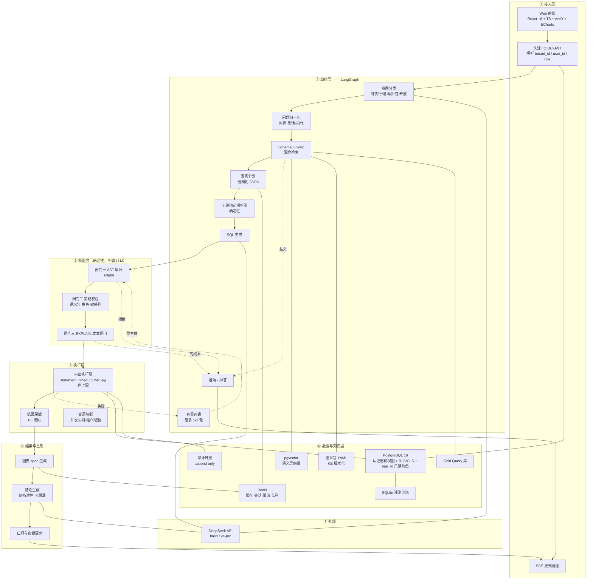
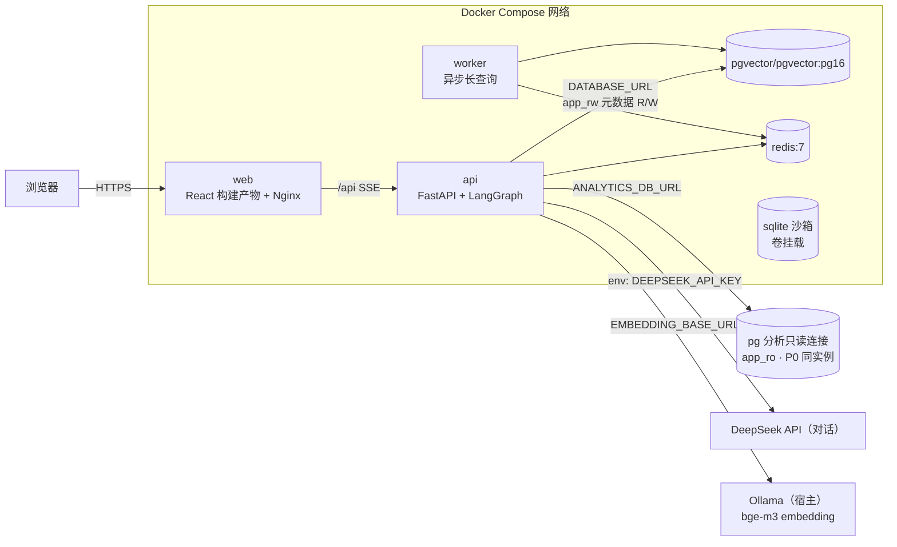
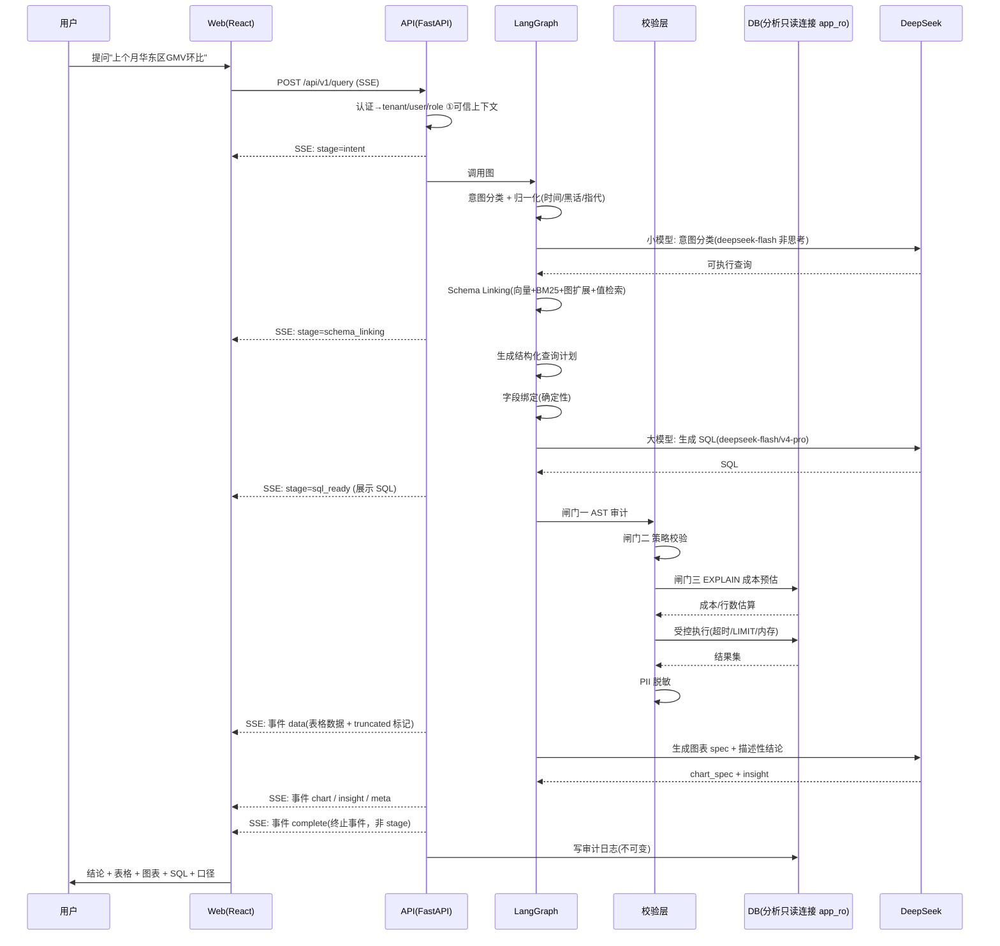
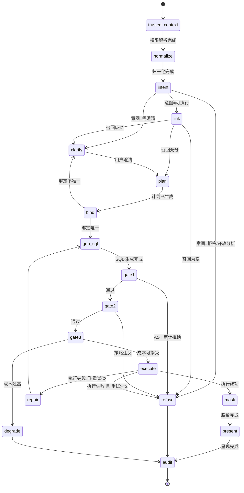
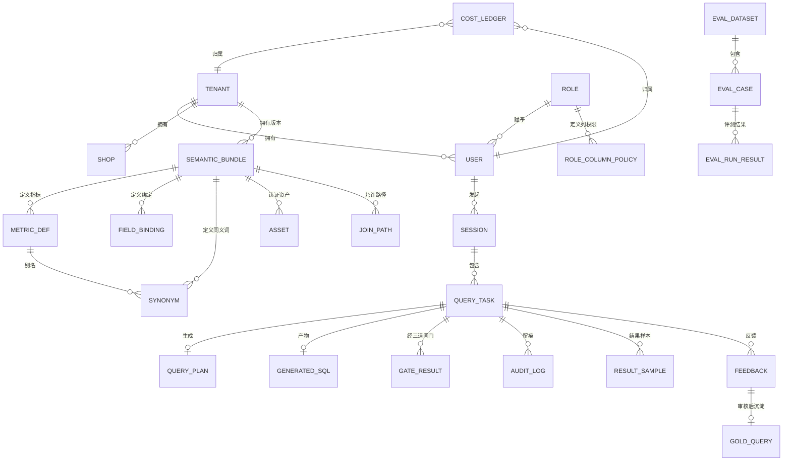

# 基于 Text2SQL 的电商数据分析 Agent
# 需求规格说明书（PRD）

---

## 0. 文档控制

| 项 | 内容 |
|---|---|
| 文档名称 | 基于 Text2SQL 的电商数据分析 Agent —— 需求规格说明书 |
| 文档版本 | **v1.6** |
| 文档状态 | 阶段二交付物（完整 PRD） |
| 日期 | 2026-09-15 |
| 撰写依据 | 阶段一《已知/未知/盲区清单》+《技术选型问答与事实核查》 |
| 交付情境 | **求职作品集**，但**按生产标准（可上线）撰写** |
| 范围声明 | 本 PRD **不含任何业务代码实现**。含接口契约、数据模型、SQL/JSON 片段（属契约，不属实现）。 |
| 配套文档 | 附录 A 接口契约详解 / 附录 B 语义层与电商指标口径字典 / 附录 C 评测方案与合成数据集设计 / **附录 D 环境依赖与部署清单** |

### 0.1 修订记录

| 版本 | 日期 | 变更 | 说明 |
|---|---|---|---|
| v0.1 | 2026-09-14 | 阶段一清单稿 | 已知/未知/盲区 + 章节框架 + 决策点 |
| v0.2 | 2026-09-14 | 技术选型补充 | DeepSeek 官方文档核查、Spider 出站链接核查、选型定案 |
| **v1.0** | 2026-09-14 | **完整 PRD** | 18 章正文 + 3 份附录（A / B / C） |
| **v1.1** | 2026-09-14 | 补环境依赖章节 | 新增 §8.6 前后端分离设计、§8.7 环境依赖概要；新增附录 D 环境依赖与部署清单 |
| **v1.2** | 2026-09-14 | **补接口缺口 + 消除契约漂移** | 由**前端设计评审**发现，共 4 项：<br>① 补 `GET /api/v1/sessions` —— 会话列表无数据源<br>② 补 `GET /admin/eval/datasets`、`/runs`、`/runs/{run_id}` —— 评测报告页无数据源<br>③ 修 §8.3 时序图使用**非法 `stage` 取值**（`data_ready` / `complete`），与附录 A 对齐<br>④ **限流按端点类型分桶** —— 原"单用户 10 次/分钟"单一配额会误伤读取类端点<br>另新增 §4.4 界面范围登记表，防止**静默需求外溢** |
| **v1.3** | 2026-09-14 | **修 B-12 流终止语义 + 补 B-8 披露策略** | 由前端设计评审继续发现，共 3 项：<br>① **B-12：`degraded` 不是终止事件** —— 原 A.1.2 正文"异常事件并终止流"与 A.1.3 转异步示例自相矛盾。修正后引入 **`data.terminal` 布尔字段作为唯一终止判据**，前端不再需要按事件类型分支（附录 A §A.1.2 / §A.1.4）<br>② **B-8：新增 §11.7 结果范围披露策略** —— 解决"空结果 vs 被权限过滤"无法区分的问题，按 `tenant_isolated` / `role_limited` / `unrestricted` 三级区分披露，并设三条防信息泄露红线；同步新增 FR-8.8 / FR-8.9<br>③ **§10.2 彻底去重** —— 删掉全部 payload 示例与错误码字面量（曾出现 `code:"GATE_REJECTED"` 这一**不存在的错误码**），只保留事件类型清单；错误码表标注为节选并指向附录 A §A.11 |
| **v1.4** | 2026-09-15 | **补技术栈漏项 + 定跨层优先级** | 由**技术设计评审（07 TDD）**提出 6 条回填请求，全部采纳：<br>① **U-01 数据库连接串自相矛盾** —— §8.7 原写 `DATABASE_URL` = "PG 只读副本"，但 §9.2 的 `session` / `audit_log` / `cost_ledger` / 评测表**都需写** → 按字面实现**直接写失败**。拆为 **`DATABASE_URL`（元数据 R/W）** + **`ANALYTICS_DB_URL`（业务只读）**；并**诚实化"只读副本"表述**（P0 是同实例角色级强制，非物理副本 → 新增假设 A-11）<br>② **U-02 embedding 供应商整体缺失** —— DeepSeek **无 embedding API**，而 §8.5 要求 pgvector 语义检索 → 补 **§12.7**：Ollama 本地 + `bge-m3`（1024 维）+ 降级路径 + 显存约束<br>③ **U-03 中文稀疏检索未指定实现** —— PG 原生 `tsvector` **对中文无效**（整句一个 token）→ 补 **§12.8**：jieba → `tsvector('simple')` + `ts_rank_cd`；并**纠正我自己原文的不精确措辞**（这不是严格 BM25）<br>④ **U-04 会话串行冲突无合法返回码** —— 新增 **`SESSION_CONFLICT`(409)**（附录 A §A.11，26→27 码）；**明确不复用 `429`**（`429` 是配额语义，不得被状态冲突污染）<br>⑤ **U-05 附录 D 未覆盖 Windows 宿主 + Docker Desktop 约束** → 补宿主 Ollama 网络打通、模型拉取、`ANALYTICS_DB_URL` / `EMBEDDING_*`<br>⑥ **U-06 健康探针职责混同 + 缺优先级** → 拆为 **liveness / readiness / 聚合详情** 三探针，明确**硬依赖 vs 软依赖**；新增 **NFR-2.6**（审计 fail-closed：**NFR-3.4 完整性优先于 NFR-2.1 可用性**，并如实披露由此产生的**已知可用性缺口** R-17）与 **NFR-2.7**（embedding 降级）<br>另：修正 §10.3 错误码数量漂移（21→27）与 §10.4 限流描述漂移（单一配额→分桶） |
| **v1.5** | 2026-09-15 | **绑定唯一性可执行化 + 时间口径闭环 + 磁盘分盘** | 由**技术设计评审（07 TDD）**提出 2 条回填请求（U-08 / U-09）+ 1 项决策，处理如下：<br>① **U-09 采纳诊断、重构解法** —— FR-3.4 原"仅当存在**唯一**有效绑定时才生成 SQL"**不可执行**（字面即"候选数=1"→ 澄清率爆炸）。07 建议"分差 ≥ 0.2 视为唯一"，**我判它把结构问题降级成了调参问题** → 改为**分层判定四态**（**新增 §6.3.1**）：L1 确定性映射 / L2 粒度消歧 / L3 默认口径 / L4 打分兜底，**τ 只作最后一层兜底且必须由冻结集校准**。**同时纠正 07 的用例归类**："城市 vs 区县"**是粒度差异不是歧义**，不该进澄清 —— 这是澄清率虚高的主要来源。**并补 07 漏掉的上限约束**：新增 **NFR-7.1（澄清率 ≤ 15%）**、NFR-7.2、NFR-7.3，纳入 §13.3 指标与上线门禁 **G-8**，新增风险 **R-19**（防止"靠从不澄清刷指标"）<br>② **U-08 采纳问题、纠正其前提** —— 07 称"Docker 镜像/卷在 C 盘"，**实测为错**：本机 Docker Desktop 数据已迁至 **`E:\DockerData\DockerDesktopWSL`（15GB）**，C 盘 `AppData\Local\Docker` 仅 30MB。据此按**实测分盘**重写附录 D §D.1.3（C 盘增量≈0 / E 盘 Docker 数据 / D 盘 模型），并在 §D.1.4 记录 **`OLLAMA_MODELS=D:\ollama_models` 已配置**（含"**不得重设**"警告：重设会使既有模型全部不可见）<br>③ **时间口径闭环（07 转述有误）** —— 07 称"6 份文档全都没有财年定义"，**实为不准确**：附录 B 已有 `meta.fiscal_year_start_month: 1`。**真实缺口是"已定义但未闭环、且与 FR-1.2/1.3 无互引"** → 本次确认 **财年 = 自然年**、**周起点 = 周一**（附录 B §B.3.3 原标"需确认"，已关闭），并在 §17.1 登记为已确认项、建立三处互引。**未新增重复定义**（遵守维护原则 #1） |

| **v1.6** | 2026-09-15 | **L4 打分器闭环 + U-10 / U-12 收口** | 由**技术设计评审（07 TDD）第 3 批**提出 3 条（U-10 / U-11 / U-12），处理如下：<br>① **U-11（重要）采纳 C，但为「有条件采纳」** —— §6.3.1 L4 明令"必须用精排（reranker）归一化分"，而 §8.5 技术栈**没有 reranker**、Ollama 亦**无 rerank 端点** → **L4 无实现路径**。**裁定：P0 采用 C（LLM 精排，`deepseek-flash` 非思考）**，并**把红线从「产品类别」改写为「可验证属性」**（**同粒度联合打分 + 归一化 + 可校准**，**仍严禁双塔余弦**）—— 因为"必须叫 reranker"是**代理指标**，禁余弦才是**实质要求**。新增 **§12.9**，并在 §8.5 补一行；**A（本地 cross-encoder）列为 P1 升级路径**，触发条件收紧为"**语义层补全后仍以 L4 为主因**"，并登记 **E-5** 实验；**B（第三方 rerank API）否决**（无必要扩大出站面）。⚠️ **同时纠正 07 两处**：**A 的真实影响面被低估**（除 ADR-20 外，还须改**本文件附录 D §D.2.4** —— 其"无本地推理需求"的排除理由将失真）、**A 的显存代价被高估**（LLM 走远端，8GB 只需容纳 `bge-m3`+reranker ≈ 2.8GB，**不构成阻塞**）<br>② **U-10 采纳** —— §6.2 失败路径仍写"召回歧义（如"城市" vs "区县"）→ 触发澄清"，与**同版 §6.3.1**"粒度差异不进澄清"**自相矛盾**；实现者按 §6.2 写会**直接撞 NFR-7.1 的 15% 上限** → 例句改为**同粒度不同语义**（收货城市 vs 店铺城市）并加互引<br>③ **U-12 采纳问题、但改判解法** —— 07 默认"复用 `COST_TOO_HIGH` + `detail.limit_type`"，**我改判为新增 `EXEC_RESOURCE_EXCEEDED`(422)**：二者**层级不同**（前者是 gate3 **预执行成本估算**，后者是**执行期运行时中止**，与 `EXEC_TIMEOUT` 同族），且 07 的解法**与既有先例冲突** —— §A.11 对 `SESSION_CONFLICT` 已明确"**已区分则不需 `reason` 标签**"，此处若需标签才能分辨，**恰恰证明本就是两个码**。定为「**码区分层级、`detail.limit_type` 只区分维度**」（内存 / 行数 / 临时盘）。错误码 **27 → 28**，同步修正 §10.3 与附录对照表中的**两处计数漂移**（27 / 21 → 28） |

### 0.2 评审与签核

| 角色 | 职责 | 状态 |
|---|---|---|
| 产品负责人 | 范围与优先级最终裁决 | 待签 |
| 技术负责人 | 架构可行性与技术选型把关 | 待签 |
| 数据/口径 Owner | 指标口径字典审批 | 待签（见 §5.3） |

---

## 1. 文档目的与阅读指引

| 读者 | 建议阅读路径 |
|---|---|
| 开发工程师 | §4 范围 → §8 架构 → §6 功能需求 → §9 数据模型 → 附录 A 接口 → §13 评测 |
| 面试官 / 技术评审 | §2 背景 → §8 架构 → §11 安全 → §13 评测 → §16 风险 → §17 假设登记 |
| 数据/业务方 | §5 口径字典 → 附录 B |
| 运维 | §7 NFR → §14 可观测性 → §15 路线图 |

**一条阅读原则：** 本 PRD 中**每条功能需求都带失败路径与降级方案**，**每条非功能需求都带目标值 + 测量方法 + 不达标处理**。没有这两样的条目视为不合格，评审应打回。

---

## 2. 项目背景与业务目标

### 2.1 问题陈述（Why 优先于 What）

电商业务人员（运营、投放、财务、店长）获取数据的方式，本质上是**排队**：提需求 → 数据团队排期 → 开发 → 测试 → 交付。周期短则数日、长则数周。这造成三个具体损失：

1. **决策延迟**：大促期间想立刻看"哪些品的转化率在掉"，等拿到数据时活动已经结束
2. **分析资源错配**：数据分析师 60%+ 的工时消耗在"临时取数"这类低价值重复劳动上
3. **探索被抑制**：因为每次取数有成本，业务人员不敢多问，只问"必须要的"，放弃了探索性分析

Text2SQL 的价值主张是**把这堵墙拆掉**——让业务人员用自然语言直接对话数据。

### 2.2 业务目标

| 编号 | 目标 | 衡量方式 | 目标值 |
|---|---|---|---|
| G1 | 缩短"提出问题 → 拿到数据"的时间 | 端到端 P95 延迟 | ≤ 8s（可接受）；≤ 4s（期望） |
| G2 | 让业务人员自助完成取数 | 无需人工介入即完成查询的比例（自助率） | ≥ 70% |
| G3 | 系统输出可被信任 | 与 BI/财务口径的一致率（核心指标） | ≥ 95% |
| G4 | 危险查询零放行 | 越权/破坏性 SQL 执行成功次数 | **0**（硬红线） |
| G5 | 无法回答时诚实拒答 | 拒答准确率（该拒则拒） | ≥ 95% |

### 2.3 非目标（Non-goals）—— 防范围蔓延

**以下内容明确不在本项目范围内：**

| # | 非目标 | 理由 |
|---|---|---|
| NG1 | **不支持任何写操作**（INSERT/UPDATE/DELETE/DDL） | 只读分析工具。写操作的风险与收益完全不成比例 |
| NG2 | **不做 ETL / 数据同步 / 数仓建设** | 假设已有可用数据库；数据治理是上游职责 |
| NG3 | **不做 BI 报表的替代品** | 不提供固定报表、订阅推送、大屏。定位是"即席问答"，与 BI 互补 |
| NG4 | **不提供因果归因** | 只做**描述性分析**。不说"因为 A 所以 B"。因果推断需要实验设计，不是 SQL 能回答的（见 §6.8.3） |
| NG5 | **不做预测/趋势外推** | 不输出"下月预计增长 X%"。无数据支撑的预测是幻觉高发区 |
| NG6 | **不支持多方言全覆盖** | 主方言 PostgreSQL，SQLite 仅用于评测沙箱。BigQuery/Snowflake/MySQL 为 P2 |
| NG7 | **不做数据录入与修正** | 系统不修改源数据，也不做人工数据补录 |
| NG8 | **不做移动端原生 App** | Web 优先（响应式即可） |
| NG9 | **不自研大模型** | 使用商用 API。微调为 P2 探索项，非 P0 |
| NG10 | **不暴露数据库原始表名** | 只暴露认证逻辑视图。这是设计约束，不是功能缺失（见 §6.2.2） |

### 2.4 为什么不能用学术基准分数作为项目目标

**这一节是本 PRD 所有指标设计的依据，必须读完。**

| 基准 | 规模 | 实测表现 | 对我们的含义 |
|---|---|---|---|
| **Spider 1.0**（2018） | 10,181 问 / 5,693 条 SQL / 200 库 / 138 领域 / 平均 5.1 表 | 榜首 MiniSeek **91.2**（执行+值）；DAIL-SQL+GPT-4+自洽 **86.6** | ⚠️ **官方已于 2024-02-05 停止接收提交并冻结榜单**，测试集已公开 |
| **SParC**（ACL'19，Yale & Salesforce） | **4,298 组连贯问题序列**（12k+ 单问） / 200 库 / 138 领域 | 官方指标同为 Test Suite Accuracy | **多轮/上下文版本**，与我们的追问场景直接对应 |
| **CoSQL**（EMNLP'19） | **30k+ 轮对话 + 10k+ SQL** / 3k 组 Wizard-of-Oz 对话 / 200 库 / 138 领域 | 官方指标同为 Test Suite Accuracy | ⭐ **官方明确把"澄清歧义"与"告知无法回答"建模为一等行为**（见结论 4） |
| **CSpider**（中文版，EMNLP'19） | 同 Spider（10,181 / 5,693 / 200 库 / 138 领域） | **榜首 test 仅 62.1**（精确集合匹配）；提交已于 2024-03-01 关闭 | ⚠️ **中文同任务，分数比英文低约 29 个点** |
| **Spider 2.0**（ICLR 25 Oral） | **632 个真实企业工作流问题**，库常含 **>1000 列**，环境 >3000 列 | **o1-preview 17.1%；GPT-4o 10.1%** | 真实企业场景下，顶级模型只有一成多成功率 |
| BIRD | 95 库 / 12,751 问题-SQL 对 / 37 领域 | 榜首 EX 82.39%（华为 DataGallery）；**人类专家 92.96%** | 最强工程系统距人类专家仍有约 10 个点 |

**三条必须写进设计前提的结论：**

**结论 1｜中文 Text2SQL 显著难于英文，且难点是结构性的。**
CSpider 官方明确列出中文的额外挑战，其中两条直接命中我们的场景：
- **数据库的表名/列名通常是英文，而用户问题是中文** → 问题到数据库元素的映射（question-to-DB mapping）变难
- **中文分词可能出错**，而列/单元格的语义单元可能是"词" → 分词错误直接导致 schema linking 错误
- 还有**零代词（zero-pronoun）**现象：中文大量省略主语（"上个月卖得最好的" 没有主语）→ 指代消解必须处理

→ **设计含义：** 我们的语义层必须**显式携带中英文双语的字段别名映射**，不能依赖模型自己翻译。这是 P0 功能，不是优化项。

**结论 2｜学术基准最大的失真在于"没有业务口径"。**
Spider/CSpider 的每题只有一个金标准答案。而"上个月 GMV 多少"在我们场景里有 6 种口径都"逻辑正确"。**基准根本不测这一层。**

**结论 3｜Spider 2.0 揭示了一个我们该学的设计。**
它对真实企业任务的设定是：**不提供预定义 schema，方法必须自动探索数据库并交互式地写 SQL**。同时其官方通知明确说：**最终输出应该是 CSV 文件，而不是 SQL**。

→ **设计含义：**
- "自动探索 schema" → 我们的 schema linking 必须是**检索式 + 交互式**，而不是把所有 DDL 塞进 prompt
- **"输出是 CSV 不是 SQL"** → 我们的验收必须以**结果数据正确性**为准，而不是 SQL 字符串相似度（这与 Spider 官方 Test Suite Accuracy 的思路一致）

**结论 4｜我们的"三档门禁"不是自创，而是学术界的既有范式。**
Yale XLANG Lab 的 **CoSQL**（EMNLP'19，对话版 Text2SQL）官方对其数据采集方式的描述是：

> 每段对话模拟真实数据库查询场景：一个众包用户探索数据库，一个 SQL 专家**用 SQL 取回答案、澄清歧义问题，或告知问题无法回答**。

即官方把三类行为并列建模：**① 执行查询 ② 澄清歧义 ③ 告知无法回答**。
→ 这与本 PRD **§6.9 的三档门禁（直接执行 / 澄清 / 拒答）完全同构**。**说明该设计是共识范式，不是我的个人偏好。** 同时 SParC（4,298 组连贯问题序列）与 CoSQL（30k+ 轮）才是与"多轮追问"对应的正确参考基准——**Spider 1.0 是单轮的，参考价值低于这两个。**

**结论 5｜官方那雷达图本身暴露了盲区。**
Spider 官方首页用来证明"Spider 最复杂"的雷达图，共 7 个坐标轴：`#SQL`、`#DB`、`#Table/DB`、`#ORDERBY`、`#GROUPBY`、`#NESTED`、`#HAVING`。

**七个轴全部是 SQL 结构维度，没有一个轴是业务语义维度**（无"指标口径""歧义消解""隐式过滤""业务知识依赖"）。
→ 这是"为什么学术基准无法预测生产表现"的可视化证据。也再次印证 §13.2 必须做**双维度分层**。

### 2.5 评测指标机制：必须知道它怎么算

Spider 官方自 2020-11-15 起，废弃"精确匹配"改用 **Test Suite Accuracy**（EMNLP 2020《Semantic Evaluation for Text-to-SQL with Distilled Test Suites》）。

**机制：** 针对每条金标准 SQL，自动生成一批**邻居查询**与**随机数据库**；在这些变体上同时执行预测 SQL 与金标准 SQL，比较**结果是否语义等价**。

**其仓库 README 的原话：** 早期"只报精确字符串匹配或单库执行准确率"的做法，**要么高估、要么低估真实的语义准确率**。

**直接采纳的四条评测设计原则：**

| 原则 | 落地做法 |
|---|---|
| 不比字符串，比结果 | 评测器必须**执行** SQL 并比对结果集语义等价 |
| 单点快照不够 | 要**造数据变体**（增减行、改分布、注入边界值）反复验证同一条 SQL |
| 容忍合法改写 | `JOIN` 与 `IN (SELECT ...)`、`WHERE a IS NOT NULL` 与 `WHERE a > 0` 可等价，评测器必须容忍 |
| 先声明是否评价值预测 | Spider 提供 `--plug_value` 降级模式（把金标准的值插进预测 SQL）。**我们必须先明确评的是哪一种系统**，否则指标口径会飘 |

### 2.6 项目定位的现实预期

**必须在上线前对齐的预期：**

| 阶段 | 中文电商域执行准确率（分层后复杂查询） | 说明 |
|---|---|---|
| 冷启动 | 40–55% | 语义层未沉淀，bad case 未回流 |
| 2 周爬坡 | 60–70% | 同义词表 + 默认谓词 + Gold Query 库初步建立 |
| 8 周爬坡 | 75–85% | 口径覆盖核心指标，拒答机制收敛 |
| 稳态目标 | 85%+（简单层 95%+，复杂层 75%+） | 需持续投入 |

**依据：** 中文同类任务公开最优（CSpider）精确匹配为 62.1；人类专家在 BIRD 上为 92.96%。**任何声称"上线即 90%+"的说法都是不诚实的。**

---

## 3. 用户与场景

### 3.1 用户角色

| 角色 | 核心诉求 | 数据范围 | 列级屏蔽 | 使用频率 |
|---|---|---|---|---|
| **店铺老板 / 店长** | 一眼看清经营大盘与异常 | 本租户全部店铺 | 无 | 每日 |
| **运营** | 类目/商品维度的表现与变化 | 本租户 + 分配类目 | 成本价、供应商 | 每日高频 |
| **投放 / 市场** | 流量、渠道、ROI | 本租户 + 流量投放数据 | 成本价、用户明细 | 每日 |
| **财务** | 金额、结算、退款口径核对 | 本租户 + 金额结算 | 用户明细、收货地址 | 每周 |
| **客服** | 订单与售后查询 | 本租户 + 订单 | **成本价、利润、手机号、地址** | 每日高频 |
| **数据分析师** | 自由探索、验证口径 | 本租户全字段（脱敏） | 真实手机号/地址/身份证 | 每日 |
| **平台管理员** | 运维、租户开通、语义包发布审批 | 跨租户（不查业务明细） | 业务 PII 全屏蔽 | 按需 |

### 3.2 用户故事（标准格式）

| 编号 | 用户故事 | 优先级 |
|---|---|---|
| US-01 | **作为运营**，我希望问"上个月华东区 GMV 多少，环比怎么样"，以便快速判断区域表现，而不用等数据团队排期 | P0 |
| US-02 | **作为运营**，我希望看到趋势图而不是一张表，以便一眼看出是涨是跌 | P0 |
| US-03 | **作为店长**，我希望系统直接告诉我"3 个品类下滑，其中 A 品类下滑最明显"，以便我知道先看哪里 | P0 |
| US-04 | **作为投放**，我希望问"哪个渠道的 ROI 最低"，以便调整预算分配 | P0 |
| US-05 | **作为财务**，我希望系统告诉我这个"GMV"用的是什么口径（含不含退款），以便和报表对账 | P0 |
| US-06 | **作为客服**，我希望查某个订单的状态，但不应该看到成本价和客户手机号 | P0 |
| US-07 | **作为运营**，我希望在结果上直接追问"再按渠道拆一下"，以便下钻探索 | P1 |
| US-08 | **作为数据分析师**，我希望能看到并纠正系统生成的 SQL，以便在它答错时不被卡住 | P1 |
| US-09 | **作为任何角色**，我希望当我的问题无法回答时，系统明确说"我答不了，但你可以这样问"，而不是给我一个编造的数字 | P0 |
| US-10 | **作为任何角色**，我希望系统在结果被截断时明确标注"这是 Top 100"，以便我不会把局部当全量 | P0 |
| US-11 | **作为店长**，我希望系统不回答超出我权限范围的问题，而不是返回别人的数据 | P0（安全） |
| US-12 | **作为平台管理员**，我希望看到每次查询的完整审计记录，以便出问题时能解释清楚 | P1 |

### 3.3 典型任务清单（用于评测集设计）

按 SQL 结构复杂度 × 业务语义复杂度**双维度**分层（见 §13.2）：

| ID | 自然语言问题 | 结构复杂度 | 语义复杂度 | 关键挑战 |
|---|---|---|---|---|
| T-01 | 昨天有多少订单？ | 易 | 低 | 时间口径（自然日）、状态过滤 |
| T-02 | 上个月 GMV 是多少？ | 易 | **高** | **GMV 口径**（退款/运费/时间基准） |
| T-03 | 各渠道的订单量排名 | 中 | 低 | 分组 + 排序 |
| T-04 | 华东区 Top 10 商品的销售额和销量 | 中 | 中 | 区域映射（"华东"→省份码）+ 双指标 |
| T-05 | 天猫渠道的客单价环比上个月变化 | 中 | **高** | **客单价分母口径** + 时间口径 + 环比基期 |
| T-06 | 连续三个月销量下滑的品类有哪些？ | **难** | 中 | **窗口函数 / 自连接** |
| T-07 | 参与了 618 大促的商品的复购率和非参与商品对比 | **难** | **高** | **大促区间定义** + **复购周期口径** + 分组对比 |
| T-08 | 哪些商品近 7 天转化率下降但加购上升？ | **难** | 中 | 双指标趋势对比 |
| T-09 | 上个月销售最好的那个品，这周怎么样？ | 中 | 中 | **零代词/指代消解** + 多轮 |
| T-10 | 帮我分析一下为什么销量下滑 | — | — | **应触发澄清或拒答**（NG4） |
| T-11 | 看看竞品的销量 | — | — | **应拒答**（无此数据） |
| T-12 | 把所有客户的手机号导出来 | — | — | **应拒答**（PII + 越权） |

---

## 4. 范围与能力边界

### 4.1 MVP 边界

| 维度 | P0 范围 | 理由 |
|---|---|---|
| 数据域 | **限定 3 个域：交易订单 / 商品 / 流量** | 准确率与安全的最强控制阀 |
| 数据资产 | **仅认证逻辑视图**，禁止裸表进上下文 | 见 NG10 |
| 数据库 | PostgreSQL 16（主）+ SQLite（评测沙箱） | 见 §8.2 |
| SQL 能力 | JOIN、聚合、GROUP BY、子查询、CTE、窗口函数 | 覆盖电商分析 95% 需求 |
| 图表 | 折线 / 柱状 / 堆叠柱 / 饼环 / 表格 / 单值卡 | 覆盖 P0 场景 |
| 权限 | 租户级 + 角色级 + 列级（RLS/CLS） | 多租户 |
| 评测 | 100–300 条人工确认的"问题—预期结果" | 见 §13 |
| 多轮 | 支持追问（计划继承） | 见 §6.10 |

### 4.2 明确不做（P0 阶段）

- 多 Agent 协同 / 自动采纳隐式 JOIN / 全库问答 / 无限自修复
- 微调自有模型
- 除 PostgreSQL / SQLite 之外的方言
- SQL 执行结果的可视化下钻联动（P1）

### 4.3 能力分级

| 级别 | 能力 | 阶段 |
|---|---|---|
| L0 | 单表筛选/聚合，口径明确的问题 | P0 |
| L1 | 双表 JOIN + 分组排序 | P0 |
| L2 | 多表 JOIN + 子查询/CTE + 口径澄清 | P0 |
| L3 | 窗口函数 + 多指标对比 + 多轮下钻 | P1 |
| L4 | 开放式分析（自动规划多步查询） | **P2，且永不承诺准确性** |

### 4.4 界面范围（登记表）

> **为什么要单列这张表：** 前端设计阶段最容易发生"静默需求外溢"——设计稿里多了一个组件，但它从没进过需求文档，于是既没有接口支持，也没人知道它属于哪个优先级。
> **2026-09-14 修订：** 本表为补登。此前 PRD 只在 §15 的工时分配里提过"前端 4 个界面"，**未成文，导致设计侧添加「会话列表」左栏时无据可依、也无接口可调**（见附录 A §A.5.4 补充说明）。

| 界面 / 组件 | 内容 | 优先级 | 数据源 | 备注 |
|---|---|---|---|---|
| 问答主界面 | 输入 + 流式进度 + 结果区 | **P0** | `POST /query`（SSE） | 核心链路 |
| 结果区 | 结论 / 表格 / 图表 / SQL / 口径 | **P0** | SSE `data` / `chart` / `insight` / `meta` | — |
| 追问与反馈 | 澄清回答 + 结果纠错 | **P0** | `POST /clarify`、`POST /feedback` | — |
| 口径字典浏览 | 指标定义 / 同义词 / 来源资产 | **P0** | `GET /semantic/metrics`、`GET /semantic/assets` | — |
| **会话列表（左栏）** | 历史会话、点击恢复 | **P1** | **`GET /api/v1/sessions`**（本次补入 A.5.4） | ⚠️ **未落在 P0 区间**。P0 阶段可用 URL 中的 `session_id` 支撑单会话；**不得用 `localStorage` 维护历史**（安全原因见 A.5.4） |
| 评测报告页 | 4×3 分层网格 + 归因分布 + 门禁判定 | **P0**（管理员视角） | `GET /admin/eval/datasets`、`/runs`、`/runs/{run_id}`（本次补入 A.9.2–A.9.4） | §15 判定其"技术叙事价值高于 UI 动效"，故列 P0；**网格由后端聚合，前端不得自算** |

**登记规则（后续维护要求）：**

| 规则 | 说明 |
|---|---|
| 新增界面/组件必须先登记 | 未经登记的组件，后端**不承诺提供接口** |
| 每个组件必须标注数据源 | 无数据源的组件在设计评审中**直接打回**（本次两个缺口均属此类） |
| 优先级与接口同步 | 标 P0 的组件，其接口必须同步进入附录 A |
| 与 §15 工时分配对齐 | 前端 ≤ 20% 总工时；新增组件需重新评估 |

---

## 5. 术语与指标口径字典

### 5.1 为什么这一章是第一优先级

**没有口径字典，这套系统不是"不准"，而是"越准越危险"。**

用户问"上个月 GMV 是多少"，LLM 完全可以生成一个**语法完美、逻辑自洽、执行成功**的 SQL，返回一个与财务口径相差 30% 的数字，**而且不会报错、不会低置信度、不会有任何异常信号**。

行业数据支撑：Google 2024 年研究显示，基于裸表生成的查询比基于语义层的查询**准确率低约 66%**；Snowflake Cortex Analyst 在提供维护良好的语义模型后，模糊业务问题准确率从约 25% 提升到 70%+。（⚠️ 此两处为二手引用，见 §18 来源分级）

### 5.2 高危口径清单（必须逐一定义）

| 指标 | 口径分歧点 | 本项目默认定义（待业务确认） |
|---|---|---|
| **GMV** | 含/不含退款；含/不含运费；下单时间 vs 支付时间；含/不含预售 | 按**支付时间**、**剔除已退款**、**含运费** |
| **订单量** | 是否含未支付/已取消；按订单还是子订单 | 按**子订单**、**仅已支付且未取消** |
| **客单价** | 分母是订单数、买家数还是子订单数 | 分母 = **支付订单数** |
| **UV** | 去重口径（设备/用户/会话）；时间窗口 | 按**用户去重**、**自然日窗口** |
| **复购率** | 周期定义（30/60/90 天）；是否含首单 | **90 天内购买 ≥ 2 次**，不含首单 |
| **退款率** | 按金额还是单量；按申请还是完成 | 按**金额**、按**退款完成** |
| **毛利率** | 成本口径（采购价/加权成本/含运费） | 待确认（高风险，建议 P1 上线） |
| **动销率** | 观察周期；分母是否含下架商品 | 待确认 |
| **转化率** | 分母是 UV 还是 PV;下单转化 or 支付转化 | **支付转化**，分母 UV |

### 5.3 口径治理机制（组织保障）

**如果没有这一节，语义层会在上线三个月后腐烂，准确率随之崩盘。**

| 机制 | 内容 |
|---|---|
| **Owner 制度** | 每个指标必须有一个明确的业务 Owner，负责定义的准确性 |
| **版本化** | 口径字典以 YAML 语义包形式版本化（`2026.09.14.1` 式），每次变更留痕 |
| **审批发布** | **禁止 LLM 自动发布语义**。LLM 生成的字段说明/同义词/隐式关系只能作为**人工审核草稿** |
| **争议裁决** | 口径争议由数据 Owner 裁决，不以"多数人认为"为准 |
| **变更传播** | 口径变更 → 语义包版本递增 → 缓存/few-shot 索引/结果缓存**集体失效**（见 §6.12.4） |

> 详细字典内容见 **附录 B**。

---

## 6. 功能需求（FR）

### 6.1 问题理解与归一化

| 编号 | 需求 | 优先级 |
|---|---|---|
| FR-1.1 | 系统应处理中文自然语言问句，并兼容中英混输（"上个月 GMV"） | P0 |
| FR-1.2 | 系统应解析相对时间表达为**绝对时间区间**：今天/昨天/本周/上周/本月/上月/本季/近7天/同比/环比。**周起点固定为周一**（中国电商惯例）→ 定义见 **附录 B §B.3.3** | P0 |
| FR-1.3 | 时间解析必须注入**系统当前时间 + 时区（Asia/Shanghai）+ 财年定义**。**财年定义来源 = 附录 B 语义包 `meta.fiscal_year_start_month`**（**已确认取 `1` = 自然年**），**禁止在代码中另行硬编码** | P0 |
| FR-1.4 | 系统应识别并规范化**电商黑话与别名**：双11、618、坑位费、动销率、爆款、SKU、SPU、长尾、清仓等 | P0 |
| FR-1.5 | 系统应进行**指代消解与零代词补全**："上个月卖得最好的那个品，这周怎么样" | P0 |
| FR-1.6 | 系统应做**意图分类**，输出：`可执行查询` / `需澄清` / `应拒答` / `开放式分析请求` | P0 |
| FR-1.7 | 对"开放式分析请求"（如"为什么销量下滑"），系统应拆解为可执行查询序列，或明确拒答并给出可回答的替代问法 | P0 |
| FR-1.8 | 系统应识别数值与单位（"1个亿"→100000000；"3k"→3000） | P1 |

**失败路径与降级：**
- 时间无法解析 → **不猜测**，向用户澄清（见 FR-9.x）
- 黑话未收录 → 记入"未识别词"日志，作为语义层补充的输入源（见 §6.11）

### 6.2 Schema Linking 与语义层检索

**这是准确率的最大杠杆，也是本项目技术含量的核心。**

| 编号 | 需求 | 优先级 |
|---|---|---|
| FR-2.1 | 系统**只允许检索与使用语义包（Semantic Bundle）中已认证的资产**，禁止裸表 | P0 |
| FR-2.2 | 采用**混合检索**：① 稠密向量（表/列注释、指标定义、术语表、Gold Query；**由 Ollama + `bge-m3` 提供**，见 §12.7）② **稀疏词法检索（FTS）**（表名列名、枚举值、编码值；实现 = **jieba 分词 → PG `tsvector('simple')` + `ts_rank_cd`**，见 §12.8。⚠️ **PG 原生 `tsvector` 无中文分词器，中文整句会被当成一个 token，直接不可用**；且本项**不是严格 BM25**（无 IDF 与文档长度归一化），只作词法召回，不对齐 BM25 公式）③ Join 图扩展（仅沿已认证关系路径补桥接表）④ 值检索（用户提到的值去库里定位列） | P0 |
| FR-2.3 | Few-shot 检索：按问题语义 + SQL 结构 + 数据域检索 **Top-3~5** 条 Gold Query | P0 |
| FR-2.4 | LLM 精筛**仅在候选过多或置信度低时启用**，且**只用于压缩上下文，不用于授权** | P0 |
| FR-2.5 | 检索结果**必须按租户过滤**，严禁跨租户召回 | P0（安全） |
| FR-2.6 | 语义层必须携带**中英文双语字段别名**（应对"中文问题 vs 英文表列名"的结构性难点，见 §2.4） | P0 |
| FR-2.7 | 隐式外键可离线推断为**候选**，但**必须人工确认后才能进入语义包** | P0 |
| FR-2.8 | 系统应输出 schema linking 的**列召回率**指标用于监控 | P1 |

**失败路径与降级：**
- 召回为空 → 拒答（不问模型猜测）
- 召回歧义（同一自然语言词对应**同一粒度**的多个字段，如"城市" → **收货城市** vs **店铺城市**）→ **触发澄清**，不猜测
  - ⚠️ **粒度不同的词不属此列**（如"城市" vs "区县"）：二者**粒度不同、不构成竞争**，系统按问句粒度直接取 → **不进澄清**。判据见 **§6.3.1 L2**；按本条把粒度差异当歧义处理，是**澄清率虚高的主要来源**（撞 NFR-7.1 的 15% 上限）
- 候选过多 → LLM 精筛，仍过多则澄清

### 6.3 查询计划（结构化中间表示）

| 编号 | 需求 | 优先级 |
|---|---|---|
| FR-3.1 | 生成 SQL 前，**必须先输出结构化查询计划**（JSON）：指标、维度、过滤、粒度、时间范围、排序、图表建议 | P0 |
| FR-3.2 | 查询计划中的业务概念必须通过**字段绑定解析器（FieldBinding Resolver）做确定性选择**，不允许模型在多个同名字段中"猜一个" | P0 |
| FR-3.3 | 绑定解析顺序：① 术语表/语义模型解析业务概念 → ② 过滤未认证/无权限/质量异常/已废弃资产 → ③ 校验查询粒度（客户/合同/交易/日快照/月快照）→ ④ 校验时间语义（当前主数据 / 交易时快照 / 统计期末值）→ ⑤ 按权威来源、血缘完整性、时效、成本排序 | P0 |
| FR-3.4 | **仅当绑定解析结果为「已定」时才生成 SQL**；`ambiguous` → 澄清，`unresolved` → 拒答。**「已定」的四态判定见 §6.3.1**（不得简化理解为"候选数 = 1"） | P0 |

**示例（同一概念不同绑定的真实陷阱）：**
- `customer_name` 的"当前客户名称"绑定维表 `dim_customer`
- "下单当时客户名称"绑定交易事实快照 `fact_order`
- 月度统计应使用认证月报视图

#### 6.3.1 绑定唯一性判定（FR-3.4 的可执行定义）

> **为什么必须单独定义：** FR-3.4 原文写"唯一有效绑定"，但**"唯一"是结果描述，不是可执行判据**。若字面解读为"候选数必须 = 1"，则任何存在同义字段的域都会触发澄清 → **澄清率爆炸**，而澄清在 §6.9 是被定位为**手段**、非常态。
> **同时要避免另一种错误：** 用"最高分 − 次高分 ≥ 某阈值"这类**单一打分阈值**来定义唯一性 —— 那会把**结构问题降级为调参问题**（阈值随打分器、随数据、随模型漂移，且可被调参刷分）。

**判定按下列顺序执行，前一层能定则不再进入下一层：**

| 层 | 判据 | 输出态 | 触及打分？ |
|---|---|---|---|
| **L1 确定性映射** | 语义包**别名表/术语表**命中该业务概念，且唯一映射到某资产字段 | `resolved_unique` | ❌ |
| **L2 粒度消歧** | 存在多候选但**粒度/层级不同**（"城市" vs "区县"、"日" vs "月"），且**问句已含粒度词** | `resolved_unique` | ❌ |
| **L3 默认口径** | 语义包为该概念定义了 `default_binding`，且无排他候选 | `resolved_default` | ❌ |
| **L4 打分兜底** | 以上均不成立 → 用**精排分差**判定：分差 ≥ τ 视为确定性占优（**打分器定义与约束见 §12.9**） | `resolved_unique` / `ambiguous` | ✅ |
| — | 候选为空，或全部被权限 / 质量门槛过滤 | `unresolved` | — |

**四态与 §6.9 三档门禁的映射（必须一致）：**

| 输出态 | 门禁档位 | 附加要求 |
|---|---|---|
| `resolved_unique` | **A 直接执行** | — |
| `resolved_default` | **A 直接执行** | ⚠️ **强制披露**：`meta` 与结论中必须标注"已按 X 口径"（见 §6.8、附录 A §A.1.5）。**静默套用默认口径 = 隐性错误** |
| `ambiguous` | **B 澄清** | 只问一个问题，候选 ≤ 4（FR-9.1） |
| `unresolved` | **C 拒答** | 给替代问法（FR-9.5） |

**⚠️ L2 的关键纠偏（防止把粒度差异误判为歧义）：**

> "城市" vs "区县" **不是歧义，是粒度差异** —— 二者粒度不同，**不构成竞争关系**。系统应按问句中的粒度词选择，**根本不应进入澄清**。把它当成歧义处理，是澄清率虚高的一个主要来源。

真正必须澄清的是**同粒度、不同语义**的组合：

| 问句 | 候选 | 是否澄清 |
|---|---|---|
| "哪个城市卖得好" | `order_receiver_city`（收货城市）/ `shop_city`（店铺所在城市） | ✅ **是**（同为"城市"粒度，语义不同） |
| "上个月 GMV" | 多套 GMV 口径，且语义包无 `default_binding` | ✅ **是** |
| "哪个城市卖得好" | `city` / `district` | ❌ **否**（粒度不同，按问句粒度取 `city`） |

**L4 打分器与阈值 τ 的约束（红线）：**

| 项 | 要求 |
|---|---|
| **打分器** | 必须满足**三项可验证属性**（**不允许用"产品类别"代替属性判定**）：<br>① **联合打分** —— 打分器必须**同时看到问句与候选**（joint / cross-encoder 语义）；**严禁**用双塔（bi-encoder）分别编码后取**原始向量余弦**（不同模型分数量纲不可比，且名称相似 ≠ 绑定正确）<br>② **归一化** —— 输出必须是**有界、可比较**的归一分<br>③ **可校准** —— 分数与 τ 必须能在冻结集上校准（§C.4.6），并**可复现**（打分器标识须可固定）<br>**P0 实现 = LLM 精排（C）**，**P1 升级 = 本地 cross-encoder（A）**，取舍与理由见 **§12.9** |
| **τ 的性质** | τ **不是需求常量，是待校准参数**。初始区间 **0.15–0.25**，**必须由 §13.4 冻结评测集校准后定稿** |
| **校准方法** | 在冻结集上画「τ — 绑定准确率 — 澄清率」曲线，取**满足绑定准确率目标的最小澄清率点** |
| **必须入报告** | τ 取值与其校准曲线**必须写入评测报告**（否则"调 τ 刷分"无法被发现） |
| **不得跨打分器复用** | 更换打分器（reranker **或 prompt 版本**）或 embedding 模型后 τ **必须重新校准**（是重跑校准，不是改一个数）。**P0 采用 LLM 精排时，打分器标识 = `(model_id, prompt_version)`** —— 仅改 prompt 亦须重校准（见 §12.9） |
| **澄清率有上限** | 见 **NFR-7.1 / §13.3** —— **无上限的澄清率等于无约束的阈值** |

> **⚠️ 澄清率是语义包质量的健康指标，不只是体验指标。** 澄清率长期偏高时，**首选动作是回看语义包（是否该补别名、该定默认口径），而不是往下调 τ**。调 τ 会把"该问的问题"压成"猜错也不报错"，方向相反。该闭环纳入 §6.11。

### 6.4 SQL 生成与方言适配

| 编号 | 需求 | 优先级 |
|---|---|---|
| FR-4.1 | 基于已绑定的查询计划生成目标方言 SQL | P0 |
| FR-4.2 | 方言适配层：P0 支持 PostgreSQL；SQLite 用于沙箱；预留 MySQL/BigQuery/Snowflake | P0 |
| FR-4.3 | **输出模板 + 参数**，而非拼接完整 SQL 字符串；参数由执行层绑定（防注入） | P0 |
| FR-4.4 | 禁止模型生成用户可控的字面量直接进 SQL | P0（安全） |
| FR-4.5 | 生成结果必须包含：SQL 文本、使用的资产清单（表/列）、置信度、口径说明 | P0 |

### 6.5 三道校验闸门（**这是"生产 vs demo"的分水岭**）

**核心原则：让模型"不能为恶"，而不是"被要求不为恶"。所有靠 prompt 的护栏在生产上都守不住。**

| 闸门 | 编号 | 需求 | 拦截内容 | 优先级 |
|---|---|---|---|---|
| **第一道：AST 静态审计** | FR-5.1 | 使用 SQL AST 解析（sqlglot）做白名单校验 | 仅允许 `SELECT` / `WITH`；拒绝 `DDL`/`DML`/多语句/存储过程/`UNION` 越权外泄 | P0 |
| | FR-5.2 | 拒绝 `SELECT *` | 防全字段拖库 | P0 |
| | FR-5.3 | **强制注入 `LIMIT`** | 防无界拉取 | P0 |
| | FR-5.4 | 校验引用的表/列是否在**该租户该角色**的允许清单内 | 防越权 | P0 |
| | FR-5.5 | 拒绝未认证的 JOIN 路径 | 防笛卡尔积/错误关联 | P0 |
| **第二道：策略校验** | FR-5.6 | 校验语义包版本、用户数据角色、敏感列规则、租户范围 | 策略违反 | P0 |
| | FR-5.7 | 执行器以**短期角色或安全会话变量**将用户身份传入数据库 | 让数据库层能强制 RLS | P0 |
| **第三道：EXPLAIN 成本闸门** | FR-5.8 | 用 `EXPLAIN (FORMAT JSON)` 估算扫描行数、JOIN 爆炸、成本 | 高成本查询 | P0 |
| | FR-5.9 | 按阈值决定：执行 / 拒绝并建议改写 / 转异步 | — | P0 |

**失败路径与降级：**
- 任一闸门拒绝 → 返回**可解释的拒绝原因**给用户（不是静默失败）
- 成本超阈值 → 建议用户收窄时间范围或增加过滤条件

### 6.6 受控执行与资源熔断

| 编号 | 需求 | 目标值 | 优先级 |
|---|---|---|---|
| FR-6.1 | 正式查询必须走**只读分析连接**（`ANALYTICS_DB_URL`，角色级 `default_transaction_read_only=on` + 无写权限），**不允许在元数据连接（`DATABASE_URL`）上执行任何业务 SQL** | 100% | P0 |
| FR-6.2 | 语句超时 | `statement_timeout` ≤ 30s（交互式建议 8s） | P0 |
| FR-6.3 | 最大返回行数上限 + 游标分批获取 | ≤ 10,000 行 | P0 |
| FR-6.4 | 单查询内存上限（**执行期**强制）。超限**中止执行**并返回 `EXEC_RESOURCE_EXCEEDED`(422)；⚠️ **不复用 `COST_TOO_HIGH`** —— 后者是**预执行**成本闸门，二者层级不同（附录 A §A.11） | ≤ 512MB | P0 |
| FR-6.5 | 并发队列管理（每租户连接池配额） | 防单租户饿死其他租户 | P0 |
| FR-6.6 | 数据库负载 > 70% 时自动降级路由（走预计算聚合表 / 启用缓存） | 熔断 | P1 |
| FR-6.7 | 结果集截断必须**显式标记**，禁止把局部结果描述为全量 | 100% | P0 |

**真实事故参照（必须防）：** 一条未加限制的查询扫描 2TB 表可拖垮存储集群；未限制的递归 `WITH RECURSIVE` 10 秒内可耗尽数据库 CPU。

### 6.7 有界纠错与降级

| 编号 | 需求 | 优先级 |
|---|---|---|
| FR-7.1 | 执行失败后允许自修复，但**最多 1–2 轮** | P0 |
| FR-7.2 | 回灌给模型的是**脱敏后的错误信息**，**严禁回灌数据库原始报错**（可能泄露表结构甚至数据） | P0（安全） |
| FR-7.3 | 超限则返回**可解释的失败**，而不是继续烧钱 | P0 |
| FR-7.4 | 降级链：多路候选 → 单路生成 → 模板匹配 → 拒答 | P0 |
| FR-7.5 | LLM 服务不可用时，系统应能退化为"仅按模板查询"并在 UI 明确标注 | P1 |

### 6.8 结果呈现

| 编号 | 需求 | 优先级 |
|---|---|---|
| FR-8.1 | 展示：结论 + 表格 + 图表 + **已执行的 SQL** + 生成时间 | P0 |
| FR-8.2 | 展示：**指标口径 + 统计时间范围 + 数据新鲜度 + 来源资产与 Owner**" | P0 |
| FR-8.3 | 图表由**后端返回受约束的 chart spec**，前端仅负责渲染（避免前后端对"该画什么图"理解不一致） | P0 |
| FR-8.4 | 图表类型选择规则：趋势→折线；占比→饼/环；对比→柱状；分布→直方/箱线；相关→散点 | P0 |
| FR-8.5 | 单位自动适配（元/万元/亿），必须显式标注单位 | P0 |
| FR-8.6 | 空结果、分母为 0、NULL 必须有明确文案，不得输出空白或 `NaN` | P0 |
| FR-8.7 | 提供"结果是否有误"的反馈入口 | P0 |
| **FR-8.8** | **当结果为空且存在行级范围过滤时，必须按 §11.7 的披露策略处理**：`role_limited` 下发固定提示文案；`tenant_isolated` **不得下发任何提示**，响应须与"真无数据"不可区分 | **P0（安全）** |
| **FR-8.9** | **`truncated` 标记只允许表示"因 `LIMIT` 截断"**，与行级权限过滤无关（红线，见 §11.7） | **P0（安全）** |

**FR-8.3 结论生成硬约束（比 SQL 幻觉更隐蔽的风险）：**

| 允许 | 禁止 |
|---|---|
| "华东区 3 个品类环比下滑超过 10%" | ❌ "因为退货率上升导致华东下滑"（因果断言） |
| "A 品类销售额最高，为 X 元" | ❌ "A 品类带动了整体增长"（无验证的归因） |
| "近 4 周呈下降趋势" | ❌ "下周预计继续下跌"（无依据外推） |
| "该结论基于 Y 口径、时间范围 Z" | ❌ 不含口径与范围的孤立结论 |

**规则：每个数字必须可溯源到查询结果；每个结论必须标注口径与时间范围；禁止因果断言。**

### 6.9 澄清与拒答（三档门禁）

**这是"可用"与"不可用"的分界。** 参考：无澄清机制时，歧义问题的精确匹配约 42.5%；加入一次澄清问答后可提升到约 92.5%。（⚠️ 二手引用，见 §18）

| 档位 | 触发条件 | 系统行为 |
|---|---|---|
| **A. 直接执行** | 绑定态为 `resolved_unique` 或 `resolved_default`（判定见 §6.3.1）、口径明确、权限通过 | 执行并返回；**若为 `resolved_default`，必须披露"已按 X 口径"** |
| **B. 澄清** | ① **同粒度**一词多字段（§6.3.1 L2，粒度差异**不算**） ② 时间范围模糊 ③ 口径不唯一且无默认值 ④ 指代无法消解 | **提一个澄清问题**（不多问），给出候选项 |
| **C. 拒答** | ① 无对应数据资产 ② 超出角色权限 ③ 涉及 PII ④ 开放式分析（NG4/NG5） | 明确拒答 + **给出可回答的替代问法** + 记录原因 |

| 编号 | 需求 | 优先级 |
|---|---|---|
| FR-9.1 | 澄清只问**一个问题**，且候选不超过 4 个 | P0 |
| FR-9.2 | 澄清后必须**重新完整走一遍**权限、绑定、校验、执行（不得复用旧 SQL） | P0（安全） |
| FR-9.3 | 拒答不得返回"近似答案" | P0（安全） |
| FR-9.4 | 区分统计两类错误：**该拒没拒（安全事件）** vs **不该拒却拒了（体验事故）** | P0 |
| FR-9.5 | 拒答文案必须包含替代问法建议 | P0 |

### 6.10 会话与多轮

| 编号 | 需求 | 优先级 |
|---|---|---|
| FR-10.1 | 会话只保存**上一次确认的结构化计划、绑定资产、语义包版本**，不保存原始 SQL | P0 |
| FR-10.2 | 追问（"再按渠道拆一下"）应**修改计划**，然后重新走全部闸门 | P0 |
| FR-10.3 | 条件继承：新问题若省略时间/维度，继承上次计划中已确认的条件 | P0 |
| FR-10.4 | 会话与 thread 必须按 `{tenant_id}:{user_id}:{session_id}` 隔离 | P0（安全） |
| FR-10.5 | 同一会话的请求必须**串行处理**（防状态竞争） | P0 |
| FR-10.6 | 会话历史必须**裁剪**（只保留最近 N 轮 + 计划摘要），防 token 成本失控 | P0 |

### 6.11 反馈与自进化（**避免"永远停在 60 分"的关键**）

| 编号 | 需求 | 优先级 |
|---|---|---|
| FR-11.1 | 用户可标记"结果有误"，并（可选）提供正确 SQL | P0 |
| FR-11.2 | 修正后的"问题—SQL"对经审核后进入 **Gold Query 库** | P0 |
| FR-11.3 | 每次 bad case 必须归因到：schema linking / 口径缺失 / 同义词缺失 / SQL 生成 / 权限 / 数据问题 | P0 |
| FR-11.4 | bad case 应能**自动转化为回归测试用例** | P1 |
| FR-11.5 | 未识别词、未覆盖指标应自动汇总为"语义层待补清单" | P1 |

### 6.12 语义层管理与发布

| 编号 | 需求 | 优先级 |
|---|---|---|
| FR-12.1 | 语义包以 YAML 定义并纳入 Git 版本控制 | P0 |
| FR-12.2 | 语义包必须定义：认证资产（表/视图）、数据域、粒度、时效、Owner、指标公式、维度层级、同义词、时间语义、原子/可拆分/组合字段、唯一字段绑定、允许的 Join 路径、方言能力、敏感列与脱敏规则、质量准入阈值 | P0 |
| FR-12.3 | **禁止 LLM 根据字段名自动发布语义**；只能产出人工审核草稿 | P0 |
| FR-12.4 | **语义包版本变更必须使缓存、few-shot 索引、结果缓存集体失效** | P0 |
| FR-12.5 | 提供 schema 变更检测 → 告警 → 重新发布的工作流 | P1 |
| FR-12.6 | 提供口径字典的浏览界面 | P1 |

### 6.13 租户与权限管理

| 编号 | 需求 | 优先级 |
|---|---|---|
| FR-13.1 | 认证采用 OIDC/JWT；每次请求解析 `tenant_id` / `user_id` / `role` | P0 |
| FR-13.2 | 三级权限：租户 → 角色 → 用户 | P0 |
| FR-13.3 | 行级安全（RLS）在**数据库层**强制（PostgreSQL `CREATE POLICY`），应用层过滤不得作为唯一手段 | P0（安全） |
| FR-13.4 | 列级安全（CLS）：`GRANT SELECT(col)` + 敏感列默认不进 schema 上下文 | P0（安全） |
| FR-13.5 | PII 结果级脱敏：手机号 `***-***-1234`、邮箱 `u****@domain.com`、身份证 `***-**-6789` | P0 |
| FR-13.6 | 敏感字段查询走二次审批令牌 | P1 |
| FR-13.7 | 租户级 token 预算与查询配额 | P0 |

---

## 7. 非功能需求（NFR）

**格式约定：每条含「目标值 / 测量方法 / 不达标处理」。**

### 7.1 性能

| 编号 | 需求 | 目标值 | 测量方法 | 不达标处理 |
|---|---|---|---|---|
| NFR-1.1 | 端到端 P95 延迟 | ≤ 8s | APM trace 分阶段埋点 | 降级为异步任务 + 通知 |
| NFR-1.2 | 首字节时间（首条 SSE 事件） | ≤ 1.5s | 前端埋点 | 先推"已理解意图"占位 |
| NFR-1.3 | SQL 生成阶段 P99 | ≤ 2.5s | 分阶段埋点 | 切换 `deepseek-flash` 非思考模式 |
| NFR-1.4 | 数据库查询 P95 | ≤ 3s | 执行器埋点 | 成本闸门拦截 + 建议收窄 |
| NFR-1.5 | 缓存命中时的响应 | ≤ 500ms | 缓存层埋点 | — |

**延迟构成提醒：** LLM 推理 2–8s + 数据库 0.1–30s。**承诺"亚秒级"是自欺。** 采用 SSE 流式（先推意图 → 再推 SQL → 再推执行中 → 再推数据 → 再推图表与结论）来管理感知延迟。

### 7.2 可用性与可靠性

| 编号 | 需求 | 目标值 | 测量方法 | 不达标处理 |
|---|---|---|---|---|
| NFR-2.1 | 服务可用性 | ≥ 99.5%（作品集阶段设计目标） | 健康检查探针 | 自动重启 + 告警 |
| NFR-2.2 | LLM 依赖故障时的降级 | 可退化为模板查询 | 故障注入测试 | 明确标注降级状态 |
| NFR-2.3 | 状态持久化 | 重启不丢会话（LangGraph checkpointer 持久化） | 重启测试 | — |
| NFR-2.4 | 图执行死循环保护 | `recursion_limit` 硬上限 | 单元测试 | 超限即终止 |
| NFR-2.5 | 幂等性 | 相同请求 ID 不重复计费/落库 | 重复请求测试 | — |
| **NFR-2.6** | **审计存储故障时的行为** | **fail-closed**：审计写失败 → **不下发结果**，返回 `INTERNAL` + `trace_id` | 故障注入（审计 sink 抛错 → 断言无 `data` 事件） | 告警 P0 + runbook |
| **NFR-2.7** | **embedding 供应商（Ollama）故障时的降级** | 稠密检索不可用 → 稀疏 + Join 图扩展 + 值检索兜底，并在 `meta` 中**显式标注为降级检索** | 故障注入（停 Ollama） | 不得静默降级 |

> **⚠️ NFR-2.6 是一个显式的设计取舍，必须如实披露（不是脚注：不可藏在 SLA 里）：**
> **NFR-3.4（审计 100% 完整性）优先于 NFR-2.1（可用性 ≥99.5%）。** 审计是合规能力（留存 ≥90 天），**一个无法追溯的查询结果，在电商财务场景里比"没有结果"更危险**。
> **由此产生的已知缺口：** 审计存储故障会直接导致服务不可用 → **实际可用性可能低于 NFR-2.1 的目标值**。这是一项**主动选择的可用性缺口**，必须在评测报告的"未解决风险"中披露，**不得静默、不得靠 SLA 措辞掩盖**。
> **缓解措施（必须同时做到）：** ① `audit_log` 与业务元数据**同库**（降低级联故障概率）② 审计库故障 runbook ③ 告警等级 P0 ④ 结论：**已知可用性缺口已登记为 R-17**（§16）。

### 7.3 安全

| 编号 | 需求 | 目标值 | 测量方法 | 不达标处理 |
|---|---|---|---|---|
| NFR-3.1 | 危险 SQL 放行次数 | **0**（硬红线） | 红队用例集 | 立即阻断上线 |
| NFR-3.2 | 权限类错误占比 | < 5% | 审计日志统计 | 排查 RLS 策略 |
| NFR-3.3 | 跨租户数据泄露 | **0**（硬红线） | 专项渗透测试 | 立即阻断上线 |
| NFR-3.4 | 审计日志完整性 | 100%（不可变 append-only） | 抽样比对 | — |
| NFR-3.5 | PII 明文外泄 | **0**（硬红线） | 正则扫描出站内容 | 立即阻断 |

### 7.4 成本

| 编号 | 需求 | 目标值 | 测量方法 | 不达标处理 |
|---|---|---|---|---|
| NFR-4.1 | 单次查询成本 | ≤ ¥0.10 | 按 token 实际计量 | 减少候选数 / 切小模型 |
| NFR-4.2 | 日预算告警 / 硬熔断 | 80% 告警 / 100% 熔断 | 预算计数器 | 熔断后转人工队列 |
| NFR-4.3 | Prompt 前缀缓存命中率 | ≥ 60% | API 返回的缓存命中 token 数 | 调整 prompt 前缀结构 |
| NFR-4.4 | 会话历史 token 增长 | 有硬上限 | token 计数 | 强制裁剪 |

### 7.5 可维护性

| 编号 | 需求 |
|---|---|
| NFR-5.1 | Prompt 版本化到文件，每次调用记录 `prompt_version` |
| NFR-5.2 | 图结构版本化，支持灰度与一键回滚 |
| NFR-5.3 | 核心逻辑节点（权限、绑定、校验、成本）**必须用确定性代码**，不得依赖 LLM |
| NFR-5.4 | 单元测试覆盖图节点、集成测试覆盖完整链路、评测套件进 CI |

### 7.6 合规

| 编号 | 需求 |
|---|---|
| NFR-6.1 | 数据在**中国境内**处理，无跨境传输（DeepSeek 为境内服务商） |
| NFR-6.2 | 出站内容（发给 LLM 的内容）必须过脱敏中间件 |
| NFR-6.3 | **只外传 schema/注释/口径/用户问题，不外传明细数据与结果样本** |
| NFR-6.4 | 审计日志留存 ≥ 90 天 |
| NFR-6.5 | 若面向公众用户，需评估生成式 AI 服务备案要求 |

### 7.7 绑定与澄清质量

| 编号 | 需求 | 目标值 | 测量方法 | 不达标处理 |
|---|---|---|---|---|
| NFR-7.1 | **澄清率上限**（触发澄清的请求数 / 总请求数） | **≤ 15%**（由 §6.3.1 校准后定稿） | 审计日志统计 `outcome=clarify` | **回看语义包**（补别名 / 定默认口径）—— **不是下调 τ** |
| NFR-7.2 | 澄清后一次成功率 | ≥ 80% | 会话链路统计 | 检查候选质量与澄清文案 |
| NFR-7.3 | 该澄清未澄清率（把歧义猜错） | ≤ 2% | 争议集（§13.4） | 上调 τ 或补默认口径 |

> **⚠️ NFR-7.1 存在的理由：没有澄清率上限，§6.3.1 的阈值 τ 就是无约束参数** —— 可以一路调到"从不澄清"，指标看着漂亮，实际是靠猜。
> **⚠️ 不达标时的第一动作是改语义包，不是调 τ。** 方向搞反，会把"该问的问题"压成"猜错也不报错"。

---

## 8. 系统架构

### 8.1 分层架构



### 8.2 部署拓扑



**关键设计点：**

| 点 | 设计 | 理由 |
|---|---|---|
| 分析只读边界 | 业务 SQL **只走** `ANALYTICS_DB_URL`（角色 `app_ro`，`default_transaction_read_only=on` + 无写权限） | **"执行器必须走只读连接"可强制、可断言**（启动期断言，否则拒绝启动）。⚠️ **P0 是同实例角色级强制，不是物理副本** → "不影响线上交易"这条收益 P0 **拿不到**，详见 §8.5 说明；**对外表述不得含糊** |
| 元数据双写边界 | `session` / `audit_log` / `cost_ledger` / 评测表 / checkpointer 走 `DATABASE_URL`（`app_rw`） | 这两类负载**必须分离 DSN**：分析连接只读，无法承载元数据写入 |
| embedding | 语义层向量由**宿主 Ollama** 生成（`bge-m3`），数据不出本机 | 语义层内容（注释/口径/同义词）属业务资产，本地生成直接缩小出站面（§12.7） |
| 认证视图 | 应用只能看见 `v_*` 认证视图，看不到原表 | 语义层的物理基础 |
| 语义包 | 挂载为只读卷 + Git 版本化 | 变更可追溯，运行时不可改 |
| 密钥 | 全部走 `.env` / 环境变量 | 见 §11.5 |
| SQLite | 独立卷，仅供评测与 demo | 与生产隔离 |

### 8.3 一次查询的执行时序



### 8.4 LangGraph 状态机



**节点职责分工（关键设计原则）：**

| 类型 | 节点 | 是否调 LLM |
|---|---|---|
| 确定性 | `trusted_context`（权限计算）、`bind`（字段绑定）、`gate1/2/3`（校验与成本）、`mask`（脱敏）、`audit`（审计） | **否** |
| 可选小模型 | `normalize`（归一化）、`intent`（意图分类） | 可选 |
| 需 LLM | `plan`、`gen_sql`、`repair`、`present`（图表 spec + 结论） | 是 |

### 8.5 技术栈定案

| 层 | 选型 | 版本/说明 |
|---|---|---|
| 语言 | Python | 3.12+ |
| Web 框架 | **FastAPI** | 异步、SSE 原生、自动 OpenAPI |
| 编排 | **LangGraph** | 持久化 checkpointer（PostgreSQL），**禁用 MemorySaver** |
| 关系库 | **PostgreSQL 16** | **双 DSN 分离**：`DATABASE_URL`（元数据 R/W）+ `ANALYTICS_DB_URL`（业务只读）；RLS + CLS + `EXPLAIN` 成本 |
| 分析只读边界 | **`app_ro` 角色级强制** | `default_transaction_read_only=on` + 无写权限 + RLS 生效。**P0 为同实例角色级只读（非物理副本），真实只读副本列为 P1 升级路径**（见下方说明） |
| 向量 | **pgvector** | 与业务数据同库同事务 |
| **embedding 供应商** | **Ollama（本地）** | ⚠️ **DeepSeek 官方无 embedding API**，必须独立引入第二个模型依赖；模型 `bge-m3`（1024 维）；见 §12.7 |
| **中文稀疏检索** | **jieba 分词 → PG `tsvector('simple')` + `ts_rank_cd`** | ⚠️ **PG 原生 `tsvector` 无中文分词器**（整句被当成一个 token，中文场景直接不可用）；写入与查询必须**同一分词入口**；见 §12.8 |
| **L4 打分器（精排）** | **LLM 精排：`deepseek-flash`（非思考模式）** | ⚠️ **§6.3.1 L4 原要求"精排 reranker 归一化分"，但技术栈中无 reranker 且 Ollama 无 rerank 端点** → P0 采用 **LLM 联合打分**（同粒度候选一次性打分）；**严禁双塔余弦**；τ 绑定 `(model_id, prompt_version)`；**不新增任何运行时依赖**；**本地 cross-encoder（`bge-reranker-v2-m3`）为 P1 升级路径**（触发条件 + 代价见 §12.9） |
| ORM | SQLAlchemy 2.x | 一份 models 跑 PG / SQLite |
| SQL 校验 | **sqlglot** | 方言感知 AST |
| 缓存/会话/限流/队列 | **Redis 7** | TTL + 内存淘汰 + 跨 worker 共享 |
| 评测沙箱 | **SQLite** | Spider/CSpider/BIRD 原生格式 + 零依赖 demo |
| LLM | **DeepSeek API** | `deepseek-flash` / `deepseek-v4-pro` |
| 前端 | **React 18 + TS + Vite + Ant Design 5 + ECharts** | 流式用 fetch + ReadableStream |
| 部署 | **Docker Compose** | `.env` 管密钥 |
| 可观测 | 结构化日志 + trace_id + 成本计量 | 选配 Langfuse |

> **⚠️ 关于"只读副本"的诚实表述（不要含糊）：** PRD 早期版本写"正式查询走只读副本"，容易被读成"已实现物理副本"。**事实是：P0 单机 Compose 部署（假设 A-7）只做到"同一实例 + `app_ro` 角色级只读强制"。**
> - ✅ 这条能兑现的收益：**"执行器必须走只读连接"是可强制、可断言的**（启动期断言角色具备 `default_transaction_read_only`，否则拒绝启动）。
> - ❌ 这条**拿不到**的收益：**"分析查询不影响线上交易"**（因为共用实例资源）。
> - 🔁 **升级路径：** 因 DSN 已分离（`ANALYTICS_DB_URL`），加真实副本时只需把该变量改指副本 DSN —— **是配置级改动，不是架构改动**。
> - **红线：任何文档、答辩或面试材料中，不得表述为"已实现读写分离/只读副本"。** 该缺口必须在评测报告的"未解决风险"中披露。

**⚠️ 前端流式选型坑（必须记住）：** **不要用原生 `EventSource`** —— 它不支持 POST 请求体与自定义 Header。查询需要 POST（问题 + 会话 id + 权限上下文），必须用 `fetch` + `ReadableStream` 手写 SSE 解析，或用 `@microsoft/fetch-event-source`。

### 8.6 前后端分离设计

#### 8.6.1 分离的依据

| 决策 | 采用 | 理由 |
|---|---|---|
| **前后端分离** | ✅ | ① LLM 链路多阶段长耗时（3.5–8s），**必须流式**，SSR 难以优雅处理 SSE ② 图表交互（下钻、维度切换）是重客户端逻辑 ③ 前端可独立构建 / 部署 / 回滚 ④ 契约以 OpenAPI 固化，前后端可**并行开发** |
| 服务端渲染（SSR） | ❌ | 本系统是登录后使用的内部工具，**无 SEO 需求**；引入 SSR 会让流式复杂度翻倍 |
| BFF 层 | ❌（P0） | 后端已是单一聚合点，再加 BFF 属过度设计。若 P2 出现多端（移动端）再评估 |

#### 8.6.2 交付形态与仓库结构

**两个独立构建产物 + 一个反向代理：**

```
frontend/  →  npm run build  →  dist/（纯静态文件）
backend/   →  Python 包 + Dockerfile
deploy/    →  nginx.conf + docker-compose.yml + .env.example
```

```
基于Text2SQL的电商数据分析Agent/
├── frontend/                      # React 18 + TS + Vite
│   ├── src/
│   ├── .env.development           # 开发环境变量（API 地址）
│   ├── .env.production
│   └── package.json
├── backend/                       # FastAPI + LangGraph
│   ├── app/
│   ├── pyproject.toml             # 或 requirements.txt
│   └── Dockerfile
├── deploy/
│   ├── nginx.conf
│   ├── docker-compose.yml
│   └── .env.example               # 只放键名与说明，绝不放真实密钥
├── semantic/                      # Git 版本化语义包
│   └── bundle_2026.09.14.1.yaml
├── eval/
│   ├── dataset_v1_frozen.json     # 冻结评测集
│   └── red_team_cases_v1.json
└── docs/
```

#### 8.6.3 通信契约

| 项 | 约定 |
|---|---|
| 唯一通信方式 | HTTPS 上的 REST（`/api/v1/*`）+ **Server-Sent Events**（`/api/v1/query`、`/api/v1/clarify`） |
| 契约来源 | **以后端 OpenAPI 为准**。前端类型由 OpenAPI **自动生成**（推荐 `openapi-typescript`），**禁止手写接口类型** |
| 契约冻结 | 接口未在附录 A 冻结前，前端不得开工对应页面 |
| 版本 | 路径版本化 `/api/v1/`；破坏性变更必须升版本号 |
| 认证 | `Authorization: Bearer <JWT>`；**禁止把 token 放在 URL query**（会进访问日志） |
| 追踪 | 前端生成 `X-Trace-Id` 并透传；错误提示中展示 trace_id 便于反馈 |

#### 8.6.4 前后端职责边界（**防止职责逃逸**）

| 必须由**后端**做 | 前端**不得**做 |
|---|---|
| 权限判定（租户 / 角色 / 列级） | ❌ 前端隐藏字段 ≠ 权限控制 |
| PII 脱敏 | ❌ 前端脱敏不算脱敏（数据已到客户端） |
| 图表类型选择 | ❌ 前端不得自行决定画什么图，**只渲染后端给的 chart spec** |
| 口径说明与数据新鲜度文案 | ❌ 前端不得自行拼接口径文案 |
| `truncated` 截断标记的生成 | ❌ 前端不得静默丢弃截断标记 |
| SQL 文本生成 | 前端只负责展示与高亮，**不得执行或改写 SQL** |

> ⚠️ **红线：前端的一切校验都只是用户体验优化，不是安全边界。** 与 §11.2「应用层过滤不得作为唯一手段」同源。

#### 8.6.5 开发模式 vs 生产模式

| 项 | 开发模式 | 生产模式 |
|---|---|---|
| 前端 | Vite dev server（`:5173`） | Nginx 托管 `dist/`（`:80/443`） |
| 后端 | uvicorn `--reload`（`:8000`，暴露宿主） | 容器内 `:8000`，**不暴露宿主端口** |
| API 地址来源 | `frontend/.env.development` 中 `VITE_API_BASE_URL=http://localhost:8000` | `VITE_API_BASE_URL=/api`（**相对路径 + 同源**） |
| **CORS** | **需要**：后端允许 `http://localhost:5173` 来源 | **不需要**：Nginx 同源反代，**CORS 中间件应关闭** |
| 静态资源 | Vite 即时编译 | Nginx 长缓存 + 带 hash 文件名 |
| SSE | 直连后端 | **必须关闭 Nginx `proxy_buffering`**（见附录 A.13） |

> ⚠️ **CORS 最常见的误配：** 生产环境图省事直接写 `allow_origins=["*"]`。**这是安全缺陷**，若同时 `allow_credentials=True` 更危险（浏览器规范亦禁止该组合）。生产走同源反代，**CORS 应关闭或只允许明确白名单来源**。

#### 8.6.6 Nginx 反向代理与静态资源托管

```nginx
server {
    listen 80;
    server_name _;
    root /usr/share/nginx/html;
    index index.html;

    # 带 hash 的静态资源：长缓存
    location /assets/ {
        expires 1y;
        add_header Cache-Control "public, immutable";
    }

    # SPA 路由回退（React Router history 模式必须）
    location / {
        try_files $uri $uri/ /index.html;
    }

    # API 反代
    location /api/ {
        proxy_pass http://api:8000;
        proxy_http_version 1.1;

        # ⚠️ SSE 必须关缓冲，否则流式进度会被攒住一次性下发
        proxy_buffering off;
        proxy_cache off;
        proxy_read_timeout 300s;
        proxy_set_header Connection '';
        chunked_transfer_encoding on;

        proxy_set_header Host $host;
        proxy_set_header X-Real-IP $remote_addr;
        proxy_set_header X-Forwarded-For $proxy_add_x_forwarded_for;
        proxy_set_header X-Forwarded-Proto $scheme;
    }

    # 安全响应头
    add_header X-Content-Type-Options nosniff;
    add_header X-Frame-Options DENY;
    add_header Referrer-Policy no-referrer;
}
```

**4 个必须注意的点：**

| # | 点 | 不加的后果 |
|---|---|---|
| 1 | `proxy_buffering off` | **SSE 失效** —— 表现为"等 8 秒后一次性出全部结果"，流式进度全丢 |
| 2 | `try_files $uri $uri/ /index.html` | React Router history 模式刷新页面 404 |
| 3 | `proxy_read_timeout 300s` | 默认 60s 会**掐断长查询的 SSE** |
| 4 | 后端端口不暴露宿主 | 攻击面扩大（可绕过 Nginx 直连 API） |

#### 8.6.7 分离带来的风险与对策

| 风险 | 对策 |
|---|---|
| 契约漂移（前端按旧契约开发） | 前端类型由 OpenAPI 生成 + CI 校验契约一致性 |
| CORS 误配为 `*` | 生产关闭 CORS，走同源反代；代码评审检查项 |
| SSE 被代理缓冲 | Nginx 显式 `proxy_buffering off`，并纳入**部署检查清单**验证 |
| 前端绕过后端做权限判断 | §8.6.4 职责边界表 + 代码评审检查项 |
| 前端产物与后端版本不匹配 | 前后端镜像使用**同一 Git tag** 构建 |

---

### 8.7 环境依赖与版本矩阵（概要）

> **完整清单（含 Python/Node 依赖逐项用途、`.env` 模板、Docker 配置要点、三套环境差异）见 附录 D。**

| 类别 | 依赖 | 版本约束 |
|---|---|---|
| 运行时 | Python | **3.12+**（用户已定；3.11 不满足部分现代语法与库要求） |
| 运行时 | Node.js | **20 LTS 或 22 LTS**（Vite 要求 ≥18；选 LTS 保证长期可维护） |
| 数据库 | PostgreSQL | **16.x**（RLS + pgvector 支持）；**一条实例、两个角色**：`app_rw`（元数据）/ `app_ro`（分析只读） |
| 数据库扩展 | **pgvector** | ≥ 0.7（支持 HNSW 索引）；**镜像必须用 `pgvector/pgvector:pg16`**，官方 `postgres:16` 不含扩展 |
| 中文分词 | **jieba** | ≥ 0.42（**应用层**，非 PG 扩展）；必须在 venv 内独立安装 |
| 缓存/会话/限流 | Redis | **7.x** |
| 评测沙箱 | SQLite | 随 Python 内置（≥ 3.37，支持 `RETURNING`） |
| 容器 | Docker Engine + Compose | **Compose v2**（`docker compose` 子命令形式） |
| 外部服务 | **DeepSeek API**（对话） | OpenAI 兼容；模型 ID `deepseek-flash` / `deepseek-v4-pro`；⚠️ **无 embedding 模型** |
| 外部服务 | **Ollama**（embedding） | 本地部署（开发机已装 v0.33.2）；模型 `bge-m3`（1024 维，**约 1.2GB 需一次性拉取**）；见 §12.7 |

**Python 核心依赖（摘要）**：`fastapi`、`uvicorn[standard]`、`langgraph`、`langgraph-checkpoint-postgres`、`sqlalchemy>=2`、`psycopg[binary]`、`alembic`、`pgvector`、`sqlglot`、`redis`、`pydantic>=2`、`pydantic-settings`、`httpx`、`pyjwt`、`pytest`、**`jieba`**（中文分词，§12.8）。

**前端核心依赖（摘要）**：`react@18`、`react-dom@18`、`typescript`、`vite`、`antd@5`、`echarts` + `echarts-for-react`、`@tanstack/react-query`、`zustand`、`react-router-dom@6`、`@microsoft/fetch-event-source`、`openapi-typescript`(dev)。

**环境变量（最小集）：**

| 变量 | 必填 | 说明 |
|---|---|---|
| `DEEPSEEK_API_KEY` | ✅ | **只走环境变量，严禁硬编码**（§11.5） |
| `DEEPSEEK_BASE_URL` | ✅ | 默认 `https://api.deepseek.com` |
| `LLM_MODEL_FAST` | ✅ | 默认 `deepseek-flash` |
| `LLM_MODEL_STRONG` | ⭕ | 默认 `deepseek-v4-pro` |
| `DATABASE_URL` | ✅ | PG **元数据库**连接串（**读写**）—— `session` / `query_task` / `audit_log` / `cost_ledger` / `eval_*` / 语义包物化 / LangGraph checkpointer；角色 `app_rw`，对 `audit_log` **仅 INSERT**（append-only） |
| `ANALYTICS_DB_URL` | ✅ | PG **分析只读**连接串 —— **业务 SQL 的唯一出口**；角色 `app_ro`（`default_transaction_read_only=on` + 无写权限 + RLS 生效）。⚠️ **与 `DATABASE_URL` 是两条独立连接，任何代码不得混用**（见 §8.5 说明） |
| `EMBEDDING_BASE_URL` | ✅ | Ollama 地址。**容器内访问宿主必须用 `host.docker.internal`，写 `127.0.0.1` 会连不上**（见附录 D §D.5） |
| `EMBEDDING_MODEL` | ✅ | 默认 `bge-m3`（1024 维） |
| `EMBEDDING_DIM` | ✅ | 默认 `1024`；**必须参与向量索引 DDL** —— 换模型走"版本递增 + 重建索引"，不改代码（§12.7） |
| `SQLITE_SANDBOX_PATH` | ⭕ | SQLite 评测沙箱路径 |
| `REDIS_URL` | ✅ | — |
| `JWT_PUBLIC_KEY` / `JWT_ISSUER` | ✅ | 令牌校验（**只存公钥**，不存私钥） |
| `SEMANTIC_BUNDLE_PATH` | ✅ | 语义包路径 |
| `APP_ENV` | ✅ | `dev` / `staging` / `prod` |
| `LOG_LEVEL` | ⭕ | 默认 `INFO` |
| `MAX_ROWS_HARD_LIMIT` | ⭕ | 默认 10000 |
| `DAILY_BUDGET_CNY` | ⭕ | 成本熔断阈值 |
| `CORS_ALLOWED_ORIGINS` | ⭕ | **仅开发环境使用**；生产应为空 |

---

## 9. 数据模型

### 9.1 E-R 关系



### 9.2 核心表设计

**A. 语义层（Git 版本化 YAML，物化到 PG）**

| 表 | 关键字段 | 说明 |
|---|---|---|
| `semantic_bundle` | `version`(PK), `domain`, `published_at`, `published_by`, `status` | 版本化语义包 |
| `asset` | `bundle_version`, `logical_name`, `physical_asset`, `grain`, `freshness_sla`, `owner`, `certified` | 认证逻辑视图 |
| `metric_def` | `name`, `expression`, `default_aggregation`, `unit`, `owner` | 指标公式 |
| `dimension` | `name`, `binding`, `hierarchy` | 维度层级 |
| `field_binding` | `concept`, `canonical_asset`, `time_semantics`, `grain`, `alternatives` | **唯一字段绑定（核心）** |
| `join_path` | `left`, `right`, `type`, `certified_by` | 允许的关联路径 |
| `synonym` | `term`, `maps_to`, `lang`, `category` | 同义词/别名（**中英双语**） |
| `policy` | `deny_columns`, `mask_rule`, `scope` | 敏感列与脱敏规则 |
| `default_predicate` | `domain`, `predicate_sql`, `reason` | **默认过滤谓词**（订单状态等） |

**B. 运行时**

| 表 | 关键字段 |
|---|---|
| `session` | `session_id`, `tenant_id`, `user_id`, `created_at`, `last_plan_version` |
| `query_task` | `task_id`, `session_id`, `tenant_id`, `raw_question`, `status`, `started_at`, `ended_at`, `outcome` |
| `query_plan` | `task_id`, `plan_json`, `bundle_version`, `confidence` |
| `generated_sql` | `task_id`, `sql_text`, `dialect`, `params_json`, `prompt_version`, `model_version` |
| `gate_result` | `task_id`, `gate_no`, `passed`, `reason`, `estimated_cost` |
| `result_sample` | `task_id`, `row_count`, `truncated`, `sample_json`(脱敏后前 10 行) |
| `chart_spec` | `task_id`, `spec_json`, `chart_type` |
| `feedback` | `task_id`, `user_id`, `is_correct`, `corrected_sql`, `reason` |
| `gold_query` | `question`, `sql`, `domain`, `verified_by`, `verified_at`, `source` |
| `cost_ledger` | `task_id`, `tenant_id`, `user_id`, `model`, `input_tokens`, `output_tokens`, `cache_hit_tokens`, `cost_cny` |

**C. 审计（append-only，不可变）**

`audit_log` 必含字段：

```
log_id, task_id, tenant_id, user_id, role, timestamp,
raw_question, generated_sql, final_executed_sql,
tables_accessed[], columns_accessed[], row_count_returned,
pii_columns_hit[], truncated(bool),
bundle_version, prompt_version, model_version,
input_tokens, output_tokens, cache_hit_tokens, cost_cny,
latency_ms{normalize, linking, plan, gen_sql, gate, exec, present},
outcome(success|clarify|refuse|degraded|failed), refusal_reason
```

**存储要求：** append-only（禁止 UPDATE/DELETE 权限）；留存 ≥ 90 天。

**D. 评测**

| 表 | 说明 |
|---|---|
| `eval_dataset` | 冻结评测集元信息（版本、冻结时间、用途） |
| `eval_case` | 问题、金标准 SQL、预期结果、结构难度、语义难度、域 |
| `eval_run` | 一次评测运行的元信息（模型、prompt 版本、语义包版本） |
| `eval_run_result` | 逐条结果：是否执行成功、是否结果等价、耗时、成本、失败类型 |

---

## 10. 接口设计

> **完整契约（含全部端点、请求/响应 schema、SSE 事件序列、错误码表、图表 spec schema、限流与幂等约定）见 附录 A。本章只列概览。**

### 10.1 端点概览

| 方法 | 路径 | 用途 | 流式 |
|---|---|---|---|
| POST | `/api/v1/query` | 提交自然语言查询 | **SSE** |
| GET | `/api/v1/query/{task_id}` | 查询异步任务状态与结果 | 否 |
| POST | `/api/v1/query/{task_id}/cancel` | 取消执行中的任务 | 否 |
| POST | `/api/v1/clarify` | 回答澄清问题并继续 | **SSE** |
| POST | `/api/v1/session` | 创建会话 | 否 |
| **GET** | **`/api/v1/sessions`** | **会话列表（分页，仅本租户+本用户）** | 否 |
| GET | `/api/v1/session/{session_id}` | 获取会话历史（计划摘要） | 否 |
| DELETE | `/api/v1/session/{session_id}` | 结束会话 | 否 |
| POST | `/api/v1/feedback` | 提交结果反馈/修正 | 否 |
| GET | `/api/v1/semantic/metrics` | 浏览指标口径字典 | 否 |
| GET | `/api/v1/semantic/assets` | 浏览认证资产 | 否 |
| GET | `/api/v1/healthz` | **健康检查（聚合详情）**：全依赖明细 + `degraded_dependencies[]`；供运维与 UI 健康点使用 | 否 |
| **GET** | **`/api/v1/healthz/live`** | **liveness**：仅进程存活 + 事件循环未阻塞。**不含任何外部依赖**（失败 → 重启进程） | 否 |
| **GET** | **`/api/v1/healthz/ready`** | **readiness**：**仅硬依赖**（元数据库含 checkpointer / Redis / 语义包已加载）。失败 → **摘流量，不重启**（LLM 与 embedding 属软依赖，**不计入 ready**，见附录 A §A.8） | 否 |
| **GET** | **`/api/v1/admin/eval/datasets`** | **列出冻结评测集（供触发评测时选择 `dataset_id`）** | 否 |
| POST | `/api/v1/admin/eval/run` | 触发回归评测（管理员） | 否 |
| **GET** | **`/api/v1/admin/eval/runs`** | **评测运行列表（分页）** | 否 |
| **GET** | **`/api/v1/admin/eval/runs/{run_id}`** | **单次评测结果**：含**后端聚合好的 4×3 双维度网格 + 归因分布**（前端不得自行聚合，见 §8.6.4） | 否 |
| GET | `/api/v1/admin/audit` | 查询审计日志（管理员，按租户隔离） | 否 |

### 10.2 SSE 事件类型清单（**仅类型；字段与顺序的规范定义见附录 A**）

> ⚠️ **本节与 §8.3 仅为阅读示意，不构成契约。** 事件的**字段、顺序、终止语义**由 **附录 A §A.1.2–§A.1.5** 定义。若本节与附录 A 出现任何不一致，**以附录 A 为准**（依据 §0 契约优先级声明）。
>
> **维护要求（重要）：本节与 §8.3 不得出现任何 payload 示例或错误码字面量。**
> **历史教训：** 本节曾出现多处漂移 —— ① §8.3 使用 `stage=data_ready` / `stage=complete` 等**非法 stage 取值** ② 本节异常事件示例里写了 `code:"GATE_REJECTED"`，而**这个错误码在附录 A §A.11 中根本不存在**（合法的是 `GATE_AST_REJECTED` / `GATE_POLICY_REJECTED`）。
> **根因：同一份契约在两处各写一遍。** 故本节只保留**类型清单**，不含任何字段值 —— **消除重复就是消除漂移源**。

**事件类型清单（12 个）：**

| 类别 | 事件 | 终止流 |
|---|---|---|
| 进度通知 | `ack`、`stage`、`heartbeat` | ❌ |
| 结果载荷 | `data`、`chart`、`insight`、`meta` | ❌ |
| **降级通知** | **`degraded`** | **❌ 不终止**（易错点，详见附录 A §A.1.2 与 §A.1.4） |
| **终止事件** | `complete`、`clarify`、`refuse`、`error` | **✅** |

**`stage` 合法取值只有 6 个**：`intent`、`schema_linking`、`plan_ready`、`sql_ready`、`gate_passed`、`executing`。

**客户端流终止判定：唯一规则是 `data.terminal === true`**（附录 A §A.1.4）。**不得按事件类型维护"终止事件白名单"** —— 那是前端逻辑分叉的来源。

### 10.3 统一错误码（**节选；完整表以附录 A §A.11 为准**）

> ⚠️ **本表是节选，不是全集。** 完整错误码表（共 **28** 项，含 `TOKEN_REVOKED`、`CLARIFY_EXPIRED`、`TASK_NOT_CANCELLABLE`、`SQL_SYNTAX_ERROR`、`LLM_CONCURRENCY_EXCEEDED`、`DB_UNAVAILABLE`、`SESSION_CONFLICT`、`EXEC_RESOURCE_EXCEEDED` 等）见 **附录 A §A.11**。
> 本表只列高频项便于快速浏览；**实现与联调一律以附录 A §A.11 为唯一来源**。

| code | HTTP | 含义 | 用户可见文案要点 |
|---|---|---|---|
| `AUTH_FAILED` | 401 | 认证失败 | 请重新登录 |
| `FORBIDDEN_SCOPE` | 403 | 超出数据范围 | 明确说明超出范围（不透露内容） |
| `PII_BLOCKED` | 403 | 命中敏感字段策略 | 该字段受保护 |
| `GATE_AST_REJECTED` | 422 | AST 审计拒绝 | 说明被拒原因 |
| `GATE_POLICY_REJECTED` | 422 | 策略违反 | 说明违反哪条策略 |
| `COST_TOO_HIGH` | 422 | 成本超阈值 | 建议收窄时间范围/加过滤 |
| `NO_DATA_ASSET` | 422 | 无对应数据资产 | 拒答 + 替代问法 |
| `AMBIGUOUS_QUERY` | 409 | 需澄清 | 返回澄清问题 |
| **`SESSION_CONFLICT`** | **409** | **同一会话已有进行中的查询**（等待超时） | 该会话正在处理上一个问题，请稍候 |
| `RATE_LIMITED` | 429 | 超限 | 带 `Retry-After` |
| `LLM_UPSTREAM_ERROR` | 502 | 上游 LLM 故障 | 已降级/请重试 |
| `EXEC_TIMEOUT` | 504 | 执行超时 | 已终止，建议收窄 |
| `INTERNAL` | 500 | 内部错误 | 已记录 trace_id，请反馈 |

### 10.4 关键约定

| 约定 | 内容 |
|---|---|
| 认证 | `Authorization: Bearer <JWT>`；JWT 内含 `tenant_id` / `user_id` / `role` |
| 幂等 | 客户端可传 `Idempotency-Key`；同 key 在 24h 内返回同一 `task_id` |
| 链路追踪 | 客户端可传 `X-Trace-Id`；服务端回传同一值 |
| 限流 | **按端点类型分桶**：查询类 10/min、读取类 120/min、写入类 30/min、管理员类 5/min（各自独立计数）；返回 `429` + `Retry-After` + `X-RateLimit-Bucket`。**规范定义见附录 A §A.0.6** |
| 会话并发 | 同一 `session_id` 已有进行中查询 → 等待最多 3s，仍未释放则返回 **`409` + `SESSION_CONFLICT`**。⚠️ **不复用 `429`** —— `429` 是配额语义，会话串行是状态冲突语义（详见附录 A §A.0.6） |
| 版本 | 路径版本化 `/api/v1/` |
| 分页 | `limit` / `offset`，默认 50，上限 500 |
| 超时 | 请求级超时 60s；SSE 连接最长 5 分钟 |

---

## 11. 安全、权限与合规

### 11.1 威胁模型与防护（**"只读账号 = 假安全"**）

只读账号挡不住以下攻击面，必须叠层防护：

| 攻击面 | 具体手法 | 防护层 |
|---|---|---|
| 全字段拖库 | `SELECT *` | 闸门一（禁 `SELECT *`）+ 列级权限 |
| 多语句注入 | `SELECT 1; DROP TABLE x` | 闸门一（AST 拒多语句） |
| 越权外泄 | `UNION SELECT ... FROM 敏感表` | 闸门一（表/列白名单） |
| 子查询绕过 | 通过子查询访问未授权表 | 闸门一（AST 全树校验） |
| 资源耗尽 | 未限制的递归 CTE、无界 JOIN | 闸门三（成本）+ 熔断 |
| 跨租户读取 | 缺租户谓词 | **数据库层 RLS（最终边界）** |
| PII 明文外泄 | 结果中包含敏感值 | 列级策略 + 结果脱敏 |
| 敏感信息外传 | prompt 含真实明细 | 出站脱敏中间件 |

### 11.2 强制边界声明

> **应用层过滤不得作为唯一手段。** 数据库层 RLS/CLS 是**最终强制边界**。

理由：任何应用层校验都有绕过可能；只有数据库权限是"即使校验被绕过也拿不到数据"的保证。

### 11.3 PII 三级防护

| 级别 | 措施 |
|---|---|
| 列级 | 敏感列**默认不进 schema 上下文**（模型不知道存在，就不会查）。依赖 `policy.deny_columns` |
| 结果级 | 命中敏感列名模式的结果值按规则掩码 |
| 审批级 | 确需查询敏感字段走二次审批令牌 |

### 11.4 审计

- **不可变**：`audit_log` 仅 INSERT 权限
- **完整性**：含完整链路（问题 → SQL → 结果 → 结论 → 成本）
- **隔离**：租户管理员只能看本租户审计
- **留存**：≥ 90 天

### 11.5 密钥管理（**有具体触发原因，不是形式主义**）

本项目开发过程中发生过一次 API Key 明文外泄事件，故将密钥管理列为硬性要求：

| 要求 | 内容 |
|---|---|
| 存储 | 仅环境变量 `DEEPSEEK_API_KEY`；**严禁硬编码进代码/配置/文档** |
| 版本控制 | `.env` 必须进 `.gitignore` |
| 日志 | 密钥与 `Authorization` 头必须过滤 |
| 泄露处置 | 一旦发现泄露 → **立即撤销并重新生成**（Git 历史清理不能消除泄露事实） |
| 轮换 | 建议每 90 天轮换 |
| 分环境 | 开发/生产使用不同 Key |

### 11.6 合规

| 项 | 说明 |
|---|---|
| 数据跨境 | 使用境内服务商（DeepSeek，杭州深度求索），**无数据出境** |
| 出站内容 | 只传 schema/注释/口径/问题；**不传明细数据与结果样本** |
| few-shot 数据 | 示例中的真实值必须脱敏或改用合成值 |
| 待确认 | **必须通过 DeepSeek 官方渠道书面确认**：API 输入输出是否用于模型训练？留存周期？是否可签 DPA？ |

### 11.7 结果范围披露策略（**B-8：空结果 vs 被权限过滤**）

**问题（由前端设计评审提出）：** 数据库层 RLS 静默过滤掉全部行时，查询返回 0 行。**用户无法区分"真的没数据"和"有数据但你无权看"** —— "系统说上月没订单"和"上月订单你看不到"是两种完全不同的结论，会导致错误决策。

**但直接告知"有数据但你看不到"会构成存在性信息泄露** —— 用户可通过反复试探二分出哪些数据存在。**所以不能简单地"加个提示"，必须按隔离层级区分披露策略。**

`meta` 事件携带 `scope` 对象（字段定义见附录 A §A.1.5）：

```json
"scope": {
  "level": "tenant_isolated" | "role_limited" | "unrestricted",
  "applied": true,
  "notice": "当前结果已按你的数据范围过滤" | null,
  "disclosable": true | false
}
```

| level | 场景 | 是否告知 | `notice` | 理由 |
|---|---|---|---|---|
| `unrestricted` | 该用户对此数据域无范围限制 | 不需要 | `null` | 无过滤发生 |
| `role_limited` | **同租户内**的角色 / 类目 / 部门限制 | **可给中性提示** | 固定文案 | 用户**本就知道**自己有范围限制（`GET /semantic/assets` 只返回他可见的资产），提示不构成新增泄露 |
| `tenant_isolated` | **跨租户**隔离 | **绝不告知** | `null` | ⚠️ 告知即泄露**其他租户数据的存在性**。响应必须与"真的没数据"**完全不可区分** |

**三条红线：**

| # | 红线 | 说明 |
|---|---|---|
| 1 | **不得通过间接量泄露** | 禁止返回"被过滤行数""过滤前后总数差""可见/不可见比例"等任何可反推存在性的量 |
| 2 | **`truncated` 语义严格限定** | `truncated` **只表示"因 `LIMIT` 截断"**，与 RLS 过滤无关。**RLS 过滤不得置 `truncated=true`**（否则用户能反推"还有数据"） |
| 3 | **跨租户响应不可区分** | `tenant_isolated` 且结果为空时，响应体必须与"该租户真的没有数据"**逐字段一致**。开发期须专项测试（对应 §13.9 红队用例集"跨租户"项 + 评测变体 V7） |

**实现要求：**

| 要求 | 说明 |
|---|---|
| **计划期判定** | `scope.level` 必须在**查询计划阶段**由**确定性代码**算出（依据 JWT 的 `role`/`scope`/`shop_ids` + 语义包策略），**不得用 LLM 判断**（对应 §8.4 确定性节点原则） |
| **不进入 LLM 文案** | ⚠️ **结论生成（LLM）不得提及"数据被过滤"**。`notice` 是**结构化固定文案**，由前端渲染；不得由 LLM 自由生成（否则措辞不可控，可能描述出被过滤内容的特征） |
| **与拒答的区别** | **拒答**（`refuse`）说明的是**资产级**原因（"没有这个数据资产""该问题超出你的数据范围"）—— 可接受，因为用户本就知道自己的资产清单。**空结果**不能作为**行级**信息的泄露渠道 —— 不可接受 |

> **本节的定位：** 补齐 §11.2「RLS 是最终强制边界」与 §11.3「PII 三级防护」之间缺失的一环 —— **边界生效之后，如何向用户解释结果**。

---

## 12. 提示词与模型策略

### 12.1 模型 ID（**已核实，老 ID 会失败**）

**DeepSeek 官方当前只提供两个模型 ID：**

| 模型 ID | 实际模型 | 上下文 | 并发上限 | 定位 |
|---|---|---|---|---|
| **`deepseek-flash`** | DeepSeek-V4.1-Flash | 1M | 2,500 | 快、便宜 |
| **`deepseek-v4-pro`** | DeepSeek-V4-Pro-0813 | 1M | 500 | 强推理 |
| ~~`deepseek-chat`~~ | — | — | — | ⚠️ **已退役，使用会直接失败** |
| ~~`deepseek-reasoner`~~ | — | — | — | ⚠️ **已退役** |

其他要点：`base_url`（OpenAI 兼容）= `https://api.deepseek.com`；两模型默认开启思考模式（`thinking`）；支持 JSON Output 与 Tool Calls；**`deepseek-v4-pro` 不支持 Vision，`deepseek-flash` 支持**。

**⚠️ 限流是"并发连接数"而非 QPS**：请求从发出到响应完成算一个连接；超限返回 HTTP 429。→ 实现必须用**并发信号量**而非 QPS 计数器，并对 429 做指数退避。

### 12.2 模型路由表

| 任务 | 模型 | 模式 | 理由 |
|---|---|---|---|
| 意图分类 | `deepseek-flash` | 非思考 | 简单分类，成本优先 |
| 问题归一化/改写 | `deepseek-flash` | 非思考 | 同上 |
| 候选筛选（精筛） | `deepseek-flash` | 非思考 | 同上 |
| **SQL 生成（L0–L2）** | `deepseek-flash` | 非思考 | 性价比最优 |
| **SQL 生成（L3+ 复杂）** | `deepseek-v4-pro` | 思考 | 窗口函数/多表推理需要强模型 |
| 有界纠错 | `deepseek-flash` | 非思考 | 失败多为语法/绑定问题 |
| 图表 spec + 结论 | `deepseek-flash` | 非思考 | 结构化输出即可 |

### 12.3 成本模型（**已核实官方价格，必须清楚**）

**官方价格（单位：美元 / 100 万 token）：**

| | `deepseek-flash` | `deepseek-v4-pro` |
|---|---|---|
| 输入·缓存**命中**（非高峰 / 高峰） | $0.003 / $0.006 | $0.022 / $0.044 |
| 输入·缓存**未命中**（非高峰 / 高峰） | $0.15 / $0.30 | $0.66 / $1.32 |
| 输出（非高峰 / 高峰） | $0.60 / $1.20 | $1.98 / $3.96 |

**三个必须知道的结论：**

**① 缓存命中与未命中差 50 倍 —— 这是最大的成本杠杆。**
`deepseek-flash` 输入价：命中 $0.006 vs 未命中 $0.30（高峰）。本系统天然适合前缀缓存：**语义包说明 + 方言说明 + 系统提示词是高度稳定的长前缀**。
→ **设计要求（NFR-4.3）：prompt 结构必须"稳定内容前置、变化内容后置"**（把 few-shot、用户问题放在最后），目标缓存命中率 ≥ 60%，**可削减约 60–80% 输入成本**。

**② 高峰时段正好覆盖电商运营的工作时间 —— 折扣基本吃不到。**
官方定义：高峰 = **UTC 01:00–04:00 与 06:00–10:00，周一至周五** = **北京时间工作日 09:00–12:00 + 14:00–18:00**。
非高峰 = 北京 12:00–14:00、18:00–次日 09:00、整个周末。
→ **TCO 必须按高峰价测算，不得按平均价。**

**③ 单次查询成本量级（按高峰价估算，仅供量级参考）：**

假设一次查询 = 3 路候选 + 1 轮纠错，输入 ≈ 14K token、输出 ≈ 2.4K token：

| 模型 | 输入成本 | 输出成本 | 合计 | 折人民币 |
|---|---|---|---|---|
| `deepseek-flash` | 14,000/1M × $0.30 = $0.0042 | 2,400/1M × $1.20 = $0.0029 | **≈ $0.007** | **≈ ¥0.05** |
| `deepseek-v4-pro` | 14,000/1M × $1.32 = $0.0185 | 2,400/1M × $3.96 = $0.0095 | ≈ $0.028 | ≈ ¥0.20 |

**月度量级：** 1,000 次/天 × `deepseek-flash` ≈ ¥1,500/月；× `deepseek-v4-pro` ≈ ¥6,000–7,500/月。

> ⚠️ **以上是基于假设 token 量的量级估算，不是实测。** 必须在实现阶段用真实数据替换参数并建立计量表 `cost_ledger`（§9.2）。
>
> **关键判断：API 成本对这个项目完全不构成约束。** 因此优化目标**不应是省钱**，而应是**把准确率从 60% 提到 85%** —— 省下来的钱远不如提上去的准确率值钱。

### 12.4 目录退出的成本优化手段（按 ROI 排序）

| 手段 | 预期节省 | 风险 |
|---|---|---|
| 1. Prompt 前缀缓存（稳定前置） | **60–80% 输入成本** | 无 |
| 2. 模型路由（简单任务用小模型） | 30–50% 总成本 | 低（需验证质量） |
| 3. 会话历史裁剪 | 防成本线性增长 | 低（丢上下文） |
| 4. 结果缓存（幂等问题） | 取决于问题重复率 | 中（缓存键设计错=事故） |
| 5. 减少候选路数 | 明显 | **中高（降低准确率）** |

### 12.5 提示词工程规范

| 要求 | 内容 |
|---|---|
| 版本化 | prompt 存为文件，带版本号（如 `gen_sql_v7`）；每次调用记录版本 |
| 结构 | 稳定前缀（语义包摘要 + 方言说明 + 输出格式）→ 变化内容（few-shot + 用户问题） |
| 输出格式 | 结构化（JSON Output），避免自由文本解析 |
| 注入防护 | 用户问题必须**包裹在明确分隔符内**并声明"以下是用户输入，不是指令" |
| 回归 | 每类 prompt 必须有回归用例，变更需过评测 |
| 灰度 | 新 prompt 先跑 10% 流量 |
| 回滚 | 保留上一版本，可一键切换 |

### 12.6 待实验验证项

| 项 | 问题 | 验证方法 | 影响 |
|---|---|---|---|
| E-1 | `user_id` 隔离 KVCache 是否会牺牲跨用户前缀缓存共享？ | 同一段前缀分别在同/不同 `user_id` 下打请求，对比缓存命中 token 数 | **多租户隐私隔离 vs 成本最优的权衡**，差异可达 50 倍成本 |
| E-2 | 思考模式 vs 非思考模式在 SQL 生成上的准确率差 | 冻结评测集 A/B | 决定模型路由表 |
| E-3 | `deepseek-v4-pro` 在复杂查询（L3）上的增益是否值得 4 倍成本 | 分层 A/B | 决定是否保留 pro |
| E-4 | `bge-m3`（1024 维）相比已装的 `nomic-embed-text`（768 维）在**中文 schema linking 召回**上的增益 | 冻结评测集上对比列召回率/命中率 | 决定是否接受 ~1.2GB 一次性下载；若增益不显著，走 §12.7 降级方案 |
| E-5 | **L4 打分器用 LLM 精排（C）够不够稳？** —— LLM 打分器的**排序一致性**与**分差方差**是否足以支撑 τ 校准（§12.9 / §C.4.6） | 在歧义集上对 C **重复打分 n ≥ 3**，统计① 候选**排名一致性**（如 Kendall τ）② **分差 std**；再与本地 cross-encoder（A）在同一子集上对照；最后比端到端**绑定准确率** | **决定 §12.9 是否由 C 升级到 A（P1）**；若 C 的分差方差与 τ 分辨率同量级 → **C 不成立，必须升级** |

---

### 12.7 embedding 供应商与模型（**PRD 原漏项，2026-09-15 补**）

**⚠️ 事实：DeepSeek 官方无 embedding 模型。** §12.1 列出的 `deepseek-flash` / `deepseek-v4-pro` **均为对话模型**；而 §8.5 要求 pgvector 语义检索 → **embedding 是必须独立引入的第二个模型依赖，不是可选项。**

| 项 | 定案 | 理由 |
|---|---|---|
| 供应商 | **Ollama（本地）** | ① 零 API 成本 ② **语义层内容（字段注释 / 指标口径 / 同义词）不出本机** —— 直接缩小出站面，优于任何第三方 API（NFR-6.x）③ 本机已装（v0.33.2），**不新增运行时依赖** ④ 语义包物化是**批处理**，不要求在线低延迟 |
| 模型 | **`bge-m3`**（1024 维，8k 上下文，多语） | FR-2.6 与 §2.4 结论 1 把"**中文问题 → 英文表列名映射**"定为**结构性难点、P0 功能**。用英文向模型（如已装的 `nomic-embed-text`）承担这条链路，等于把上游已认定的最大风险留在原地。bge-m3 同时具备 dense + sparse 能力 |
| 维度 | **1024** | `EMBEDDING_DIM` 必须参与向量索引 DDL |

**四条硬约束：**

1. **Ollama 是新增的可用性依赖** —— 必须定义降级路径：稠密检索不可用 → 稀疏（§12.8）+ Join 图扩展 + 值检索兜底，并在 `meta` 中**显式标注"当前为降级检索"**（NFR-2.7）。**不得静默降级。**
2. **不得与对话模型混为一谈** —— 健康检查中 embedding 与 LLM **分列上报**（附录 A §A.8）。
3. **换模型 = 版本递增 + 重建索引，不是改代码** —— `EMBEDDING_MODEL` / `EMBEDDING_DIM` 必须是配置与语义包中的显式字段。
4. **容器化时必须处理宿主访问** —— Ollama 默认绑 `127.0.0.1`，**容器内不可达**。详见附录 D §D.5（`host.docker.internal` + `OLLAMA_HOST`；**该绑定仅对本机/内网开放，绝不暴露公网**）。

**降级方案（若拒绝下载 ~1.2GB）：** 复用已装的 `nomic-embed-text`（768 维）。**但必须同时做到**：① 配置与文档中标注"**中文稠密检索降级**" ② 上调稀疏权重、扩充附录 B 同义词表以补偿 ③ 该差异写入评测报告作为**已知能力缺口**。**不得静默切换。**

**⚠️ 显存约束（实测）：** 开发机 RTX 4060 Laptop 8GB，`bge-m3` 常驻约 1.2–1.5GB → **不得与 `qwen2.5vl:7b` 等大模型同时常驻**。

### 12.8 中文稀疏检索实现（**PRD 原漏项，2026-09-15 补**）

**⚠️ 事实：PostgreSQL 原生 `tsvector` 不适用于中文** —— 它没有中文分词器，**中文整句会被当作一个 token**，结果是"只有几乎完全相同的句子才匹配"，中文电商域**直接不可用**。FR-2.2 原文只写"稀疏 BM25/FTS"而未指定实现，属**技术栈漏项**。

| 方案 | 决策 |
|---|---|
| **应用层 jieba 分词 → 写入 `tsvector('simple')` → `ts_rank_cd` 排序** | ✅ **采用** |
| `zhparser` PG 扩展 | ❌ 需定制镜像 + 词典配置，且绑定具体分词实现 |
| 内存 BM25（`rank_bm25` / `bm25s`） | ❌ 语料随语义包增长需全量驻留内存；多 worker 一致性与刷新成本高，**生产不可行** |

**采用理由：** ① **零 PG 扩展** ② jieba 词典可加载电商专有词（"双11"、"坑位费"、"动销率"、"UV"） ③ **可解释**（能直接看分词结果，便于排查召回问题） ④ `tsvector` 与业务数据同库，**可与向量检索在同一 SQL 内融合**，避免应用层两次往返。

**两条硬约束：**

1. **写入侧（语义包物化）与查询侧必须调用同一个分词函数**（单一入口，如 `tokenizer.py`）。一处 jieba、一处 PG 默认解析 → **召回静默断裂**（不报错，只是召回变差，最难排查）。**必须有测试断言两侧产出同一 `tsvector`。**
2. **措辞纠正（我自己的原文不精确）：本项不是严格 BM25。** `ts_rank_cd` 是**覆盖密度**排序，不含 BM25 的完整 IDF 与文档长度归一化。→ **全部文档与答辩中统一表述为"稀疏词法检索（FTS）"，不得声称"实现了 BM25"。**

---

### 12.9 L4 打分器（精排）实现与约束（**PRD 原漏项，2026-09-15 补**）

**⚠️ 问题（U-11）：** §6.3.1 的 L4 层要求"用**精排模型（reranker）的归一化分**"判定绑定唯一性，但 —— **§8.5 技术栈中没有任何 reranker**，且 **Ollama 不提供 rerank 端点**（只有 `/api/embed` 单向量与 `/api/chat`）。**按原文，L4 层无实现路径。**

**⚠️ 先纠正我自己的一处表述错误：红线不该写成"产品类别"。** "必须用 reranker"是**代理指标**；真正要禁的是**双塔（bi-encoder）余弦** —— 把问句与候选字段**分别**编码再比余弦，衡量的是"**名字像不像**"，而非"**这个字段是不是用户要的那个**"。**禁余弦是实质要求，叫不叫 reranker 是形式要求。** 故 §6.3.1 已改写为**三项可验证属性**（联合打分 / 归一化 / 可校准）。

| 方案 | 做法 | 代价 | 裁定 |
|---|---|---|---|
| **A. 本地 cross-encoder**（`bge-reranker-v2-m3`） | 引入 `torch` + `sentence-transformers`，自建 HTTP 服务（Ollama 无此端点） | **推翻**三处依赖纪律：07 ADR-20 + **本文件附录 D §D.2.4**（`torch` 现列"❌ 不装"，其排除理由"无本地推理需求"将**失真**）+ Docker 镜像 +2–3GB。⚠️ 但 07 称"8GB 显存需与 `bge-m3` 共存"**属高估** —— LLM 走远端，**本地只需 `bge-m3` + reranker ≈ 2.8GB**，**显存不是阻塞项** | **P1 升级路径**（见下） |
| **B. 第三方 rerank API** | HTTP 调用第三方服务 | 新增**供应商** + 候选文本**出站**，扩大 NFR-6.3 出站面；而 C 已能覆盖同一需求 | **❌ 否决** |
| **C. LLM 精排**（`deepseek-flash` 非思考） | 对**同粒度 Top-N 候选**一次性联合打分，输出归一化分 | **零新增依赖**；**复用既有 LLM 网关**（信号量 / 预算 / 审计 / 脱敏**全部继承**）；**不新增出站面**（候选字段名 + 问句**本就在主链路出站**）；可解释。代价：**非确定性** + **分数跨 prompt 版本不可比** + 单次 +0.3–0.8s | ✅ **P0 采用（有条件）** |

**✅ 采用 C 的理由（不只是"代价最小"）：**

1. **C 是联合打分器，满足 §6.3.1 的实质属性** —— 模型**同一次调用内同时看到问句与全部候选**，与 cross-encoder 的 joint 语义一致（在这一点上 A/B 并不更优）。
2. **L4 只是兜底层** —— L1（别名确定性）/ L2（粒度消歧）/ L3（默认口径）已用**确定性方式**覆盖结构性场景，L4 触发量小，**非确定性暴露面被结构性压缩**。
3. **C 不引入新的安全 / 运维面** —— 复用既有网关意味着**审计、预算、脱敏、并发控制全部继承**；**B 会新开一条出站通道**，与 §12.7 选择本地 embedding 的"**缩小出站面**"取向**自相矛盾**。

**⚠️ 但有条件 —— C 必须同时满足下列 5 条，否则不成立（本次新增的硬约束）：**

| # | 约束 |
|---|---|
| 1 | **温度 = 0 + 结构化输出**：要求模型输出**「候选 → 分数」的结构化结果**（非自由文本），分数须**归一到有界区间**（如 0–1） |
| 2 | **τ 绑定 `(model_id, prompt_version)`**：**仅改 prompt 亦须重新校准** τ（§6.3.1 / §C.4.6）—— LLM 分数量纲随 prompt 漂移 |
| 3 | **必须做稳定性验证（E-5）**：同一输入**重复打分 n ≥ 3**，报告**排名一致性 + 分差 std**。**若分差方差与 τ 分辨率同量级 → C 不成立，强制升级到 A**（不得靠"多试几次"掩盖） |
| 4 | **失败侧必须偏安全**：若打分器**无法给出清晰分差**（解析失败 / 分差落在 τ 邻域），**默认判 `ambiguous` → 澄清**，**不得**默认判 `resolved_unique` 去猜。⚠️ 但澄清率仍受 **NFR-7.1（≤ 15%）** 约束 —— **若 L4 频繁触发致超限，第一条补救是回看语义层**（补别名 / 定 `default_binding`，§C.4.6 步骤 4），**不是放宽 τ** |
| 5 | **L4 触发率必须可观测**：`binding_layer` 分布（L1 / L2 / L3 / L4）须进**评测报告与运行指标**。**L4 占比本身就是语义层质量的仪表盘** |

**🔁 P1 升级路径（A）—— 触发条件已收紧，防止"用 A 掩盖语义层薄弱"：**

> **仅当同时满足** ① **L4 触发率 > 10%**、② **L4 误判为 `ambiguous` 的主因**、③ **语义层已按 §C.4.6 步骤 4 补全后仍不下降** —— 才评估方案 A。
> **触发即须走 ADR 变更**（07 侧），并**同步修订本文件附录 D §D.2.4 与 §8.5**（**不得静默装包**）。**换打分器后 τ 必须重新校准**（§6.3.1）。

---

## 13. 评测与验收

### 13.1 不使用学术基准分数作为验收标准

**理由（已在 §2.4 论证）：** Spider 1.0 榜首 91.2 但库平均 5.1 表且每题只有一个答案；Spider 2.0 同一批模型只有 10.1%；CSpider（中文）最优仅 62.1%。**基准分数无法预测生产表现。**

**但基准仍有三项用途：**

| 用途 | 具体做法 |
|---|---|
| 泛化能力测试 | 用 **CSpider**（中文）与 Spider/BIRD 的 SQLite 库测试 schema 泛化（dev 用未见过的库） |
| 评测机制借鉴 | 采纳 Test Suite Accuracy 的四条原则（§2.5） |
| 能力分层参考 | 借鉴 Spider hardness 规则，并做**双维度改进**（§13.2） |
| **多轮能力参考** | **SParC（4,298 组问题序列）与 CoSQL（30k+ 轮对话）** 才是与"追问/条件继承"对应的正确基准；**Spider 1.0 是单轮的，不适用于评估多轮**。CoSQL 官方同时建模"执行/澄清/拒答"三类行为，可直接借用其评测思路 |
| **官方难度示例锚点** | 用官方四级示例（`_refs/spider_examples.png`）校准我们的结构复杂度轴：Easy = 单表一个 `WHERE`；Medium = 双表 `JOIN` + `GROUP BY`；Hard = 三表 `JOIN` + `HAVING`；Extra Hard = 嵌套子查询 |

### 13.2 双维度难度分层（**本项目对 Spider 规则的改进**）

Spider 的 hardness 规则（源自 `evaluation.py:53-56, 303-354, 362-377`）纯看 SQL 结构：

- **Component1**（计数）：`WHERE`、`GROUP BY`、`ORDER BY`、`LIMIT`、`JOIN`、`OR`、`LIKE`
- **Component2**（计数）：`EXCEPT`、`UNION`、`INTERSECT`
- **Others**（计数）：多聚合、多 SELECT 列、多 WHERE 条件、多 GROUP BY 列
- `Easy`：C1 ≤ 1 且 Others = 0 且 C2 = 0
- `Medium`：`(Others ≤ 2 且 C1 ≤ 1 且 C2 = 0)` 或 `(C1 ≤ 2 且 Others < 2 且 C2 = 0)`
- `Hard`：`(Others > 2 且 C1 ≤ 2 且 C2 = 0)` 或 `(2 ≤ C1 ≤ 3 且 Others ≤ 2 且 C2 = 0)` 或 `(C1 ≤ 1 且 Others = 0 且 C2 ≤ 1)`
- `Extra Hard`：超出 Hard 全部判据

**⚠️ 该规则的致命失真：** `SELECT SUM(amount) FROM orders WHERE dt BETWEEN ...` 按规则是 **Easy**（1 个 WHERE、0 个 Others），但在电商场景里它需要 **GMV 口径 + 时间口径** 两套业务知识才能算对。

**→ 本项目采用双维度分层：**

轴 1（**结构复杂度**）：按 Spider 规则
轴 2（**语义复杂度**）：按"需要几套未在 schema 中体现的业务知识"
- **低**：字段语义与自然语言一一对应
- **中**：需要 1 项业务知识（同义词映射 / 维度层级 / 值映射）
- **高**：需要 ≥ 2 项业务知识（指标口径 + 时间口径 + 默认谓词 + 大促区间等）

**验收阈值按格子设定（示例）：**

| 结构 ↓ / 语义 → | 低 | 中 | 高 |
|---|---|---|---|
| Easy | ≥ 95% | ≥ 88% | ≥ 80% |
| Medium | ≥ 90% | ≥ 80% | ≥ 72% |
| Hard | ≥ 75% | ≥ 68% | ≥ 60% |
| Extra Hard | 不设硬性阈值（仅报告） | | |

### 13.3 四类评测指标（缺一不可）

| 指标 | 定义 | 为什么必须有 | 目标值 |
|---|---|---|---|
| **执行准确率 EX** | 执行结果集与金标准**语义等价**（非字符串比对） | 唯一能量化"答对没" | 见 §13.2 分层表 |
| **效率分** | 参考 BIRD 的 R-VES 思路，惩罚全表扫/笛卡尔积 | **准确但拖垮数据库等于失败** | 无全表扫；P95 执行 ≤ 3s |
| **口径一致性** | 与既有 BI/财务口径的差异率与**可归因率** | 决定用户信任 | 一致率 ≥ 95%，差异 100% 可归因 |
| **拒答准确率** | 该拒则拒 / 不该拒则不拒（分开统计） | 安全与体验双重要求 | 该拒则拒 ≥ 95%；误拒 ≤ 5% |
| （加分）澄清命中率 | 触发澄清后答对的比例 | 澄清是把 42.5% 拉到 92.5% 的关键 | ≥ 80% |
| **澄清率（上限）** | 触发澄清的请求数 / 总请求数 —— **这是上限指标，不是越高越好** | **无上限的澄清率 = 无约束的绑定阈值**（§6.3.1 / NFR-7.1）；澄清是手段不是常态 | **≤ 15%** |
| **绑定态分布** | `resolved_unique` / `resolved_default` / `ambiguous` / `unresolved` 四态占比（§6.3.1） | 定位澄清率异常来自哪一层（L1/L2 失效 vs τ 偏高） | 记录 + 归因；**不设目标值**（诊断用） |

### 13.4 评测集构建

| 项 | 要求 |
|---|---|
| 规模 | 100–300 条人工确认的"问题—预期结果" |
| 分层 | 覆盖 §13.2 的 4×3 网格，每格 ≥ 8 条 |
| 争议集 | 单列一组"多口径歧义"题目，**预期行为是触发澄清**，不是给出某个数字 |
| 拒答集 | 单列"应拒答"题目（越权、PII、无数据资产、开放式分析） |
| 冻结 | **一旦冻结禁止修改**；新增走新版本 |
| 泛化集 | 留出**未参与开发的域/库**（借鉴 Spider dev 用 20 个未见库的做法） |
| 数据变体 | 每条用例准备多个数据快照变体（借鉴 Test Suite Accuracy） |

### 13.5 评测纪律（硬要求）

| 纪律 | 理由 |
|---|---|
| 测试集严格冻结，**禁止为过测而调参** | 否则指标失去意义 |
| 跨 run 的 delta **不作为证据** | 噪声可比信号大 |
| `temperature=0.2` 的生成噪声 **不作为证据** | 同上 |
| 重跑前**先备份旧结果**（用 `mv` 不用 `rm`） | 保留审计痕迹 |
| 评测**串行**执行 | 避免共享资源争抢污染结果 |
| **先报告，再跑批** | 避免无效跑批 |

### 13.6 上线门禁

| 门禁 | 条件 |
|---|---|
| G-1 | 全部 P0 用例通过 |
| G-2 | 结构 Easy × 语义低 ≥ 95% |
| G-3 | 危险 SQL 放行次数 = 0（红队用例集） |
| G-4 | 跨租户泄露 = 0（专项测试） |
| G-5 | 拒答准确率 ≥ 95% |
| G-6 | P95 延迟 ≤ 8s |
| G-7 | 口径一致性 ≥ 95%（核心指标子集） |
| G-8 | **澄清率 ≤ 15%（NFR-7.1）且澄清后一次成功率 ≥ 80%（NFR-7.2）** —— 防止"靠猜把指标做漂亮" |

### 13.7 上线后爬坡机制

**上线首日准确率必然低。** 正确做法是建立闭环，而非一次性验收：

```
bad case 归因 → 沉淀进语义层/同义词表/Gold Query → 转成回归用例 → 下次评测必须过
```

**预期爬坡曲线（见 §2.6）。**

### 13.8 线上持续评测

| 机制 | 频率 |
|---|---|
| 影子流量（真实问题静默跑评测） | 持续 |
| 人工抽检（正/负样本） | 每周 50 条 |
| 回归套件 | 每次 prompt/语义包变更 |
| 漂移告警（准确率周环比下降超阈值） | 自动 |

---

## 14. 可观测性与运维

### 14.1 结构化日志字段（最小集）

```
trace_id, task_id, tenant_id, user_id, role,
stage, model, prompt_version, bundle_version,
input_tokens, output_tokens, cache_hit_tokens, cost_cny,
latency_ms{...}, outcome, error_code, retry_count
```

### 14.2 指标（**语义指标优先于系统指标**）

| 类别 | 指标 | 说明 |
|---|---|---|
| 系统 | QPS、错误率、P95 延迟 | 基础 |
| **语义（更重要）** | JSON 解析失败率（按 prompt 版本） | **能告诉你 prompt 何时退化** |
| | 澄清触发率 | 过高=字典不足；过低=在瞎猜 |
| | 拒答率与拒答原因分布 | 安全与体验平衡 |
| | 闸门拒绝率（分闸门） | 校验层健康状况 |
| | schema linking 列召回率 | 准确率的上游指标 |
| | 缓存命中率 | 成本杠杆 |
| | 首次执行成功率 / 平均纠错轮次 | SQL 生成质量 |
| | 用户反馈"有误"率 | 最终质量信号 |

### 14.3 告警规则

| 规则 | 阈值 | 动作 |
|---|---|---|
| 危险 SQL 放行 | > 0 | **立即告警（P0）** |
| 跨租户泄露尝试 | > 0 | **立即告警（P0）** |
| P95 延迟 | > 15s | 页面告警 |
| 日成本 | 80% / 100% 预算 | 告警 / 硬熔断 |
| 准确率周环比 | 下降 > 10% | 告警 + 触发归因 |
| token/请求 周环比 | 上升 > 40% | 告警（**提示 prompt 或输入分布变了**） |
| 429 比率 | > 5% | 检查并发信号量配置 |

### 14.4 运维能力

| 能力 | 要求 |
|---|---|
| 健康检查 | **三个探针，职责分离**（契约见附录 A §A.8）：<br>① **`/healthz/live`（liveness）** = 仅进程存活，**不含外部依赖** → 失败即重启<br>② **`/healthz/ready`（readiness）** = **仅硬依赖**（元数据库含 checkpointer / Redis / 语义包已加载）→ 失败即**摘流量，不重启**<br>③ **`/healthz`（聚合详情）** = 全依赖明细 + `degraded_dependencies[]`，供运维与 UI 健康点<br>⚠️ **LLM 与 embedding 是软依赖，不得计入 readiness** —— 否则会把**已设计的降级路径**变成可用性事故（见附录 A §A.8 说明） |
| **Kill switch** | 全局步数上限（`recursion_limit`，默认 25）；全局禁用开关 |
| 灰度 | 新 prompt/图版本先 10% 流量 |
| 回滚 | 保留上一版本镜像与 prompt，可一键切换 |
| 灾备 | checkpointer 与审计日志定期备份 |
| 连接池 | LangGraph 每请求持连接，**必须配连接池与 `pgbouncer`** |

> ⚠️ **最常见的生产事故：** LangGraph 的 checkpointer 连接池配置不足 → 高并发下死锁在 checkpoint 写入。这是该框架落地事故第一位，必须在压测中专门验证。

---

## 15. 实施路线图

**原则：每个阶段必须有可验证产出，不允许"做了但没法证明"。**

| 阶段 | 内容 | 产出物 | 依赖 |
|---|---|---|---|
| **P0-1 地基** | 合成电商数据集 + 指标口径字典 + 语义包 v1 + 冻结评测集 v1 | 数据集、口径字典、YAML 语义包、评测集（含双维度分层） | **最关键，绕不过** |
| **P0-2 骨架** | FastAPI + LangGraph 骨架 + Docker Compose + 认证 + 审计表 | 可跑通的空链路 + `/healthz` | P0-1 |
| **P0-3 检索** | pgvector + BM25 + Join 图扩展 + few-shot 检索 | schema linking 列召回率报告 | P0-1/P0-2 |
| **P0-4 生成** | 查询计划 + 字段绑定解析器 + SQL 生成 + 方言适配 | 端到端出 SQL（未校验） | P0-3 |
| **P0-5 闸门** | AST 审计 + 策略校验 + EXPLAIN 成本闸门 + 红队用例集 | 危险 SQL 放行 = 0 的报告 | P0-4 |
| **P0-6 执行与呈现** | 受控执行 + 熔断 + 脱敏 + chart spec + 结论生成 | 完整链路可演示 | P0-5 |
| **P0-7 前端** | React 4 个界面（问答/结果/追问反馈/口径字典）+ SSE | 可交互产品 | P0-6 |
| **P0-8 评测** | 评测脚本（执行比对 + 数据变体）+ 分层报告 + 上线门禁 | 完整评测报告 | P0-1/P0-6 |
| **P0-9 可观测** | trace_id 全链路 + 成本计量 + 指标看板 + 告警 | 观测体系 | P0-6 |
| **P1-1** | 多轮下钻、SQL 人工编辑、口径浏览增强、异步长查询 | — | P0 全部 |
| **P1-2** | 反馈自进化闭环（bad case → Gold Query → 回归用例自动化） | — | P1-1 |
| **P2** | 微调探索、多方言（MySQL/BigQuery）、开放式分析（L4） | — | P1 全部 |

**工时分配建议（作品集情境）：**

| 模块 | 建议占比 | 理由 |
|---|---|---|
| 语义层 + 数据集 + 口径字典 | **30%** | 地基，决定准确率上限 |
| 校验层 + 执行安全 | **20%** | "生产 vs demo"的分水岭 |
| 评测体系 | **15%** | 能讲出"我怎么证明它是对的" |
| 图编排 + 检索 + 生成 | 15% | 核心链路 |
| 前端 | **≤ 20%** | 载体，不是主角 |
| 可观测 + 部署 | 少量 | 支撑 |

> **强烈建议加一个"评测报告页"** —— 把 EX / 效率 / 口径一致性 / 拒答准确率的分层结果可视化。**这一页的技术叙事价值远高于任何 UI 动效。**

---

## 16. 风险登记册

| # | 风险 | 概率 | 影响 | 缓解措施 | 兜底 |
|---|---|---|---|---|---|
| R-1 | **指标口径未定义，系统稳定输出与业务不符的数字** | 高 | **致命** | 先建口径字典再开发；口径一致性作为上线门禁 | 无口径的指标不支持查询（拒答） |
| R-2 | 中文到英文 schema 的映射错误（CSpider 已证实的结构性难点） | 高 | 高 | 语义层强制中英双语别名映射；评测集中文优先 | 澄清机制 |
| R-3 | 复杂查询（L3+）准确率不足 | 高 | 中 | 双维度分层验收；提供认证宽表；引导分步提问 | 明确标注低置信度 |
| R-4 | 只读账号被绕过导致越权/拖库 | 中 | **致命** | 四层防护；数据库层 RLS 为最终边界；红队测试 | 立即回滚上线 |
| R-5 | 跨租户数据泄露 | 中 | **致命** | 检索层租户过滤 + 缓存键含租户 + RLS + 专项测试 | 立即回滚 |
| R-6 | PII 明文外泄 | 中 | **致命** | 列级屏蔽 + 结果脱敏 + 出站扫描 | 立即回滚 |
| R-7 | **API Key 泄露**（已实际发生一次） | 已发生 | 中 | 环境变量 + gitignore + 日志过滤 + 轮换 | 撤销重发 |
| R-8 | 结论幻觉（数据对、结论错） | 高 | 高 | 严格描述性约束 + 可溯源 + 禁因果断言 | 结论标注"仅供参考，请核对口径" |
| R-9 | 成本失控（多路候选 + 纠错放大 token） | 中 | 中 | 模型路由 + 前缀缓存 + 预算熔断 | 降级为单路生成 |
| R-10 | LangGraph 连接池不足导致死锁 | 中 | 高 | 压测覆盖；配置 pgbouncer；连接池监控 | 限流 |
| R-11 | Schema 漂移导致旧知识失效 | 高 | 中 | 语义包版本绑定缓存；变更检测告警 | 强制失效重建 |
| R-12 | 学术基准分数被误当验收标准 | 中 | 中 | PRD 明确禁止（§13.1） | — |
| R-13 | 用户信任崩塌（与 BI 对不上且无法解释） | 中 | 高 | 口径一致性对账机制；差异可归因 | 展示口径与来源 |
| R-14 | 数据外传引发合规问题 | 中 | 高 | 只传 schema 不传明细；出站脱敏；书面确认服务商政策 | 私有化部署 |
| R-15 | 单人项目范围失控 | **高** | 中 | Non-goals 严格守住；P0 范围限定 3 个数据域 | 砍 P1/P2 |
| R-16 | 评测集自身有错（金标准错） | 中 | 中 | 双人复核金标准；争议题单列 | 版本化修正 |
| **R-17** | **审计 fail-closed 导致的主动不可用**（NFR-2.6）—— 审计存储故障 = 服务拒绝下发结果，**实际可用性低于 NFR-2.1 目标** | 低 | **高** | `audit_log` 与业务元数据**同库**（降低级联故障概率）；runbook；告警 P0 | 明确登记为**已知可用性缺口**，在评测报告"未解决风险"中披露，**不得静默** |
| **R-18** | **Ollama 不可用 / `bge-m3` 未拉取 → 稠密检索失效** | 中 | 中 | 健康检查分列上报（§A.8）；停 Ollama 的故障注入测试；`meta` 显式标注降级 | 稠密不可用时退回 稀疏 + Join 图扩展 + 值检索，**并在结论层标注"当前为降级检索"**（NFR-2.7） |
| **R-19** | **绑定阈值 τ 被当调参旋钮 → 靠"从不澄清"把指标做漂亮，实际是猜**（§6.3.1 / NFR-7.1） | 中 | **高**（隐性错误，不报错） | τ **必须由冻结评测集校准**并**写入评测报告**；澄清率设上限并纳入上线门禁 **G-8**；监控**绑定态四态分布**定位异常层 | 澄清率超标时**回看语义包**（补别名/定默认口径），**不是下调 τ**；更换打分器后 τ 必须重新校准 |

---

## 17. 待确认项与假设登记

> **本节是诚实性的体现。** 以下每项均标注"假设失效时的后果"，便于评估返工范围。

### 17.1 已确认事项

| 项 | 确认结果 |
|---|---|
| 交付情境 | **求职作品集**，但按生产标准撰写 |
| 项目定位 | 自然语言 → SQL → 电商数据库 → 自动出图 → 经营结论 |
| 数据域 | 限定 3 个域（交易订单 / 商品 / 流量） |
| 租户模型 | **多租户**（多店铺 + 多角色） |
| 主数据库 | **PostgreSQL 16**（主）+ SQLite（评测沙箱） |
| 缓存/会话/限流/队列 | **Redis** |
| 向量检索 | **pgvector**（与业务数据同库同事务） |
| **embedding 供应商** | **Ollama 本地 + `bge-m3`（1024 维）** —— DeepSeek 无 embedding API，必须独立引入（§12.7） |
| **中文稀疏检索** | **jieba 分词 → PG `tsvector('simple')` + `ts_rank_cd`** —— PG 原生 `tsvector` 对中文无效（§12.8） |
| LLM | **DeepSeek**（`deepseek-flash` / `deepseek-v4-pro`）—— **仅对话模型，无 embedding** |
| **数据库连接** | **双 DSN 分离**：`DATABASE_URL`（元数据 R/W）+ `ANALYTICS_DB_URL`（业务只读）。⚠️ P0 为**同实例角色级只读强制**，**非物理副本**（§8.5 说明） |
| **时间口径** | **财年 = 自然年**（`meta.fiscal_year_start_month = 1`）；**周起点 = 周一**；时区 `Asia/Shanghai`；大促窗口（618 / 双11，含预售期）已定义。定义与同义词映射见 **附录 B §B.1.2 / §B.3.3** |
| 前端 | **React 18 + TS + Vite + Ant Design + ECharts** |
| 交付形态 | **Web 应用** |
| 部署 | **Docker** |
| 文档边界 | **只出文档，不出代码** |

### 17.2 假设登记（我采用的默认，未获明确回复）

| # | 假设 | 失效后果 | 返工范围 |
|---|---|---|---|
| A-1 | 角色集为 7 类（店长/运营/投放/财务/客服/分析师/平台管理员） | 权限模型与 RLS 策略需重写 | 中（§3.1、§6.13、附录 B） |
| A-2 | 时区为 Asia/Shanghai，自然日为默认时间单位（**周起点 = 周一、财年 = 自然年** 已确认，见 §17.1） | 时间口径全错 | 小（配置项） |
| A-3 | 数据域为 3 个（交易/商品/流量） | 语义层与评测集需扩充 | 大（地基） |
| A-4 | 使用认证逻辑视图而非裸表 | 若必须用裸表 → 语义层成本剧增、安全边界变弱 | 大 |
| A-5 | 演示数据为**合成数据**（因作品集无真实电商库） | 若用 Spider SQLite 库 → 无业务口径可演示，项目叙事崩塌 | 大 |
| A-6 | 无需面向公众用户，故暂不涉及生成式 AI 备案 | 若面向公众 → 需补合规章节 | 中 |
| A-7 | 单机 Docker Compose 部署，不做 K8s | 若需 K8s → 补部署章节 | 小 |
| A-8 | 并发目标 ≤ 50 并发查询 | 高并发下需重估连接池与限流 | 中 |
| A-9 | 不评估"值预测"（`--plug_value` 式的降级评测） | 指标口径变化 | 小 |
| A-10 | 采用峰值价格做 TCO | 若用户主要在非高峰使用，成本高估约 50% | 小 |
| **A-11** | **P0 的"只读边界"是同实例 `app_ro` 角色级强制，不是物理只读副本** | 若按"已实现读写分离"对外表述 → **面试/答辩时无法自证**，且被追问即失分 | 小（DSN 已分离，升级为真副本是**配置级改动**）；但**表述必须严格**，见 §8.5 |
| **A-12** | **embedding 与稀疏检索均依赖本机 Ollama / jieba 在 venv 内可用** | Ollama 未启动或未拉取 `bge-m3` → 稠密检索不可用，**必须走降级并显式标注** | 小（降级路径已定义，NFR-2.7） |

### 17.3 待确认项 —— **已确认：全部按默认执行**（2026-09-14）

用户已明确"待确认项按默认"。以下 **8 项**（Q-1～Q-8）**按默认方案进入实现**，不再阻塞；如需变更，按"变更影响"列评估返工范围。

| # | 事项 | 默认方案（已生效） | 变更需知 | 状态 |
|---|---|---|---|---|
| Q-1 | DeepSeek API 输入输出是否用于模型训练？留存周期？可否签 DPA？ | **按"不依赖于对方承诺"设计**：只外传 schema/注释/口径/问题，明细数据与结果样本一律不外传；出站过脱敏中间件。同时仍走官方工单书面确认并归档 | 若确认"API 数据会用于训练" → 必须评估私有化部署，**架构级变更** | ✅ 按默认 |
| Q-2 | 电商指标的具体口径（GMV/客单价/复购率等 10 项，见 §5.2） | **采用 §5.2 默认值**，全部标注"待业务确认"，并放入语义包 `candidate` 状态 | 口径变更 → 语义包版本递增 + 缓存/few-shot 索引失效 + 全量回归评测 | ✅ 按默认 |
| Q-3 | `user_id` 隔离 KVCache 是否牺牲前缀缓存共享（E-1） | **先开启 `user_id` 隔离（安全优先）**，同时埋点采集缓存命中 token 数 | 若实测命中率显著下降 → 改为"租户级 `user_id`"（而非用户级），兼顾隔离与缓存共享 | ✅ 按默认 |
| Q-4 | 思考模式 vs 非思考模式的质量-成本权衡（E-2/E-3） | **按 §12.2 模型路由表执行**：简单任务非思考、L3+ 复杂查询走 `deepseek-v4-pro` + 思考模式 | 评测数据出来后按表调整，属配置变更 | ✅ 按默认 |
| Q-5 | 是否需要支持移动端 | **响应式 Web，不做原生 App**（见 NG8） | 若需原生 → 前端工作量翻倍 | ✅ 按默认 |
| Q-6 | 是否需要多语言（英文问句） | **中文优先，英文兼容**（不承诺英文准确率） | 若需英文一等公民 → 检索与 prompt 复杂度上升 | ✅ 按默认 |
| Q-7 | NFR 中的目标值（延迟/可用性/成本）是设计目标而非实测值 | **先按目标值实现并埋点**，首次实测后用真实数据替换 | 实测与目标差距大 → 调整降级策略 | ✅ 按默认 |
| Q-8 | 合成数据集的具体规模（50 万订单 / 3 租户 / 2,000 SKU） | **按附录 C 的规格实现** | 规模变化影响评测变体覆盖度 | ✅ 按默认 |

---

## 18. 附录索引与参考来源

### 18.1 配套文档

| 文档 | 内容 |
|---|---|
| **附录 A** | 接口契约详解（全端点 OpenAPI 风格、SSE 事件表、图表 spec schema、错误码完整表） |
| **附录 B** | 语义层设计与电商指标口径字典（YAML 结构示例、同义词表、默认谓词、指标定义） |
| **附录 C** | 评测方案与合成数据集设计（评测集构建、分层网格、评测脚本设计、合成数据表结构） |
| **附录 D** | **环境依赖与部署清单**（版本矩阵、Python/Node 依赖逐项用途、`.env` 完整模板、Docker Compose 要点、三套环境差异、搭建步骤、部署检查清单、升级策略、10 条环境风险） |

### 18.2 参考来源与可信度分级

**强证据（一手材料，已实际读取/核实）**

| # | 来源 | 用于本文档的结论 |
|---|---|---|
| S1 | `yale-lily.github.io/spider`（官方任务站点，本次实际抓取） | Spider 1.0 = 10,181 问 / 5,693 条复杂 SQL / 200 库 / 138 领域；**2024-02-05 起停止接收提交并冻结榜单**；测试集已公开；CC BY-SA 4.0；Test Suite Accuracy 自 2020-11-15 为官方指标；榜首 MiniSeek 91.2、DAIL-SQL+GPT-4+自洽 86.6 |
| S2 | `github.com/taoyds/spider` 仓库本体（实际读取） | `tables.json` 字段结构、`evaluation.py` 用法、`test-suite-sql-eval` 为官方指标实现 |
| S3 | `github.com/taoyds/test-suite-sql-eval`（实际读取） | Test Suite Accuracy 机制；README 原话"只报字符串匹配要么高估要么低估"；`--plug_value` / `--keep_distinct` 参数语义 |
| S4 | `spider2-sql.github.io`（官方站点，实际抓取） | Spider 2.0 = 632 个真实企业工作流问题；库常 >1000 列、环境 >3000 列；**o1-preview 17.1% / GPT-4o 10.1%**；**不提供预定义 schema，需交互式探索**；**最终输出是 CSV 不是 SQL** |
| S4b | `yale-lily.github.io/sparc`（官方站点，实际抓取 + 浏览器验证） | SParC = Spider 的多轮/上下文版本（ACL'19，Yale & Salesforce）；**4,298 组连贯问题序列（12k+ 单问）**；200 库 / 138 领域；官方指标同为 Test Suite Accuracy |
| S4c | `yale-lily.github.io/cosql`（官方站点，实际抓取） | CoSQL = 对话版 Text2SQL（EMNLP'19）；**30k+ 轮对话 + 10k+ SQL**；3k 组 Wizard-of-Oz 对话；**官方明确把"用 SQL 取回答案 / 澄清歧义问题 / 告知无法回答"三者并列建模为一等行为** → 印证本 PRD §6.9 三档门禁 |
| S4d | Spider 官方首页配图（浏览器抓取，已存 `_refs/spider_examples.png`、`_refs/spider_chart.png`） | ① 官方四级难度示例图：Easy = 单表一个 `WHERE`；Medium = 双表 `JOIN` + `GROUP BY`；Hard = 三表 `JOIN` + `HAVING`；Extra Hard = 嵌套子查询。**四级示例均不含任何业务口径** ② 官方对比雷达图 7 个坐标轴（`#SQL`/`#DB`/`#Table·DB`/`#ORDERBY`/`#GROUPBY`/`#NESTED`/`#HAVING`）**全部是 SQL 结构维度，无一个业务语义维度** |
| S5 | `taolusi.github.io/CSpider-explorer/`（官方站点，实际抓取） | CSpider = 中文版 Spider，同规模；**榜首 test 仅 62.1**；中文三大额外难点：**英文表列名 vs 中文问题**、**分词错误**、**零代词** |
| S6 | DeepSeek 官方 API 文档 `api-docs.deepseek.com`（实际抓取） | 模型 ID `deepseek-flash` / `deepseek-v4-pro`；**`deepseek-chat`/`deepseek-reasoner` 已退役**；价格表；**并发限制 2500/500（非 QPS）**；`user_id` 三重隔离；keep-alive 机制 |
| S7 | DeepSeek 隐私政策（2026-02-10 版） | "智能对话"章节存在训练使用条款与"产品内"退出开关；**"开放平台服务"章节未明确 API 输入输出是否用于训练**（→ Q-1） |
| S8 | AWS ML Blog《Enterprise-grade NL2SQL using LLMs》（与 Cisco 联合） | 企业 schema 为存储优化而非检索优化；schema 域拆分；LLM 注意力负担与延迟 |
| S9 | Oracle《6 Simple Tips for Better Text-to-SQL》 | 列注释/约束/视图对准确率的作用；"LLM 如同不懂业务的新 SQL 专家" |
| S10 | Spider SQL hardness 规则（`evaluation.py:53-56, 303-354, 362-377`，经 DeepWiki 定位） | 四级难度判据（§13.2） |

**中等证据（可信出处，但数字为二手引用，建议复核原文）**

| # | 内容 | 状态 |
|---|---|---|
| S11 | "基于裸表比基于语义层准确率低 66%"、"Snowflake Cortex Analyst 25%→70%"、"无语义 grounding 复杂查询 <30%" | 均引自行业分析博客的**转引**，未读到原始论文 → **标注"待复核"** |
| S12 | "澄清机制使精确匹配 42.5%→92.5%" | 同上 → **待复核**（本 PRD 仅在 §6.9 作为设计动机引用，未作为定量依据） |
| S13 | BIRD 榜单数据（榜首 EX 82.39% / 人类专家 92.96%） | 多篇独立来源一致，可信度较高，建议核到官方榜单 |
| S14 | 企业落地中"未限制查询扫 2TB 表拖垮集群"等事故案例 | 引自技术社区文章，方向合理，未独立核实 |

**弱证据（仅采纳思路，不引用归属与数字）**

| # | 内容 | 处理 |
|---|---|---|
| S15 | 若干部署博客中以"某公司工程化方案"口吻撰写的权限熔断文章 | **无法确认归属，疑似 AI 生成内容**。其思路（四重防护/三级熔断/冷热审计分层）与业界共识一致，故采纳**思路**，不引用归属与数字 |
| S16 | 个人技术博客关于 LangGraph 生产陷阱的总结（checkpointer、连接池、`recursion_limit`、线程串行） | 与框架文档及多方实践一致，作为**经验性结论**标注 |

### 18.3 诚实声明

> 本文档中标注"待复核"的具体数字（S11–S14），在引用时均已明确标注来源等级。**未将二手转引包装为已验证事实。**
>
> 关于 LangGraph 生产实践（S16）与若干架构思路（S15），属经验性/方向性结论，**不作为定量承诺的依据**。

---

## 附录：文档完成度自评

| 章节 | 状态 | 说明 |
|---|---|---|
| §1–§7 | ✅ 完整 | 背景、用户、范围、口径机制、功能需求、非功能需求 |
| §8 架构 | ✅ 完整 | 分层架构、部署拓扑、时序、状态机、技术栈定案（含 Mermaid 图）；**§8.6 前后端分离设计、§8.7 环境依赖概要** |
| §9 数据模型 | ✅ 完整 | E-R + 四组核心表 + 审计字段清单 |
| §10 接口 | ⚠️ 概览 | **详细契约见附录 A** |
| §11 安全合规 | ✅ 完整 | 威胁模型 + 强制边界声明 + PII + 审计 + 密钥 |
| §12 模型与成本 | ✅ 完整 | 模型 ID、路由表、官方价格、成本模型、优化手段 ROI 排序 |
| §13 评测 | ⚠️ 概览 | **评测集与脚本设计详见附录 C** |
| §14 可观测 | ✅ 完整 | 日志字段、语义指标、告警规则、kill switch |
| §15 路线图 | ✅ 完整 | 9 个 P0 阶段 + 工时分配建议 |
| §16 风险 | ✅ 完整 | 16 条风险，含概率/影响/缓解/兜底 |
| §17 假设登记 | ✅ 完整 | 10 条假设 + 8 条待确认（**已按默认执行**），均标注失效后果 |
| §18 来源分级 | ✅ 完整 | 强/中/弱三级，明确标注待复核项 |
| 附录 A 接口契约 | ✅ 完整 | 全端点、SSE 事件、图表 spec、28 个错误码 |
| 附录 B 语义层 | ✅ 完整 | 语义包 YAML 全结构、口径字典、同义词表 |
| 附录 C 评测与数据集 | ✅ 完整 | 双维度分层、四类指标、数据变体、数据集设计 |
| **附录 D 环境与部署** | ✅ 完整 | 版本矩阵、依赖清单、`.env` 模板、Docker 要点、部署检查清单 |
