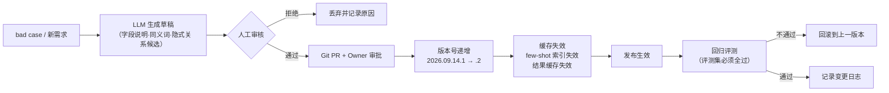

# 附录 B：语义层设计与电商指标口径字典

> 配套文档：《基于 Text2SQL 的电商数据分析 Agent 需求规格说明书》§5、§6.2、§6.12
> 版本：**v1.1**　|　日期：2026-09-15
>
> **v1.1 变更：时间口径闭环**（回应 07 技术设计窗口的转述）——
> ① `meta.fiscal_year_start_month` 标注为 **已确认**（= `1`，**自然年**）
> ② **新增 `meta.week_starts_on: "monday"`**，并关闭 §B.3.3 中"周一为起点，**需确认**"的待确认标记
> ③ 与 **PRD FR-1.2 / FR-1.3** 建立互引
>
> **⚠️ 一处事实澄清：** 07 转述称"财年定义 6 份上游文档全都没有" —— **不准确**。本附录 §B.1.2 **原本就有 `fiscal_year_start_month` 字段**。**真实缺口是"已定义但未闭环、且与 FR-1.2/1.3 无互引"**。故本次只做**闭环**（确认取值 + 补周起点 + 建互引），**未新增重复定义** —— 遵守"同一事实不写两遍"的维护原则。

---

## B.0 为什么这一层是项目成败的地基

**核心命题：没有口径字典，系统不是"不准"，而是"越准越危险"。**

用户问"上个月 GMV 是多少"。LLM 生成的 SQL 可能**语法完全正确、逻辑完全自洽、执行成功、无任何异常信号**——但它算出的数字与财务口径差 30%。系统会**带着极高的置信度交付一个错数**。

这不是模型能力问题。**模型只是不知道你的组织里"GMV"指什么。** 换更大的模型也解决不了——它没有读过你的内部文档。

行业证据（标注可信度，见 PRD §18）：
- Google 2024 研究：基于裸表生成比基于语义层生成，**准确率低约 66%**（S11，二手引用，待复核）
- Snowflake Cortex Analyst：提供维护良好的语义模型后，模糊业务问题准确率 **25% → 70%+**（S11，同上）
- Oracle 官方实践文：把 LLM 类比为"一个懂 SQL 但完全不懂你业务的新员工"（S9，一手）

**结论：语义层不是优化项，是 P0 地基。**

---

## B.1 语义包（Semantic Bundle）设计

### B.1.1 定位

| 项 | 说明 |
|---|---|
| 载体 | 版本化 YAML 文件，纳入 Git |
| 版本号 | `YYYY.MM.DD.N`，如 `2026.09.14.1` |
| 作用 | **运行时唯一允许检索和使用的上下文来源** |
| 准入 | 未进入语义包的资产，模型**不可检索、不可引用、不可生成** |
| 发布 | 人工审批。**禁止 LLM 自动发布语义**，LLM 只能产出待审草稿 |

### B.1.2 完整结构示例（带逐字段注释）

```yaml
# ============================================================
# 语义包 v2026.09.14.1
# Owner: data-team  审批: 待签  生效: 2026-09-14
# ⚠️ 任何修改必须走 PR + 审批；版本递增后缓存/few-shot 索引必须失效
# ============================================================

meta:
  version: "2026.09.14.1"
  domain: ["orders", "products", "traffic"]
  dialect: postgresql
  published_at: "2026-09-14T10:00:00+08:00"
  published_by: "data-team"
  status: "candidate"          # candidate | active | deprecated
  timezone: "Asia/Shanghai"
  fiscal_year_start_month: 1    # 财年起始月（1 = 自然年）。✅ 已确认（PRD §17.1 / FR-1.3）
  week_starts_on: "monday"      # 周起点 = 周一（中国电商惯例）。✅ 已确认；决定"本周/上周"的解析边界（见 §B.3.3）

# ---------- 1. 认证资产（只有这些可被检索） ----------
assets:
  - logical_name: order_paid
    physical_asset: v_order_paid          # 认证逻辑视图，非裸表
    grain: sub_order                      # 粒度：子订单
    domain: orders
    owner: data-team
    certified: true
    freshness_sla: "PT6H"                 # ISO 8601 duration，6 小时
    level: hot                            # hot=当日可用 | warm | cold
    row_estimate: 42000000
    description: "已支付子订单事实表。默认已剔除取消/测试单。"
    # ⚠️ 字段级注释：这是模型理解列语义的主要依据
    columns:
      - name: sub_order_id
        type: text
        comment: "子订单号，主键"
        synonyms: ["子订单号", "订单号"]
      - name: order_id
        type: text
        comment: "父订单号（一个订单可含多个子订单）"
      - name: shop_id
        type: text
        comment: "店铺 ID"
      - name: sku_id
        type: text
        comment: "SKU 唯一标识，最小销售单元"
        synonyms: ["SKU", "单品", "货品"]
      - name: spu_id
        type: text
        comment: "SPU 标准产品单元（同款不同规格共用）"
        synonyms: ["SPU", "产品", "款"]
      - name: category_l1
        type: text
        comment: "一级类目名"
      - name: pay_amount
        type: numeric
        comment: "实付金额（含运费，扣除优惠后）"
        unit: CNY
      - name: freight_amount
        type: numeric
        comment: "运费"
        unit: CNY
      - name: pay_time
        type: timestamptz
        comment: "支付完成时间。**这是 GMV 的时间基准**"
        time_semantics: transaction_time
      - name: create_time
        type: timestamptz
        comment: "下单时间。**不要用于 GMV 统计**"
        time_semantics: transaction_time
      - name: pay_status
        type: text
        comment: "支付状态"
        enum: { paid: "已支付", unpaid: "未支付" }
      - name: refund_status
        type: text
        comment: "退款状态"
        enum: { none: "无退款", partial: "部分退款", refunded: "全额退款" }
      - name: region_code
        type: text
        comment: "收货省份编码"
      - name: is_test_order
        type: boolean
        comment: "是否测试单"
      - name: receiver_phone
        type: text
        comment: "收件人手机号"
        sensitive: pii_phone            # ⚠️ 敏感列标记

  - logical_name: product
    physical_asset: v_product
    grain: sku
    domain: products
    owner: data-team
    certified: true
    freshness_sla: "PT24H"
    columns:
      - name: sku_id
        type: text
        comment: "SKU 唯一标识"
      - name: sku_name
        type: text
        comment: "商品标题"
      - name: category_l1
        type: text
        comment: "一级类目"
      - name: list_price
        type: numeric
        comment: "标价（吊牌价，非成交价）"
        unit: CNY
      - name: cost_price
        type: numeric
        comment: "成本价"
        unit: CNY
        sensitive: internal_cost        # ⚠️ 按角色屏蔽
      - name: on_sale
        type: boolean
        comment: "是否在架"
      - name: launch_date
        type: date
        comment: "上架日期"

  - logical_name: traffic_daily
    physical_asset: v_traffic_daily
    grain: sku_day_channel
    domain: traffic
    owner: data-team
    certified: true
    freshness_sla: "PT12H"
    columns:
      - name: stat_date
        type: date
        comment: "统计日期"
      - name: sku_id
        type: text
      - name: channel
        type: text
        comment: "流量渠道"
        enum: { search: "搜索", feed: "推荐", live: "直播", direct: "直接访问", ad: "付费广告" }
      - name: uv
        type: bigint
        comment: "独立访客数（按用户去重，自然日窗口）"
        synonyms: ["UV", "访客数", "独立访客"]
      - name: pv
        type: bigint
        comment: "页面浏览量（不去重）"
      - name: cart_add_cnt
        type: bigint
        comment: "加购次数"
      - name: order_cnt
        type: bigint
        comment: "支付订单数"
      # ⚠️ 转化率不存成列！由 metric 定义，避免口径分裂
    # ⚠️ 注意：转化率不在此列出，因为它必须由 metric_def 统一定义

# ---------- 2. 指标定义（唯一权威口径） ----------
metrics:
  - name: gmv
    display_name: GMV
    domain: orders
    expression: "SUM(order_paid.pay_amount)"
    default_aggregation: sum
    unit: CNY
    owner: finance
    definition_note: >
      口径：按下单支付时间（pay_time）统计；含运费；
      剔除全额退款订单；剔除测试单。
      与财务口径的差异仅在"部分退款"处理上，本口径暂不扣减部分退款。
    default_predicates:
      - "pay_status = 'paid'"
      - "refund_status <> 'refunded'"
      - "is_test_order = false"
    time_basis: pay_time
    synonyms: ["GMV", "gmv", "成交额", "销售额", "交易额", "成交金额"]
    created_at: "2026-09-14"
    version: 1

  - name: order_cnt
    display_name: 订单量
    domain: orders
    expression: "COUNT(DISTINCT order_paid.sub_order_id)"
    default_aggregation: count_distinct
    unit: 单
    owner: operations
    definition_note: "按子订单计数；仅已支付且未取消未全额退款。"
    default_predicates: *default_order_predicates
    synonyms: ["订单量", "单量", "订单数", "成交单量"]

  - name: aov
    display_name: 客单价
    domain: orders
    expression: "SUM(pay_amount) / NULLIF(COUNT(DISTINCT sub_order_id), 0)"
    default_aggregation: ratio_of_sums
    unit: CNY
    owner: operations
    definition_note: >
      ⚠️ 高危口径。分母 = 支付子订单数（非买家数、非父订单数）。
      若业务需要"人均消费"，应使用独立指标 arpu，不要复用 aov。
    default_predicates: *default_order_predicates
    synonyms: ["客单价", "平均订单金额", "AOV"]

  - name: arpu
    display_name: 人均消费
    domain: orders
    expression: "SUM(pay_amount) / NULLIF(COUNT(DISTINCT buyer_id), 0)"
    definition_note: "分母 = 去重买家数。与 aov 不可混用。"
    synonyms: ["人均消费", "人均产出", "ARPU"]

  - name: uv
    display_name: UV
    domain: traffic
    expression: "SUM(traffic_daily.uv)"
    definition_note: "按用户去重、自然日窗口。跨日累加会重复计数，跨日应使用独立口径 uv_period。"
    synonyms: ["UV", "访客数", "独立访客"]

  - name: pay_cvr
    display_name: 支付转化率
    domain: traffic
    expression: "SUM(traffic_daily.order_cnt)::numeric / NULLIF(SUM(traffic_daily.uv), 0)"
    unit: ratio
    definition_note: "支付转化（非下单转化），分母为 UV。"
    synonyms: ["转化率", "支付转化率", "CVR"]

  - name: refund_rate
    display_name: 退款率
    domain: orders
    expression: >
      SUM(CASE WHEN refund_status = 'refunded' THEN pay_amount ELSE 0 END)
      / NULLIF(SUM(pay_amount), 0)
    unit: ratio
    definition_note: "按金额、按退款完成。若要按单量口径，使用独立指标 refund_rate_qty。"
    synonyms: ["退款率", "退货率"]

  - name: repurchase_rate_90d
    display_name: 90天复购率
    domain: orders
    expression: >
      COUNT(DISTINCT CASE WHEN cnt >= 2 THEN buyer_id END)
      / NULLIF(COUNT(DISTINCT buyer_id), 0)
    window: "90 days"
    definition_note: "90 天内购买 ≥ 2 次；不含首单口径。周期固定为 90 天，不接受运行时改窗口。"
    synonyms: ["复购率", "回购率"]

  - name: sell_through_rate
    display_name: 动销率
    domain: products
    status: draft                      # ⚠️ draft 状态不可被检索使用
    definition_note: "口径待业务确认（观察周期、分母是否含下架商品）。确认前不对外开放。"

# ---------- 3. 维度与层级 ----------
dimensions:
  - name: region
    binding: order_paid.region_code
    hierarchy: [country, region, province, city]
    value_map:
      "华东": ["310000", "320000", "330000", "340000", "350000", "360000", "370000"]
      "华南": ["440000", "450000", "460000"]
      "华北": ["110000", "120000", "130000", "140000", "150000"]
      "华中": ["410000", "420000", "430000"]
      "西南": ["500000", "510000", "520000", "530000", "540000"]
      "西北": ["610000", "620000", "630000", "640000", "650000"]
      "东北": ["210000", "220000", "230000"]
    note: "⚠️ 大区映射是业务约定，不是数据库字段。必须走 value_map，禁止让模型猜。"

  - name: category
    binding: order_paid.category_l1
    hierarchy: [category_l1, category_l2, category_l3]

  - name: channel
    binding: traffic_daily.channel
    note: "枚举值见 traffic_daily.channel.enum"

  - name: time
    bindings:
      day: pay_time
      week: pay_time
      month: pay_time
    note: "⚠️ GMV 的时间维度必须绑定 pay_time，不得用 create_time"

# ---------- 4. 字段绑定（唯一性保障 —— 核心机制） ----------
field_bindings:
  - concept: customer_name
    canonical_asset: dim_customer.name
    time_semantics: current
    note: "当前客户名称（主数据现值）"
    alternatives:
      - asset: order_paid.buyer_name_snapshot
        use_when: transaction_snapshot
        note: "下单当时客户名称（历史快照）"

  - concept: 城市
    # ⚠️ 这是一个"故意保留歧义"的例子：两个绑定都合法 → 必须触发澄清
    ambiguous: true
    candidates:
      - asset: order_paid.receiver_city
        label: 收货城市
      - asset: shop.city
        label: 店铺所在城市
    clarify_prompt: "你说的「城市」是指收货城市还是店铺所在城市？"

# ---------- 5. 允许的 Join 路径（图） ----------
joins:
  - left: order_paid.sku_id
    right: product.sku_id
    type: many_to_one
    certified_by: data-team
  - left: order_paid.region_code
    right: dim_region.code
    type: many_to_one
    certified_by: data-team
  - left: traffic_daily.sku_id
    right: product.sku_id
    type: many_to_one
    certified_by: data-team
  # ⚠️ 未列出的 Join 路径 = 禁止。防止笛卡尔积与错误关联。

# ---------- 6. 默认过滤谓词（隐式业务规则） ----------
default_predicates:
  orders:
    - id: dp_order_001
      predicate: "is_test_order = false"
      reason: "排除测试单"
      owner: data-team
    - id: dp_order_002
      predicate: "refund_status <> 'refunded'"
      reason: "GMV 口径剔除全额退款"
      applies_to: [gmv, order_cnt, aov]
    - id: dp_order_003
      predicate: "pay_status = 'paid'"
      reason: "仅统计已支付"
      applies_to: [gmv, order_cnt, aov]

# ---------- 7. 时间语义 ----------
time_semantics:
  transaction_time: "交易发生时的时间戳（pay_time / create_time）"
  current: "主数据当前值"
  period_end_snapshot: "统计期末快照"
  notes:
    - "'上个月' = 日历上月首日 00:00:00 至末日 23:59:59（Asia/Shanghai）"
    - "'近7天' = 含今天往前 7 个自然日"
    - "'618' = 2026-05-24 至 2026-06-20（含预售期）"   # ⚠️ 大促区间是业务约定
    - "'双11' = 2026-10-20 至 2026-11-11（含预售期）"
    - "'同比' = 去年同期；'环比' = 上一相邻周期"

# ---------- 8. 敏感列与脱敏策略 ----------
policies:
  - deny_columns:
      - order_paid.receiver_phone
      - order_paid.receiver_address
      - product.cost_price
    applies_to_roles: [support, marketer, finance, analyst]
    note: "敏感列不进 schema 上下文 → 模型不知道存在 → 不会生成查询"
  - mask_rules:
      - column_pattern: ".*phone.*"
        rule: "***-***-1234"
      - column_pattern: ".*email.*"
        rule: "u****@domain.com"
      - column_pattern: ".*id_card.*"
        rule: "***-**-6789"

# ---------- 9. 质量与准入门槛 ----------
quality_gates:
  min_certified: true
  max_staleness_hours: 24
  require_owner: true
  on_violation: exclude_from_context
```

### B.1.3 关键设计说明

| 设计 | 理由 |
|---|---|
| **只暴露认证逻辑视图** | 模型看不见裸表 → 从源头消除"选错表"这一失效模式 |
| **`ambiguous: true` 显式建模歧义** | 与其让模型猜，不如让系统知道"这里必须澄清" |
| **`value_map` 承载大区映射** | "华东"不是数据库字段，是业务约定，必须显式声明 |
| **`default_predicates` 承载隐式规则** | 订单状态、测试单排除这些规则不在 schema 里 |
| **转化率不存成列** | 存成列必然导致口径分裂（有人算下单转化、有人算支付转化） |
| **`status: draft` 的指标不可检索** | 口径未确认的指标上线 = 主动制造 R-1 风险 |
| **`joins` 白名单** | 未列出的路径禁止 → 防笛卡尔积与错误关联 |
| **中英双语 synonyms** | 应对 CSpider 证实的中文结构性难点（中文问题 vs 英文列名） |

---

## B.2 高危口径清单（必须逐项书面确认）

| 指标 | 分歧点 | 本项目默认 | 风险等级 |
|---|---|---|---|
| GMV | 含/不含退款；含/不含运费；下单 vs 支付时间；含/不含预售 | 按支付时间、剔除全额退款、含运费 | 🔴 高 |
| 订单量 | 含未支付/已取消；按订单 or 子订单 | 子订单、已支付未取消未退款 | 🟡 中 |
| 客单价 | 分母：订单数 / 买家数 / 子订单数 | 支付子订单数 | 🔴 高 |
| UV | 去重口径（设备/用户/会话）；时间窗口 | 按用户去重、自然日 | 🔴 高 |
| 复购率 | 30/60/90 天周期；含不含首单 | 90 天 ≥ 2 次 | 🔴 高 |
| 退款率 | 按金额 or 单量；申请 or 完成 | 按金额、退款完成 | 🟡 中 |
| 毛利率 | 成本口径（采购价/加权成本/含运费） | **待确认，P1 上线** | 🔴 高 |
| 动销率 | 观察周期；分母是否含下架 | **待确认，`status: draft`** | 🟡 中 |
| 转化率 | 分母 UV or PV；下单 or 支付 | 支付转化、分母 UV | 🔴 高 |
| 大促区间 | 618/双11 是否含预售期 | 618 = 05-24~06-20；双11 = 10-20~11-11 | 🟡 中 |

---

## B.3 同义词与黑话表（示例）

**这张表的完备度直接决定中文问答的准确率上限。** 它是"学习型资产"——每次未识别词都要回流。

### B.3.1 指标类

| 用户说法 | 映射 |
|---|---|
| GMV / gmv / 成交额 / 销售额 / 交易额 / 成交金额 / 流水 | `gmv` |
| 单量 / 订单数 / 成交单量 / 出单量 | `order_cnt` |
| 客单价 / 平均订单金额 / AOV / 件单价 | `aov`（注意：件单价 ≠ 客单价，需区分） |
| 转化率 / 转化 / CVR / 成交转化 | `pay_cvr` |
| 复购 / 回购 / 复购率 | `repurchase_rate_90d` |
| 退款率 / 退货率 / 退款占比 | `refund_rate` |
| 动销 / 动销率 | `sell_through_rate` |

### B.3.2 实体与维度类

| 用户说法 | 映射 |
|---|---|
| 品 / 商品 / 款 / 货 / SPU | `product` / `spu_id` |
| SKU / 单品 / 规格 / 颜色尺码 | `sku_id` |
| 流量 / 访客 / UV | `traffic_daily.uv` |
| 大区 / 区域 / 华东华南 | `dimensions.region` + `value_map` |
| 类目 / 品类 / 一级类目 | `category_l1` |
| 渠道 / 来源 / 流量来源 | `traffic_daily.channel` |
| 直播 / 达人 / 头部主播 | `channel = live` |
| 搜索 / 自然搜索 | `channel = search` |
| 推荐 / 猜你喜欢 / 信息流 | `channel = feed` |

### B.3.3 时间与大促类

| 用户说法 | 映射 |
|---|---|
| 今天 / 昨日 / 昨天 / 前天 | 相对日 |
| 本周 / 上周 / 这周 | 周（**起点 = 周一**，✅ 已确认；定义见 `meta.week_starts_on`） |
| 本月 / 上月 / 这个月 | 自然月 |
| 近 7 天 / 近一周 / 上周起到现在 | 滚动窗口 |
| 双11 / 十一月大促 / 双十一 | `time_semantics.notes` 中的区间 |
| 618 / 年中大促 / 618大促 | 同上 |
| 大促 / 活动期 / 促销期 | **⚠️ 歧义：需澄清是哪个大促** |
| 淡季 / 旺季 | **⚠️ 无定义 → 拒答** |

### B.3.4 商家黑话（需专门收录）

| 说法 | 含义 | 处理 |
|---|---|---|
| 坑位费 / 坑产 | 直播/资源位费用与产出 | 若无数据 → 拒答 |
| 爆款 / 主推 / 头部 | 按销量 Top-N 的俗语 | 需澄清阈值（如"指销量 Top 10 吗"） |
| 长尾 / 尾部 | 低销量商品集合 | 需澄清阈值 |
| 清仓 / 尾货 | 折扣促销商品 | 无标准字段 → 拒答或澄清 |
| 刷单 / 补单 | 虚假交易 | 无字段 → 拒答（且涉及合规） |
| 动销 | 有销量的商品占比 | 见 `sell_through_rate`（draft） |
| 兜底价 | 最低可售价 | 无字段 → 拒答 |

**处理原则：无法映射到数据资产的词，一律**拒答 + 给替代问法**，绝不近似。**

---

## B.4 语义包的生命周期



### B.4.1 版本变更影响表（**必须严格执行**）

| 变更类型 | 必失效项 | 必须重跑 |
|---|---|---|
| 指标口径修改（expression / predicates） | 结果缓存、few-shot 索引 | 全量回归评测 |
| 新增/删除资产 | schema linking 检索索引、结果缓存 | 全量回归评测 |
| 同义词表变更 | 检索索引 | 全量回归评测 |
| 时间语义变更（大促区间等） | 结果缓存（时间相关全部） | 时间相关用例回归 |
| Join 路径变更 | 结果缓存 | 全量回归评测 |
| 权限策略变更 | **审计与安全用例必须全过** | 安全用例集 |

### B.4.2 Owner 职责

| 角色 | 职责 |
|---|---|
| 指标 Owner | 定义准确性、口径争议裁决、变更审批 |
| 资产 Owner | 逻辑视图正确性、数据新鲜度、质量 |
| 平台管理员 | 发布审批、版本管理、回滚决策 |

> **没有 Owner 制度，语义层会在上线三个月内腐烂，准确率随之崩盘。** 这条是组织保障，不是流程形式。

---

## B.5 语义层落地检查清单（开发前自检）

| # | 检查项 | 通过标准 |
|---|---|---|
| 1 | 所有 P0 指标是否都有唯一权威定义？ | 是 |
| 2 | 每个指标是否都有 Owner？ | 是 |
| 3 | 是否存在"存成列"会导致口径分裂的比率型指标？ | 已全部改为 `metric_def` 定义 |
| 4 | 大区/类目等业务约定是否都进了 `value_map` / `hierarchy`？ | 是 |
| 5 | 隐式业务规则（测试单、状态过滤）是否都在 `default_predicates`？ | 是 |
| 6 | 是否存在"一词多字段"的情况？是否都标了 `ambiguous`？ | 是 |
| 7 | 所有 Join 路径是否白名单化？ | 是 |
| 8 | 敏感列是否都在 `deny_columns`？ | 是 |
| 9 | 中英双语 synonyms 是否覆盖核心概念？ | 是 |
| 10 | 大促/特殊时间区间是否明确定义？ | 是 |
| 11 | 是否有 `status: draft` 的指标混入 P0 检索？ | 无 |
| 12 | 语义包是否在 Git 中版本化？ | 是 |
| 13 | 是否已建立"未识别词 → 待补清单"的回流机制？ | 是 |
| 14 | 是否有口径争议的裁决人？ | 是 |
