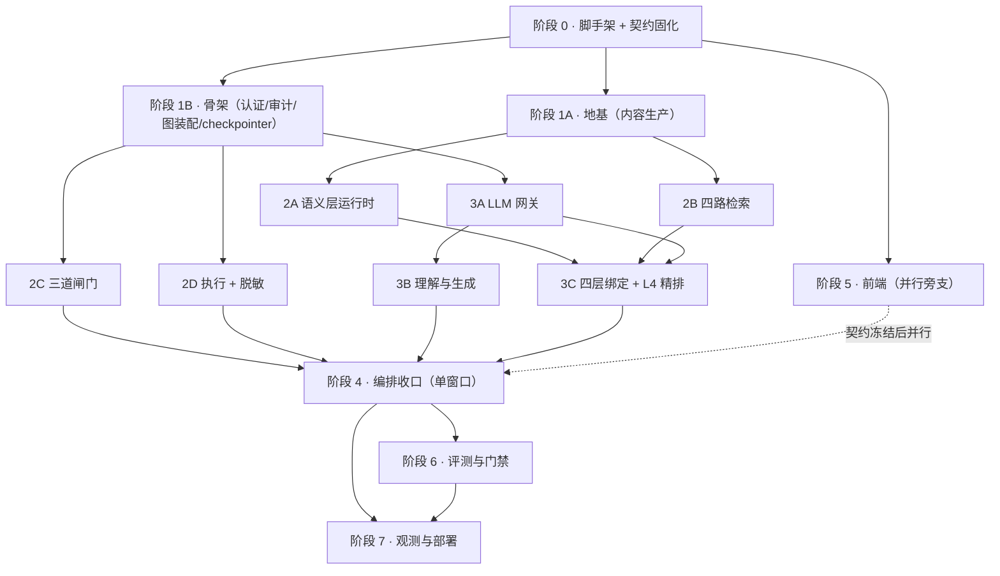

# 基于 Text2SQL 的电商数据分析 Agent
# 编程实施计划 —— 阶段划分与窗口归属

---

## 0. 文档控制

| 项 | 内容 |
|---|---|
| 文档名称 | 基于 Text2SQL 的电商数据分析 Agent —— 编程实施计划（阶段划分与窗口归属） |
| 文档版本 | **v1.4.1** |
| 文档状态 | **生效**（可作为各窗口的开工依据） |
| 日期 | 2026-09-15 初版；**2026-09-16 v1.1**（U-24 销账：§4.1 补 `data/**` 并拆细 `eval/**`；§3.2 阶段 1A 独占补 `data/**`）；**v1.2**（§6 新增"同号撞车"处置 + 提新号前先查 07 §4.8）；**v1.3**（2026-09-22：新增 `§6.4` 共享 git 索引的提交纪律 / `§6.5` "跑前 + 跑后"的前置自证 / `§6.6` `skip` 明线；W2A 的两条"待裁决"经核查为 `U-55` / `U-56` 既有裁定的漏读 ⇒ **不新开号**）；**v1.4**（2026-09-28：`§4.1` 补「归属列语义」澄清 —— 归属列 = 写权限归属、**不是作者归属**（裁 W4 `RELAY §二十.1` 的"请订正归属列"请求）；配套裁定见 07 **v1.7.3**）；**2026-10-02 v1.4.1**（§4.1 补 `tests/integration/**` 归属行 = 回验收窗口 QA 第一轮 O-4；`U-114` 行末的上游回填请求由此落点） |
| 读者 | **参与编码的每个窗口（人 / AI）** + 用户本人（作为调度者） |
| 交付路径 | `docs/08_编程实施计划_阶段划分与窗口归属.md` |
| 范围声明 | 本文件**不含业务代码实现**，也**不含技术设计内容**。只定义「工作怎么切 / 谁写哪些文件 / 每包何为完成 / 怎么排期」。 |

### 0.1 与 07 TDD 的关系（**先读这条**）

| 项 | 约定 |
|---|---|
| 本文档的性质 | **07 的配套执行文档**，不是设计文档 |
| **技术契约的归属** | 接口 / 状态机 / 规则表 / 阈值 / 决策表 —— **一律以 `07_技术设计文档_TDD.md` 为准** |
| **契约优先级** | `附录 A > PRD > 06 UI/UX > 07 TDD > 本文档`。本文档与 07 冲突 → **以 07 为准** |
| 本文档可否被推翻 | **阶段划分可以调**（排期是工程判断）；**§4 文件归属权表不可破坏**（它是防撞车的唯一机制） |
| 不重复原则 | 本文档**不复制** 07 的任何表格（规则表、决策表、字段表），只**引用其章节号** |

### 0.2 本文档要解决的一个具体问题

**已发生过的教训**（文档阶段实证）：同一份文件被两个窗口编辑，**即使两边都对，也会产生自相矛盾** —— `06` 曾被上游窗口改了一半，导致"§9.5 把 B-12 标为已关闭，同一节末尾仍写'联调第一天必须对齐'"。

编码阶段这种撞车代价更高：**不是文档不一致，是编译不过、是接口对不上、是两套实现**。因此本文档把「**独占文件**」提升为与「**可验收**」并列的切分条件。

---

## 1. 切分依据

### 1.1 两条硬条件（缺一不可）

| # | 条件 | 不满足的后果 |
|---|---|---|
| **①** | **能独立验收**（有明确 DoD） | 无法判断"做完了没"，包会无限膨胀 |
| **②** | **能独占文件**（有明确目录边界） | 多窗口同时写同一文件 → 冲突或两套实现 |

> **推论**：按"功能模块"切是错的（一个包做"全部闸门 + 执行"既写不深也测不严）；按"技术层"切也是错的（前端窗口会被后端空接口长期阻塞）。**正确的切口在"契约边界"上** —— 一个包的产物是一个**可被独立测试的契约实现**。

### 1.2 反面切法（明确不要）

| # | 反面切法 | 后果 |
|---|---|---|
| 1 | 按**层**切（一个前端窗口 + 一个后端窗口） | 前端被后端空接口长期阻塞；后端内部无并行度 |
| 2 | 按**功能模块**切（一个窗口做全部闸门 + 执行） | 单窗口过重，包内无法并行；且"能不能跑"与"跑得安全"两件事混在一起 |
| 3 | 让某窗口**"顺便"改共享文件** | **必然撞车**（文档阶段已实证）。共享文件必须单窗口所有 |
| 4 | **先做前端** | 契约未冻结 → 必返工（PRD §8.6.3 已规定"接口未冻结前前端不得开工对应页面"） |

### 1.3 规模

| 项 | 值 |
|---|---|
| 阶段数 | **8**（阶段 0 – 阶段 7） |
| 工作包数 | **14** |
| 并发窗口峰值 | **3–4** |
| 关键路径 | 阶段 **0 → 1 → 2 → 3 → 4 → 6 → 7** |
| 前端 | **并行旁支**（阶段 5），不占关键路径 |

---

## 2. 阶段总览

### 2.1 八阶段 / 十四工作包

| 阶段 | 工作包 | 并发窗口数 | 一句话 |
|---|---|---|---|
| **0 脚手架 + 契约固化** | W0 | 1 | 目录 / 依赖白名单 / **三个单一真相文件** / **契约 CI** / 三探针空实现 |
| **1 地基 ∥ 骨架** | W1A 地基（内容）· W1B 骨架（代码） | **2** | 语义包 + 合成数据 + 冻结集 **∥** 认证 + 审计 + 图装配 + checkpointer |
| **2 确定性核心** | W2A 语义层 · W2B 检索 · W2C 闸门 · W2D 执行脱敏 | **4** | 全部确定性模块（**禁依赖 LLM**） |
| **3 LLM 链路** | W3A 网关（先行）· W3B 理解生成 · W3C 绑定精排 | **3** | 网关先行，否则后两包只能拿桩写 |
| **4 编排收口** | W4 | **1** | 图接线 / 条件边 / 事件发射 / 版本固定 —— **必须单窗口** |
| **5 前端（旁支）** | W5 | 1 | 5 页 + SSE 客户端；**只依赖阶段 0 的契约冻结** |
| **6 评测与门禁** | W6 | 1 | 复用在线 `guard`/`exec`；分层网格 + G-1…G-8 + 沙箱缺口表 |
| **7 观测与部署** | W7 | 1 | 指标 / 看板 / 告警 / 压测 / 优雅停机 / runbook |

### 2.2 依赖关系



### 2.3 与 07 §19 / PRD §15 的映射（**防两套编号打架**）

| 本文档 | 07 §19 / PRD §15 的 P0 编号 | 说明 |
|---|---|---|
| 阶段 0 | （07 §19.3 中并入 P0-2） | 07 未单列脚手架；本文档把它单列，因为它有独立 DoD 与独占文件 |
| 阶段 1A | **P0-1 地基** | PRD §15 判定其"**最关键，绕不过**"，占比 30% |
| 阶段 1B | **P0-2 骨架** | 含 07 §16.3 的 **T-A1 压测**（架构级未知） |
| 阶段 2A / 2B | **P0-3 检索** | 2A 语义层运行时在 07 中属 P0-1/P0-2 之间，本文档归入阶段 2 以保独占 |
| 阶段 2C / 2D | **P0-5 闸门** / **P0-6 执行与呈现**（执行部分） | — |
| 阶段 3 | **P0-4 生成** + LLM 网关 | 07 未单列网关；它必须先于生成 |
| 阶段 4 | 跨 P0-4→P0-6 的接线 | 本文档单列，因其为**汇合点** |
| 阶段 5 | **P0-7 前端** | — |
| 阶段 6 | **P0-8 评测** | — |
| 阶段 7 | **P0-9 可观测** + 部署 | — |

> **规则**：**PRD §15 的 P0-1…P0-9 是需求侧的阶段划分，本文档是执行侧的窗口划分**，二者是**多对多映射**，不是替代关系。汇报进度时**两个编号都要给**（如"阶段 2C 完成 = P0-5 完成"）。

### 2.4 关键路径

**关键路径 = 阶段 0 → 1 → 2 → 3 → 4 → 6 → 7**

**两条必须记住的结论：**

| # | 结论 |
|---|---|
| 1 | **单人项目里，除前端外后端全部在关键路径上，没有可省的阶段** —— 所谓"并行"只发生在**阶段内部**（1 可 2 包、2 可 4 包、3 可 3 包），不是阶段之间 |
| 2 | **阶段 1A 地基在关键路径上，但它不依赖任何工程产出**（是内容生产）→ 因此**必须与阶段 0 同时启动**，而不是"等脚手架搭完再做" |

---

## 3. 阶段详解

> **每个阶段统一四栏**：产出 / 独占文件 / DoD / 必读章节。**"必读章节"指 07 TDD 的章节号**，开工前必须读。

### 3.1 阶段 0 · 脚手架 + 契约固化

**落地清单（精确到文件）：**

```
backend/
├── pyproject.toml                      # 依赖白名单（07 ADR-20）+ pytest / import-linter 配置
├── .importlinter                       # R-DEP-1（分层）/ R-DEP-2（确定性模块禁 import llm）
├── app/
│   ├── core/
│   │   ├── config.py                   # pydantic-settings，启动即校验（07 §18.4）
│   │   ├── clock.py                    # 唯一时间来源（07 N-18）
│   │   ├── errors.py                   # 内部异常基类（不含 HTTP 语义）
│   │   ├── enums.py                    # ★ stage 6 值 / 错误码 28 值 / reason / action_taken / chart_type
│   │   └── contracts.py                # ★ 跨模块 Protocol（端口定义）
│   ├── cache/keys.py                   # ★ 缓存键唯一构造入口（07 §11.2）
│   ├── obs/{logging,trace,metrics,audit}.py
│   ├── api/
│   │   ├── routers/health.py           # /healthz/live · /ready · /healthz（空实现三探针）
│   │   ├── sse.py                      # SSE 编码器（唯一产出 event/data 帧处）
│   │   └── errors.py                   # 异常 → 附录 A §A.11 错误码的唯一映射点
│   ├── repo/dsn.py                     # 两套 DSN（metadata R/W + analytics RO）
│   └── {semantics,retrieval,binding,planner,guard,exec,mask,llm,graph,auth}/__init__.py
├── tests/{unit,contract,integration,graph_snapshot,redteam}/__init__.py
└── .github/workflows/ci.yml            # 契约断言 / import-linter / gitleaks
deploy/{docker-compose.yml,nginx.conf,.env.example}
```

**★ 标记的三个文件是本阶段最重要的产出**：`core/enums.py`、`core/contracts.py`、`cache/keys.py`。后续**每一个**窗口都要 import 它们 —— **晚立一天，冲突概率涨一分**。

| 项 | 内容 |
|---|---|
| **DoD** | ① `docker compose up` 后 `/healthz/live` 返回 **200**、`/healthz/ready` 返回 **503**（硬依赖未接，这是**正确**行为）② **故意写一个违规 import（让 `guard` import `llm`）→ CI 必须失败** ③ 契约断言集**可以是空的，但必须能跑通** ④ `gitleaks` 无命中 |
| **独占** | 上述全部文件 |
| **必读** | 07 §1（N-01…N-27）、§3.2（目录树）、§3.3（两套 DSN）、§4.2（六步断言）、§18.4（启动校验） |
| **不做什么** | 不写任何业务逻辑；节点与模块目录只放 `__init__.py` |

### 3.2 阶段 1A · 地基（**内容生产，不是编码**）

| 项 | 内容 |
|---|---|
| **产出** | ① 3 域语义包 v1 YAML（交易订单 / 商品 / 流量）② 合成数据集生成脚本 + 数据 ③ 指标口径字典 ④ **冻结评测集 v1**（4×3 分层 + 争议集 + 拒答集）⑤ **红队用例集 v1** ⑥ few-shot Gold Query 种子 |
| **独占** | `semantic/**`、`data/**`（DDL + 生成器 + 沙箱库）、`eval/` 下的**内容资产与其生产脚本**（`case_library.py`/`build_*.py`/`dataset_v1_frozen.json`/`red_team_cases_v1.json`/`gold_query_seed_v1.json`/`MANIFEST_v1.json`）—— **用词订正（U-24）**：原写"数据生成脚本"，未覆盖 `data/**` 整目录 |
| **DoD** | ① 语义包通过 07 §6.1 的**五步校验** ② 冻结集含 `content_hash`（N-13）③ **4×3 网格每格 ≥ 8 条** ④ **红队集覆盖 07 §7.8 的全部 20 条 AST 规则 + 跨租户 + truncated 专项（SQL 层）**；⚠️ **"RLS 专项"拆归 W6**（v1.2 裁定，W1A §10 自纠成立：沙箱是 SQLite **物理无 RLS**，该子项在 W1A 环境不可满足；RLS 用例需 W1B 迁移落地后由 W6 在 PG 侧做） ⑤ `default_binding` 与别名表就位（**L1/L3 层依赖它**）⑥ 维度含 `grain_level`（**L2 层依赖它**） |
| **必读** | 07 §6.1 / §6.8（L1/L3 需要什么字段）、§12.2；附录 B；附录 C |
| **为什么必须与阶段 0 同时启动** | 它是**内容生产**，不依赖任何工程产出；但**在关键路径上** —— 阶段 2A/2B 以它为输入 |

### 3.3 阶段 1B · 骨架（编码）

| 项 | 内容 |
|---|---|
| **产出** | ① 认证链路（07 §13.1 七步）② `TrustedContext`（不可变）③ 审计两段式（07 §12.4 的**四重保证**）④ 图装配骨架（节点用桩）⑤ checkpointer + **三池独立** ⑥ 会话串行锁（07 §9.3）⑦ 限流分桶（07 §9.2） |
| **独占** | `auth/`、`repo/`（含 migrations）、`graph/build.py`、`graph/state.py` |
| **DoD** | ① 空链路（桩节点）可跑通 ② **`/healthz/ready` 的就绪判定（v1.2 裁定，U-40）**：`semantic_bundle_loaded` 是**硬依赖**，在 1A 交付语义包前**物理无法转 200** → 本条记为 **「被 1A 阻塞 = 阶段性达成」**：其余 3 个硬依赖探针为 true、且 503 的 `checks` 明确只差语义包一项，即视为达成；**转 200 随 W2A 交付自然发生，不作为 1B 的未决债**（用户 1.b 口头裁定的落笔）③ **⭐ 20 并发压测确认 checkpoint 池行为（T-A1）** ④ 三池互不串用 ⑤ 以 `app_rw` 身份 `UPDATE`/`DELETE` 审计表**必须失败** |
| **必读** | 07 §5.5（检查点）、§9.2–9.3（限流与锁）、§12.4（审计）、§13.1（认证）、§16.3（连接池算数）、§18.2（三探针） |
| **⭐ T-A1 为什么必须在这里做** | 07 §16.3 的算数推不出来"checkpoint 是每节点短持还是整 run 长持"。若长持 → 50 并发 = 50 个长持连接 → **连接池模型乃至实现方式要改**。**放这里做的成本是半天；放到最后发现是改架构。** |

### 3.4 阶段 2 · 确定性核心（4 包并行）

| 包 | 独占 | DoD | 必读 |
|---|---|---|---|
| **2A 语义层运行时** | `semantics/` | ① §6.1 五步校验 ② §6.2 **单键指针原子切换** + 旧版本回滚可用 ③ **一致性测试：应用白名单 == DB 实际 GRANT/POLICY**（ADR-10） | §6.1–6.2 / §12.2 / §13.3 |
| **2B 四路检索** | `retrieval/` | ① **分词两侧同源（N-24：同文本两条路径产出同一 `tsvector`）** ② 检索黄金集 recall 报告 ③ **降级路径可触发**（停 Ollama → `sparse_only` + `degraded` 事件）④ RRF 融合 + 降级权重重分配为确定性 | §6.3–6.7 |
| **2C 三道闸门** | `guard/` | ① **红队集全绿 = 危险 SQL 放行 0** ② 每条规则的**可解释文案不泄露表名** ③ `rule_id` 进 `gate_detail` ④ gate3 阈值表可配置 | §7 全章 |
| **2D 执行 + 脱敏** | `exec/`、`mask/` | ① 类型归一化表**逐条**测试（含 `numeric` 保精度、超 `2^53` 转字符串、`NaN`→`null`、`bytea` 不返回）② `deny` 与 `mask` 两套语义分离 ③ **以 `app_ro` 尝试写操作必须失败**（N-02）④ `truncated` 只由 LIMIT 触发 | §8 / §12.3 |

**2C 与 2D 必须分窗口**：一个管"能不能跑"，一个管"跑得多安全"。合成一包会既写不深也测不严。

### 3.5 阶段 3 · LLM 链路（3A 先行）

| 包 | 独占 | DoD | 必读 |
|---|---|---|---|
| **3A 网关**（**先行**） | `llm/` | ① 按模型的 `asyncio.Semaphore`（**并发非 QPS**）② 退避 / 熔断 / 预算熔断 ③ **出站白名单断言：录制 payload 不含任何明细键与值**（N-12）④ 前缀缓存布局（稳定内容前置）⑤ `prompt_version` 必录（N-19） | §10 全章 |
| **3B 理解与生成** | `planner/` | ① **合并调用后的延迟实测**（`normalize`+`intent`、`plan`+`gen_sql`，见 §16.1）② JSON 修复 1 次后降级 ③ 注入防护（分隔符 + 声明） | §5.3（节点 2/3/5）、§16.1 |
| **3C 四层绑定 + L4 精排** | `binding/` | ① **四层判定四态可观测**（`binding_state` + `binding_layer` 双双落库）② **L4 fail-safe：解析失败 / 分差落在 τ 邻域 → 必判 `ambiguous`**（N-27）③ τ/ε 校准脚手架（含 E-5：**n ≥ 3 排名一致性 + 分差 std**）④ `RerankScore` 类型不接受裸 `float` | §6.8 全节、§12.9（PRD） |

**3A 不做完，3B/3C 只能拿桩写** —— 最后还要返工。

### 3.6 阶段 4 · 编排收口（**必须单窗口**）

| 项 | 内容 |
|---|---|
| **产出** | ① `graph/nodes/` 接线（16 个节点）② `graph/edges.py` 条件边（含 `route_terminal` 幂等收口）③ **`graph/events.py`**（17 个事件 + `terminal` 唯一性保证）④ 版本固定（会话级）⑤ 两段审计接线 ⑥ 每节点超时与失败转移 |
| **独占** | `graph/`（全部）、`api/routers/` 的 SSE 端点 |
| **DoD** | ① **SSE 转录测试覆盖全部出口路径，并断言"恰有 1 个 `terminal:true`"**（N-08）② 07 §14.3 的 **8 条事件序列约束全绿** ③ `stage` 取值只有 6 个（枚举校验）④ 07 §14.2 的 A–H 八组决策表逐行有对应测试 |
| **必读** | §5 全章、§14.2–14.3 |
| **为什么必须单窗口** | 它是**所有模块的汇合点**，多窗口改这一处必然撞车 |

### 3.7 阶段 5 · 前端（并行旁支）

| 项 | 内容 |
|---|---|
| **产出** | 5 页（登录 / 会话问答 / 口径字典 / 评测运行列表 / 评测报告）+ SSE 客户端 + 14 个组件 |
| **独占** | `frontend/**`（全部） |
| **DoD** | ① SSE 跨 chunk 半行缓冲 / 心跳忽略 / **`terminal` 唯一判据** ② `truncated` 不被静默丢弃 ③ 前端零判断权（图表类型 / 口径 / 脱敏值全部来自后端）④ 06 §14.2 的 QA Checklist 全过 |
| **必读** | 06 全文、附录 A §A.1.2–A.1.5 |
| **依赖** | **只依赖阶段 0 的契约冻结** → 可与阶段 1–4 并行 |

### 3.8 阶段 6 · 评测与门禁

| 项 | 内容 |
|---|---|
| **产出** | ① 评测执行器（**必须 import 在线 `guard`/`exec`，不另写一套**）② 结果集等价判定（含浮点容差 / 舍入 / 列序归一化规则）③ 4×3 分层网格 + 归因分布 ④ G-1…G-8 判定 ⑤ **沙箱能力缺口表** |
| **独占** | `eval/`（执行器部分，不含数据集） |
| **DoD** | ① 能产出「评测报告 + 门禁判定」② 报告**必须含未覆盖项声明**（07 §17.4）③ τ 变更必须附校准报告（N-25） |
| **必读** | §17 全章、附录 C |

### 3.9 阶段 7 · 观测与部署

| 项 | 内容 |
|---|---|
| **产出** | ① 指标接入（§15.3 清单 + **标签基数上限**）② 看板 ③ 告警规则 ④ 压测（§16.5 四场景）⑤ 优雅停机 ⑥ runbook 六条 ⑦ 启动校验全量 |
| **独占** | `obs/`（指标部分）、`deploy/` |
| **DoD** | ① **四场景压测通过 + P95 达标** ② runbook 六条可执行 ③ `/healthz` 三探针语义正确（**软依赖失败必须 200 + degraded**） |
| **必读** | §15 / §16.5 / §18 全章 |

---

## 4. 文件与目录归属权表（**本文档的核心资产**）

> **规则**：下表"归属窗口"列是**唯一可落笔者**。其他窗口需要变更时，**只能向归属窗口提需求（或由用户转达），不得直接落笔**。

### 4.1 后端目录

| 路径 | 归属 | 备注 |
|---|---|---|
| `backend/pyproject.toml`、`.importlinter`、`.github/**` | **W0** | 依赖白名单变更需登记 ADR-20 |
| `app/core/**`（含 `enums.py` / `contracts.py`） | **W0** | ★ **最高冲突风险**：所有窗口都依赖 |
| `app/cache/keys.py` | **W0** | ★ 键构造唯一入口 |
| `app/obs/**` | **W0（骨架）→ W1B（`audit.py`）→ W7（指标）** | **v1.2 追认（U-43）**：`audit.py` 由 W1B 依用户裁定 2.b/3.a（= 07 §12.4.1 的 U-18 裁定）实现，**追认归 W1B**；W0 只留骨架位，**不得两边各留一份**。指标/采样器仍归 W7 |
| `app/api/errors.py`、`app/api/sse.py` | **W4**（接口由 W0 定骨架） | 错误码映射与帧格式唯一入口 |
| `app/api/routers/health.py` | **W7** | 三探针 |
| `app/api/routers/**`（其余） | **W4** | 端点实现 |
| `app/api/deps.py`、`app/api/ratelimit.py` | **W1B（骨架）→ W4** | **v1.2 补登记（U-42）**：运行时装配 / 限流拦截 / 会话锁守卫由 W1B 建；阶段 4 W4 在其上扩展。**整体移交，不得两边各留一份**（W1B 已在文件头注明） |
| `app/auth/**`、`app/repo/**` | **W1B** | 含 migrations |
| `app/graph/**` | **W4** | 全部 |
| `app/semantics/**` | **W2A** | — |
| `app/retrieval/**` | **W2B** | 含 `tokenizer.py` 唯一入口 |
| `app/guard/**` | **W2C** | 含 `rules.py` 唯一入口 |
| `app/exec/**`、`app/mask/**` | **W2D** | — |
| `app/llm/**` | **W3A** | 含 prompts 目录 |
| `app/planner/**` | **W3B** | — |
| `app/binding/**` | **W3C** | 含 `four_layer.py` |
| `frontend/**` | **W5** | 全部 |
| `eval/**`（**执行器**：跑评测、等价判定、出报告） | **W6** | **与"内容资产"分界见下一行** |
| `semantic/**`、`data/**`、`eval/case_library.py`、`eval/build_*.py`、`eval/dataset_v1_frozen.json`、`eval/red_team_cases_v1.json`、`eval/gold_query_seed_v1.json`、`eval/MANIFEST_v1.json` | **W1A** | **内容资产与其生产脚本**（语义包 / 沙箱 DDL 与生成器 / 用例库 / 冻结集 / 红队集 / 证据链）。<br>**分界规则**：`eval/` 下"**生产数据集与红队集的脚本与产物**"归 W1A；"**运行评测并出报告的代码**"归 W6 |
| `deploy/**` | **W7** | — |
| `app/main.py`、`app/cache/session_lock.py`、`backend/alembic.ini`、`backend/scripts/**` | **W1B** | **v1.2 补登记（U-42）**：`main.py` 是**组装根**（lifespan 六步由 W1B 落）——W4/W7 扩展时**在该文件追加**，**不得另立第二个组装根**；`session_lock.py` 是会话锁唯一实现；`alembic.ini` **刻意不含默认 DSN**（U-45）；`scripts/**` 是探针/断言脚本 |
| `backend/reports/**` | **各报告的产出窗口，按子目录划分** | **v1.2 补登记（U-42）**：`w1a/`→W1A｜`w1b/`→W1B｜`t-a1/`→W1B｜`arch/`→架构窗口。**只写自己子目录** |
| `tests/unit/**` | **随被测模块** | 谁写模块谁写单测 |
| `tests/contract/**`、`tests/graph_snapshot/**`、`tests/redteam/**` | **W4**（redteam 与 W2C 共建） | — |
| `tests/integration/**` | **随被测模块**（跨模块共享 harness `tests/integration/_env_dsn.py` = **W2A 建、W0 管形状守卫**） | **v1.4.1 补登记（回 QA 第一轮 O-4；`U-114` 行末那条上游回填请求此前无处可落）**：规则与 `tests/unit/**` 同规 —— 集成测试跟着它验的模块走（现测提交分布 = w1b 6 / w2a 4 / w2b 2 / retrieval 2 / w2d 1 / stage0 1）；⚠️ **禁「谁都能往这棵树下加文件」** —— 新增文件必须在同一笔里点名归属窗口。🔴 运行期 DSN 只许来自环境变量或显式参数（缺 env = 具名 fail、禁 skip、禁字面默认串）：见 `U-114` 防线①② 与 **`U-133`**（探针面）；守卫扫描面此前只覆盖 `tests/integration/**`，扩面归 W0。⚠️ 另一处漂移（**归总控裁**，架构不擅改别窗行）：下一行 `tests/contract/**` 表上写 **W4**，而 git 现测提交分布 = w4 19 / w0 6 / w7 4 / w2b 2 / w2a 2 / retrieval 2。 |

> **归属列语义（v1.4 新增，架构裁定 W4 `reports/w4/RELAY.md §二十.1`）**：本表的"归属"列 = **谁有权写这棵子树（写权限归属）**，**不是"这一行代码是谁打的"（作者归属）**。⇒ **跨窗口代写不改本表**，包括两种既有形态：① `§6.4` 记的"卷入"（无意，须具名更正）；② `U-124` 起的"**牵头窗口 + 其余当轮复核**"同批（有意，`07 v1.7.2` 已追认）。**作者归属的凭据 = 该 commit 的 message + 写者窗口的 RELAY 行**，`§6.4` 要求的 `git show --stat` 复核就是它的机械读法。<br>⚠️ **不要把本表改成作者归属表**：那会与本文件"目录 → 窗口"的用途（防冲突、判定越界）互相抵消，且作者信息 git 已经有了、抄进表里必然过期。**今后凡"请订正 `§4.1` 归属列以反映真实作者"的请求，一律指回本段，不改表。**

### 4.2 文档

| 路径 | 归属 |
|---|---|
| `docs/01`–`docs/05` | **PRD 窗口** |
| `docs/06` | **UI 窗口** |
| `docs/07` | **架构窗口** |
| `docs/08`（本文档） | **架构窗口** |
| `README.md` | **上游窗口**（见 §8） |

### 4.3 共享文件的变更流程（**四步，不许跳**）

```
① 需求方在本窗口内记录：要改哪个符号 / 为什么 / 影响哪些调用点
② 转达给归属窗口（或由用户转达）
③ 归属窗口改，并同步更新 07 的对应章节号（如有契约变化 → 走 U-xx 或 C-xx）
④ 需求方 rebase 后重跑测试
```

**禁止**：需求方自行加一个"临时兼容分支"或复制一份常量到自己模块 —— **那等于制造第四个"真相"**。

---

## 5. 排期与窗口分配

### 5.1 六段排期

| 段 | 窗口分配 | 说明 |
|---|---|---|
| 第 1 段 | **W0 脚手架** ∥ **W1A 地基** | ⭐ **两个窗口同时开** —— 地基不依赖工程产出，且它在关键路径上 |
| 第 2 段 | W0 转 **W1B 骨架** ∥ W1A 继续地基 | 骨架的 DoD 含 **T-A1 压测** |
| 第 3 段 | **4 个窗口**：W2A / W2B / W2C / W2D | 阶段 2 是并行度最高的一段（全是确定性模块，边界清晰） |
| 第 4 段 | **3 个窗口**：W3A →（W3B ∥ W3C）；**同时启动 W5 前端** | 3A 必须先出，否则 3B/3C 拿桩写 |
| 第 5 段 | **单窗口 W4**（其余窗口停手，或只写测试） | 汇合点，必须独占 |
| 第 6 段 | **W6 评测** ∥ **W7 观测部署** | 收尾两包并行 |

### 5.2 并发上限与其理由

| 阶段 | 上限 | 理由 |
|---|---|---|
| 1 | 2 | 一个内容生产 + 一个编码，边界天然清晰 |
| 2 | **4** | 四个包都依赖阶段 1A/1B 的**稳定接口**，且彼此零交互 → 最适合并行 |
| 3 | 3 | 3A 是前置，实际并发是 3B ∥ 3C |
| **4** | **1** | **汇合点**；多窗口碰 `graph/` 必然冲突 |
| 5 | 1 | 前端内部耦合高（共享 store 与组件库） |

### 5.3 每个窗口的"开工三件套"

1. **读**：本包的「必读章节」+ 07 §1（不可协商项）+ 07 §3.2（目录树）
2. **认领**：确认自己的独占路径（§4），并确认**不碰共享文件**（`core/enums.py` / `core/contracts.py` / `cache/keys.py`）
3. **对齐**：若发现 07 的契约有缺口 → **写 `U-xx` 或 `C-xx` 登记**，按 07 §4.3/§4.6 的机制走，**不得自行发明字段**

---

## 6. 交接纪律

### 6.1 交付前自检（逐条打勾，未过不得交接）

| # | 检查 |
|---|---|
| 1 | 有对应单元测试，且**确定性模块的测试不依赖网络**（N-01） |
| 2 | 涉及端点/字段/枚举的，有对应 §4.2 契约断言 |
| 3 | 涉及链路的，有 SSE 转录测试覆盖其出口路径 |
| 4 | 涉及判定的，有**负向用例**（不只测"对"，还测"拒绝"） |
| 5 | 新增配置项进入 07 附录 6，且有启动期校验 |
| 6 | 新增指标/日志字段进入 07 §15.1 / §15.3 |
| 7 | 若引入新依赖 → 必须在 07 ADR-20 白名单登记 |

（以上即 07 §17.5 的 DoD，此处只是把它变成交接前的自检动作。）

### 6.2 收尾动作

| 动作 | 位置 |
|---|---|
| 勾选本阶段 DoD | 本文档 §3 对应行 |
| 记录实测数据（如 T-A1 的压测结论、τ 校准结果） | 07 对应 ADR 的「验证」栏 |
| 新发现的契约问题 | **先查 07 §4.8 的编号登记表**，再按 07 §4.6（`U-xx`）/ §4.3（`C-xx`）登记 |
| 与上游冲突 | 报告用户，不擅自改 01–06 |

### 6.3 跨窗口冲突的处理（沿用文档期教训）

| 情形 | 处置 |
|---|---|
| 发现别人改了我的文件 | **不责怪、不回滚**（其改动方向可能是对的），**先读 diff 再补齐并消解矛盾**，同时在文件中加"本节由两个窗口先后修订，已做一致性校对"的声明 |
| 我需要改别人的文件 | **只提需求，不落笔** |
| 两窗口对同一契约理解不同 | **以 07（或更上游）为准**，并把歧义写成 `U-xx` |
| **⚠️ 两个窗口用了同一个 `U-xx` 号** | **新增（2026-09-16 实证 6 处）**：① **编号的唯一权威是 07 §4.8 登记表** —— 提新号前**必须先查**；② **一个编号只允许一件事**：发现"根因在别处"要**拆号**，不得把新问题塞进原号；③ 撞车时**引用面小的一方让号**（改号需同步通知的范围 = 引用面）—— **不是"谁级别低谁改"**；④ 改号必须**在 07 §4.8 留一行"原编号"记录**并通知所有引用方，**不得静默改** |

### 6.4 多窗口共享工作副本：**提交纪律**（v1.3 新增，2026-09-22 实证）

本项目**所有窗口共用同一个工作副本、同一个 git 索引**（staging area）。⇒ 任何人 `git add` 之后没有**立刻** `commit`，他暂存的内容就会被**下一个提交的窗口卷进自己的提交**，并以**别人的 commit message** 入库、随后被 push。这类事实**在 git 里不可撤销**（已推送的提交要改写就得 force-push）。

| 动作 | 要求 |
|---|---|
| **① `add` 与 `commit` 零间隔** | 必须写在**同一条命令**里（`git add <明确文件…> && git commit -m …`）。**禁止**"先 add 完再去干别的"；**禁止** `git add -A` / `git add .` / 整目录 add（目录里通常有别人的未跟踪件与 `*.bak-*`，整目录 add 会把它们一起入库） |
| **② 提交后当轮复核** | 立刻 `git show --stat HEAD`，核对文件清单**只含本窗口归属**（`§4.1`）。发现卷入他人文件 ⇒ **在自己的 RELAY 具名登记 + 上报总控**（不得静默）；⚠️ **不得**用 `reset --hard` / `git clean` "清理" —— 那会连别人的工作区一起清掉（本项目已因此丢过一次 `.git`） |
| **③ 连带他人未推提交** | 自 2026-09-22 起各窗口自己的 commit **自行 push**；若 `origin/main..HEAD` 里含**别人**的提交，push 前须**点名授权来源**（谁的、依据哪条指令）—— 否则等于替别人发表未评审的活 |

**判据（机械可复核）**：任取一条 commit，`git show --name-only <sha>` 的文件集合应落在 `§4.1` 声明的**同一窗口归属**内；跨归属者必须在 commit message 或本窗口 RELAY 里**点名"卷入"及真实归属**。
**实证（本条的由来）**：`0f3f125`（message 前缀 `docs(w2b)`）实际携带了 **W4 的三处** —— `backend/reports/w4/RELAY.md`、`backend/tests/contract/test_decision_table_d_e.py`、`backend/tests/contract/test_exec_port_face_contract.py` —— **且已推送**。⇒ 归属已由 W2B 在 `d4ca203` 具名更正；但"谁验证过这三份文件"在 git 里**永久失真**，只能靠纪律防下一次。

### 6.5 取证纪律：依赖共享前置的读数，要**"跑前 + 跑后"各测一次**（v1.3 新增）

有些读数的**前置条件不在被测窗口手里**。例：`app.embed_doc` 的 `embedding` / `tsv` 是 G-6 判据④ 的前置，而它会被**任何一次** `pytest tests/integration`（`U-114`）或**任何一次缺参调用** `materialize()`（`U-123`）静默清成 `NULL` —— 2026-09-22 一天内被清两轮。

| 时机 | 测它证明什么 |
|---|---|
| **跑前** | 起点成立 ⇒ 跑出来的红**可以归因到被测面**（否则红的是前置，不是代码） |
| **跑后** | 我没弄脏共享前置 ⇒ **下一次运行仍可归因**（否则下一个窗口会替你背锅，或反过来把你摘干净） |

**记录格式（三条缺一即视为未自证）**：**读数时刻 + 当时 commit + 前置值**，例：`embed_doc = 197/197/197 @16:13, d4ca203`。
**归因规则（对所有窗口对等，含免责侧）**：只有**前后两次都在**，才有资格说"我的运行没有破坏前置"；**缺任一次 ⇒ 该回执对前置状态既不指认、也不免责**。
**实证**：`0f3f125` 写"已重灌成 197｜197｜197"，而架构 09-22 15:06 读到 `(197, 0, 0)` —— 因为**没有任何一次带前后双测**，"重灌后又被清" 与 "重灌打在另一个库" 两种读法**至今无法区分**，故登记为**不指认**。
**与 `§6.1` 的分工**：`§6.1` 管"交付前测试要过"，本条管"测试所依赖的那个世界要能被复现"。

### 6.6 `skip` 的明线（v1.3 新增，**架构裁定，全窗口适用**）

| 情形 | 处置 |
|---|---|
| 🔴 **一条断言的判据本身就要求"今天必红"**（它是**缺陷的证据**，如 `U-123` 判据②、`U-119` 的刻意红） | **不得以 `skip` / `xfail` 处置**。skip 掉它 = **把判据删掉**，与"缩门禁 scope 消红"**同族 = 假绿**。"缺 env / 缺库所以先 skip 上"同样不许 —— `U-114` 防线① 已把这条落成代码（`tests/integration/_env_dsn.py`：缺 `COMMERCEQL_TEST_*_DSN` ⇒ **import 期 raise**） |
| ⭕ **缺的是真实环境前置**（无库、服务未起、迁移未应用到 head） | **允许 skip**，但须**同时满足三条**：**a)** 理由**点名具体缺失前置**（写"迁移未应用到 `0003`"，不写"环境问题"）；**b)** **不得被读作通过** —— 回执须记"未运行 N 条"并把对应判据列入 `UNVERIFIED`；**c)** 该前置**归属未定**时必须挂在具名的 `U-xx` / 待裁决项上，**不许悬空** |

**判据（机械可复核）**：`grep -n "pytest.skip" <该文件>` 的每一处理由串**必须含具体前置名**（表 / 迁移号 / 服务），且在对应窗口的交付说明里有配对的"未运行"计数。
**架构裁定（W2A 上报的两条"待裁决"经核查 = 既有裁定的漏读，均不新开号）**：
· **待裁决③**「业务视图未建（归属待架构裁决）」—— **前提不成立**：视图 DDL **早已存在且归 W1B** = `app/repo/migrations/versions/0003_business_views.py:282`（`CREATE OR REPLACE VIEW app.{view}`，`revision="0003"`、`down_revision="0002"`），依据 **`U-56`**（v0.9 已裁：`v_*` 视图与基表 DDL **一律归 W1B 的 alembic 迁移**，迁移先于物化）。⇒ 缺的不是 DDL 而是**跑到 head 的迁移**：夹具的 skip 理由**改为点名**"迁移未应用到 `0003`（需 `alembic upgrade head`）"，处置归 **W2A**（夹具随被测模块）。
· **待裁决②**「PG 拒绝对视图 `ENABLE ROW LEVEL SECURITY`」—— **已由 `U-55`（v0.9）裁定 (a)**：RLS 落**基表** + 视图保持默认 owner 语义 + `app_ro` 对基表零 GRANT（`07 §13.3` 模板已整段重写）。⚠️ **代码其实早已照做**（`app/semantics/materialize.py:162-178` 先用 `_base_table()` 剥掉 `v_` 前缀，再 `ENABLE / FORCE ROW LEVEL SECURITY` 与 `CREATE POLICY`）⇒ 夹具里那条"只在 PG 拒绝对视图 ALTER 时 skip"的分支**已是死代码**，请结案并删除（或改写成断言"该错误不再出现"）。
· 📌 **机制层教训（不指认窗口）**：两条"待裁决"在上报之前，`07 §4.8` 里**都已有答案**（`U-55` / `U-56`，v0.9 轮）⇒ 这正是 `§6.2` 那条"**提新号或提待裁决前，先查 §4.8**"存在的理由。

---

## 7. 风险与裁剪顺序

### 7.1 三个最可能出问题的点

| # | 风险 | 判据 | 处置 |
|---|---|---|---|
| 1 | **阶段 1B 的 T-A1（checkpoint 池行为）** | 压测出现 checkpoint 写入等待 | 上 pgbouncer（已规划）或改短持策略；**这是唯一可能推翻架构的项，所以排在最前** |
| 2 | **阶段 3C 的 E-5（L4 打分器稳定性）** | 分差 std 与 τ 分辨率同量级 | 判定方案 C 不成立 → **强制升级方案 A**（须走 ADR 变更 + 同步改附录 D §D.2.4） |
| 3 | **阶段 2C 的红队集覆盖不全** | 上线门禁 G-3 不达标 | 红队规则表是**会长大的**；把发现的绕过形态**变成新规则 + 新用例**，而不是只修当前这一条 |

### 7.2 延期时的裁剪顺序（**照 07 §19.4，一字不改**）

| 顺序 | 砍什么 | 绝不能砍 |
|---|---|---|
| 1 | 前端动效 / `SessionRail`（已是 P1） | **三道闸门** |
| 2 | `present` 的 LLM 结论（退化为纯表格 + 固定口径文案） | **脱敏（N-05）** |
| 3 | SQL 人工编辑（本已 P1） | **审计两段式（N-09）** |
| 4 | 多候选（ADR-11 本就默认单路） | **RLS / CLS** |
| 5 | 评测集的"数据变体"（保留基础冻结集） | **冻结集本身 + 红队集** |

> **原则**：**砍掉的都是"能力"，不能砍的都是"边界"。**
> 一个只有单路生成但闸门完整的系统，是产品；一个多路生成但闸门残缺的系统，是事故。

---

## 8. 待确认项与交接请求

| # | 事项 | 归属 | 状态 |
|---|---|---|---|
| 1 | **`README.md` 需登记本文档（08）与 07** | **上游窗口** | ⚠️ **待办**（本窗口按归属权约定**不擅自改 README**；请转达） |
| 2 | 07 §19.3 的 DoD 表是否需要加一列"对应本文档阶段"（交叉引用） | 架构窗口 | 可选（不加也不影响执行） |
| 3 | 阶段 3A 是否与 3B 合并窗口 | 用户 | 建议**不合并** —— 网关是所有 LLM 调用的公共出口，混进业务包后边界会糊 |
| 4 | 前端窗口（W5）从第 1 段就开，还是第 4 段再开 | 用户 | 建议**第 4 段**开 —— 第 1–3 段前端只能拿到桩，过早开容易写出"按猜测的契约"的代码 |
| 5 | 是否把本文档的阶段编号写进 07 §19 作为正式映射 | 用户 | 建议**只放在本文档**，07 保持上游 P0 编号，避免两套编号打架（§2.3 已给映射） |

---

## 附：本文档不做什么（诚实清单）

| 不做 | 理由 |
|---|---|
| 不定义任何技术契约 | 那是 07 的职责；本文档只引用章节号 |
| 不写代码 / 不给代码片段（除目录树与 CI 步骤） | 交付边界 |
| 不估算人天 | 单人项目的估算噪声大于信息量；**只给依赖顺序与裁剪顺序** |
| 不替代 PRD §15 的工时占比 | 那是需求侧分配（语义层 30% / 校验 20% / 评测 15% …），本文档是执行侧切分 |
