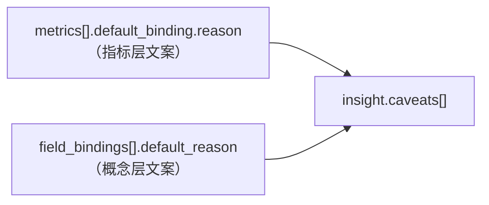

# 语义包字段契约 SCHEMA_v1.1（bundle_2026.09.14.1）

> **归属窗口**：W1A（`docs/08 §4.1`：`semantic/**`）
> **状态**：**v1.1 —— 已按 `07 §4.7.1` 的裁定同步**（裁定日期 2026-09-16，07 v0.8）。
> v1 是 candidate；v1.1 是**裁定后的实现契约**，W2A / W2B / W3 / W4 可据此动手。
> **本文用途**：把「YAML 里每个字段什么形状、谁依赖它、依据是哪条」写成一张可核对的表。
>
> **v1.1 相对 v1 的差异（`07 §4.7.1` 的"采纳 3 / 收窄 1 / 删除 2"）**：
>
> | 字段 | v1 | v1.1（裁定后） |
> |---|---|---|
> | `assets[].grain_level` | 有（1–6 资产细度档） | ❌ **删除**（见 §10） |
> | `field_bindings[].default_binding` | 有 | ❌ **删除** → 新增 `field_bindings[].default_reason`（见 §5） |
> | `metrics[].default_binding` | `{asset, time_field, reason}` | ⚠️ **收窄为 `{asset, reason}`**（`time_field` 删，与 `time_basis` 重复，见 §4） |
> | `meta.disclosure_text` | 有 | ❌ **删除**（U-26 改判 → 载体 `insight.caveats[]`，见 §1.3） |
> | `ambiguous: true` | 可带"占位非空"`canonical_asset` | ⚠️ **必须为空**，且不得有 `default_reason`（双向断言，见 §5.2） |
> | `dimensions[].grain_levels` / `grain_level` | 提议 | ✅ **采纳**（`grain_level == grain_levels[hierarchy 末项]`，见 §3.3） |
> | `joins` | 7 条 | ✅ **10 条**：显式登记 U-28 的 `v_dim_date` 两跳（见 §6.2） |

---

## 0. 权威链（谁说了算）

```
附录 A(02)  >  PRD(01)  >  06 UIUX  >  07 TDD(v0.8)  >  08 实施计划
```

本文件**不是**权威来源，是**实现输入**（对 W2A/W2B/W3/W4 而言）。字段来源逐条标注如下。

| 区块 | 结构来源 | 消费者 |
|---|---|---|
| `meta` | 附录 B §B.1.2 + 07 §6.1⑤ | W2A loader |
| `assets` | 附录 B §B.1.2 + 07 §12.2 `asset` 物化表 | W2B 检索 / W3 绑定 / W4 守卫 |
| `metrics` | 附录 B §B.2 + 07 §12.2 `metric_def` | W3 绑定 / W6 评测 |
| `dimensions` | 附录 B + 07 §12.2 `dimension` | **W2A L2 层判据** |
| `field_bindings` | 附录 B §B.3.2 + 07 §6.8.1 | **W2A L3 层判据** |
| `joins` | 附录 B §B.1.3 + 07 §12.2 `join_path` | W4 守卫 R10/R11 |
| `default_predicates` | 附录 B + 07 §5.4 | W4 谓词注入 |
| `aliases` ★ | 07 §12.2 `synonym` 物化表（附录 B 无此区块） | W2A L1 层 |
| `blacklist_terms` ★ | 附录 B §B.3.4（无此区块名，是 B.3.4 的落地） | W2A L1 拒答/澄清 |
| `time_semantics` | 附录 B + N-26 | W3 / W4 |
| `policies` | 附录 B §B.3.3 + PRD FR-12.5 | W4 守卫 R07 |
| `quality_gates` | 07 §6.1④ | W2A loader 准入 |

---

## 1. `meta`

`meta.domain` 是**域的单一真相**：所有 `assets[].domain` 必须是它的子集（校验器已断言）。

```yaml
meta:
  version: "2026.09.14.1"        # 形态 YYYY.MM.DD.N（07 §6.1 版本状态机）
  domain: [orders, products, traffic]
  dialect: postgresql             # ⚠️ 语义包声明 postgresql；评测沙箱是 sqlite —— 见 §7 差异说明
  published_at: "..."
  published_by: "data-team"
  status: candidate               # candidate | active | published | deprecated
  timezone: "Asia/Shanghai"
  fiscal_year_start_month: 1      # 附录 B v1.1 已确认（PRD §17.1 / FR-1.3）
  week_starts_on: "monday"        # 决定"本周/上周"边界
  embedding:                      # ★ U-25，07 §4.7.1 已裁定采纳
    model: "bge-m3"
    dim: 1024
```

### 1.1 ★ U-25 `meta.embedding`（✅ 裁定采纳）

- **问题**：07 §6.1 步骤⑤ 要求「`EMBEDDING_DIM` 与 YAML 声明一致」，但附录 B 结构示例**没有任何位置**声明维度。
- **裁定**：**采纳**。§6.1⑤ 明文要求"YAML 声明"，就必须有承载位。
- **实现**：`meta.embedding.{model,dim}`，值与 `app/core/config.py` 默认（`bge-m3` / 1024）一致；校验器步骤⑤断言一致。

### 1.2 `default_reason` / `reason` 的披露链路（**U-26 改判后的唯一载体**）



| 项 | 裁定 |
|---|---|
| **最终载体** | **`insight.caveats[]`**（附录 A §A.1.2 第 8 条：口径展示必须展示、**不可折叠隐藏**） |
| 指标层文案 | `metrics[].default_binding.reason`（L3 命中指标默认口径时） |
| 概念层文案 | `field_bindings[].default_reason`（L3 命中字段默认绑定时） |
| 渲染规则（确定性，由 API 层执行） | 去重 → 按 `display_name` / `concept` **字典序**排列 → 每条 ≤ **40 字** |
| ⚠️ **禁止**塞进 `scope.notice` | 那是**权限范围披露**的专用字段（附录 A §A.1.5 的三级策略 + 三条泄露红线按它定义）。混进去会让"跨租户不可见"与"口径默认"在同一个字段上无法区分 |

> **给 W2A 的硬约束**：语义包**只提供文案字段**，**不提供渲染字段**。`meta.disclosure_text` 已被裁定**不采纳**（私增 meta 字段会违反"附录 A 是接口唯一规范源"，§4.1）。校验器有**负向断言**防它回归。

---

## 2. `assets`（认证资产 —— 检索准入白名单）

**唯一可被检索的资产集合**。未进本包 = 不可检索、不可引用、不可生成。

```yaml
assets:
  - logical_name: order_paid        # 逻辑名（模型可见）
    physical_asset: v_order_paid    # 物理视图名（认证视图，非裸表）
    grain: sub_order                # 粒度 token（**枚举**，不是数值刻度）
    domain: orders                  # 必须 ∈ meta.domain
    owner: data-team
    certified: true
    tenant_scoped: true             # ★ 07 §7.4 分支 3 判据
    quality_score: 0.98             # ★ 与 quality_gates.min_quality_score(0.90) 联判 certified
    freshness_sla: "PT6H"           # ISO 8601 duration
    level: hot                      # hot | warm | cold
    row_estimate: 494249            # ★ **实测行数**（见 §2.2）
    description: "..."
    columns:
      - name: tenant_id
        type: text
        comment: "..."
        sensitive: tenant_key       # 敏感标记 → 必须在 policies.deny_columns
```

### 2.1 ★ `tenant_scoped`（✅ 采纳，安全必需，**双向断言**）

- **依赖**：07 §7.4 分支 3 判据（是否注入租户谓词）。
- **形状**：`bool`。`true` = RLS 生效，执行层必须 `SET app.tenant_id`。
- **写反的后果**：**跨租户存在性泄露**（把 `false` 写在有租户数据的资产上 → 不注入谓词 → T_A 能看到 T_B 的行数）。这是 **N-07 的直接失效路径**。
- **校验器断言**（**双向**）：`tenant_scoped: true` **⇔** 该资产含 `tenant_id` 列。当前 6 个租户资产 / 2 个公共资产（`region` / `dim_date`）双向一致。

### 2.2 ★ `row_estimate` = **实测值**（07 §4.7.4 第 1 条裁定）

> **裁定原文**：`params.*` 是生成器**名义输入**、`measured.*` 是**实测事实**，两者必须在产物里分开；**YAML 的 `row_estimate` 填实测值**。理由：分开之前，审计者会拿名义值当事实。

| 资产 | `row_estimate`（本 YAML，实测） | 名义输入 | 差异原因 |
|---|---|---|---|
| `order_paid` | **494,249** | 500,000 | T_C 2025-02 空区间吃掉 5,751 |
| `order_refund` | **23,116** | 25,000 | — |
| `product` | **6,000** | 2,000 | 名义值是**单租户**，实际 3 租户 × 2,000 |
| `shop` | **12** | 12 | 一致 |
| `region` | **31** | 34 | — |
| `campaign` | **84** | 24 | 名义值是**单租户**，实际 3 租户 × 28 |
| `traffic_daily` | **1,500,556** | 1,500,000 | 稀疏分布 + 确定性重分配 |
| `dim_date` | **730** | 731 | 2024-10-01…2026-09-30 共 **730** 天 |

逐表/逐租户实测证据：`eval/MANIFEST_v1.json` 的 `measured` 段。

### 2.3 `quality_score`（✅ 采纳）

- **依赖**：07 §12.2 `asset.quality_score`；与 `quality_gates.min_quality_score`（=0.90）联判 `certified`。
- **形状**：`0–1` 浮点。当前 8 个资产全部 ≥ 0.90（校验器已断言）。
- **超出阈值的行为是"排除"，不是"报错"**（§6.1④：`on_violation: exclude_from_context`）。

### 2.4 ❌ 已删除：`assets[].grain_level`

见 **§10**。**不要加回来。**

---

## 3. `dimensions`

### 3.1 形状

```yaml
dimensions:
  - name: region
    binding: order_paid.region_code          # 单绑定形态
    hierarchy: [country, region, province, city]
    grain_levels: { country: 1, region: 2, province: 3, city: 4 }
    grain_level: 4                            # = grain_levels[hierarchy 末项]
    value_map: {...}                          # 业务约定映射（非 DB 字段）
  - name: time
    bindings:                                 # 多绑定形态（时间维度专有）
      day: pay_time
      week: pay_time
      ...
```

### 3.2 单绑定 vs 多绑定

| 形态 | 适用 | 说明 |
|---|---|---|
| `binding: <asset>.<col>` | 一般维度 | 一个默认物理列 |
| `bindings: {<粒度>: <col>}` | **时间维度** | 各粒度可绑不同列（GMV 走 `pay_time`，流量走 `stat_date`） |

> 多绑定形态**有上游依据**：附录 B §B.1.2 的 time 维度示例本身就是 `bindings: {day/week/month: pay_time}`。
> （v1 曾把它记为待确认项 L7 —— **已关闭**，07 §4.7.4 第 3 条。）

### 3.3 ✅ 裁定采纳 · `grain_levels` / `grain_level`（**刻度族制，不是 1..N**）

**这是本契约里最反直觉的一处，必须写清楚，否则 W2A 会"修正"它。**

- `grain_levels` = **层级名 → 细度值**。**族内刻度**（绝对值无跨族意义），必须与 `hierarchy` 逐项对应且**严格递增**。
- **地理族**：`country=1 / region=2 / province=3 / city=4`
- **时间族**：`year=1 / quarter=2 / month=3 / week=4 / day=5`
- **类目族**：`category_l1=1 / category_l2=2 / category_l3=3`

**后果**：`dimensions.city` 的 `grain_levels` 是 `{region:2, province:3, city:4}` —— **从 2 起，不是从 1 起**。这是**故意的**，不是笔误。

| 理由 | 说明 |
|---|---|
| L2 的比较发生在**同族内** | `shop.city` 与 `order_paid.receiver_city` 必须可比 → 必须共用族刻度 |
| 若重排为 1..N | `city` 变成 2 起 vs `shop` 的 1 起 → 同粒度被判成不同粒度 → **真歧义被漏判** |
| 校验器规则 | 不断言"1..N 连续"，只断言「层级名与细度值一一对应且**随 `hierarchy` 顺序严格递增**」 |

> ⚠️ **给 W2A 的硬约束①**：L2 判"是否同粒度"用的是 **`grain_level` 数值相等**，**不是** `hierarchy` 数组下标。用下标会把 `city`(4) 与 `shop`(1) 误判为不同粒度。

#### `grain_level`（标量）的语义与断言

`grain_level` = 该维度的**默认细度**（07 §4.7.1 的表述：「问句未给粒度词时的默认粒度」）。

裁定要求「**必须等于 `grain_levels` 中该维度的默认层级值**（校验器断言，防漂移）」。要让这句话**可机检**，必须先定死"默认层级"。本契约采用的读法：

> **默认层级 ≡ `hierarchy` 的最后一层**（因 `hierarchy` 随 `grain_levels` 严格递增，它等价于"该维度可表达的最细层级"）。
> 校验器据此断言 `grain_level == grain_levels[hierarchy[-1]]`。当前 **6/6 通过**。

> ⚠️ **残留口径待确认（属已裁定的 U-23，不是新问题）**：若架构窗口要的是"**`binding` 所在层级**"这一读法，则
> `region`（binding = `region_code`，省）应为 **3**、`category`（binding = `category_l1`）应为 **1**，
> 而当前分别是 4 / 3。**W1A 不擅自改**：改它需要新增 `default_level` 字段承载"默认层级"，
> 而附录 B 无该字段承载位（属 **U-34** 范围）。
> → 校验器把它做成一条**每次跑都会出现的 WARN**（不是 FAIL），确保它不会被忘掉。

### 3.4 `value_map` 的定位

`region.value_map`（大区 → 省编码列表）**是业务约定，不是数据库字段**。
→ 禁止让模型猜大区归属；未列入 `value_map` 的省 → 归"其他"或不支持。

### 3.5 `dimensions[].binding` 指向 `order_paid.receiver_city` 的来源

**与附录 C §C.11.2 的差异**：附录 C 的 `v_order_paid` 字段表**只列了 `region_code`（收货省编码）**，没有城市列。但 `dimensions.city.binding` 需要一个城市字段，L2 的"城市 vs 店铺城市"竞争要靠它。
→ W1A 在 `v_order_paid` 补 `receiver_city` 列（`region_code` 只到省，`receiver_address` 是敏感列不可用）。**U-27 已被 07 §4.7.1 采纳**，并把该列写进 `data/schema.sql`，`selfcheck.py` 断言两处一致。

### 3.6 ❌ 已删除：`assets[].grain_level`（原"资产细度档"）

见 **§10**。与 `dimensions[].grain_level` **同名不同义**，是最容易被误用的形态。

---

## 4. `metrics`

```yaml
metrics:
  - name: gmv
    display_name: GMV
    domain: orders
    expression: "SUM(order_paid.pay_amount)"
    default_aggregation: sum
    unit: CNY
    owner: finance
    status: active                 # active | draft | deprecated
    definition_note: >
      口径：按支付完成时间（pay_time）统计；含运费；剔除全额退款订单；剔除测试单。
    default_binding:               # ★ 形状 = {asset, reason}（已收窄）
      asset: order_paid
      reason: "GMV 的时间基准固定为 pay_time，而非 create_time"
    time_basis: pay_time           # ← 时间基准的**唯一**承载位
    default_predicates:
      - "pay_status = 'paid'"
```

### ⚠️ 收窄后的 `metrics[].default_binding`（**形状必须恰好是 `{asset, reason}`**）

| 键 | 必填 | 说明 |
|---|---|---|
| `asset` | ✅ | 必须 ∈ `assets`（§6.8 步②③ 要按它查认证 / 时效 / 租户） |
| `reason` | ✅ | L3 强制披露文案（≤ 40 字，见 §1.2） |
| ~~`time_field`~~ | ❌ | **已删**。与同一条目既有的 `time_basis` **重复**（同一事实两处 → 必然漂移）。时间基准一律读 **`time_basis`** |

**校验器不只查"少了什么"，也查"多了什么"** —— 被删字段最可能的回归形态是"顺手又加回来"，而多出来的键**不会有任何报错**。

- **纪律**：**`draft` 指标不得有 `default_binding`** —— draft 不参与 L3；给了默认口径等于把未定口径的指标伪装成已定。校验器已断言（当前 `sell_through_rate` 为 draft，无绑定、无别名）。

---

## 5. `field_bindings`（唯一性保障 —— 核心机制）

```yaml
field_bindings:
  - concept: 城市
    ambiguous: true                      # 两个候选同 grain_level(=4) → 真竞争
    grain_level: 4
    candidates:
      - { asset: order_paid.receiver_city, label: 收货城市, grain_level: 4 }
      - { asset: shop.city,              label: 店铺所在城市, grain_level: 4 }
    clarify_prompt: "你说的「城市」是指收货城市还是店铺所在城市？"
    # ⚠️ ambiguous ⇒ 既无 canonical_asset 也无 default_reason

  - concept: customer_name
    canonical_asset: shop.shop_name      # 字段层依据（L3）
    default_reason: "主数据现值"          # 披露文案（L3）
    time_semantics: current
    grain_level: 1
```

### 5.1 两个字段的分工（**v1.1 变更点**）

| 字段 | 语义 | 消费者 |
|---|---|---|
| `canonical_asset` | 该概念的**规范字段**（附录 B §B.3.2 已有） | **L3 的字段层依据** |
| `default_reason` | 命中该默认绑定时**强制披露的文案**（**§4.7.1 新增**） | L3 → `insight.caveats[]` |
| ~~`default_binding`~~ | ❌ **已删**。W1A 自述"非 ambiguous 时 `canonical_asset` 即 `default_binding`" → **两字段恒等 = 同一事实两处** | — |

### 5.2 ⚠️ `ambiguous` 与"规范字段"的**双向**互斥（**最易写错的一条**）

| 方向 | 规则 | 违反的后果 |
|---|---|---|
| `ambiguous: true` ⇒ | **`canonical_asset` 必须为空**，且 **`default_reason` 必须为空**，且 `candidates` 非空 | 留一个"占位非空"的规范字段 = **留了一个假值** —— 任何漏判 L3 的路径都会把它当真 → **歧义被静默解决** → 用户得到看似合理但可能错误的字段 |
| 非 `ambiguous` ⇒ | **`canonical_asset` 与 `default_reason` 都不得缺** | 默认口径缺失 → L3 在本该直接执行的场景退回澄清 → **澄清率虚高**（§6.8.1 的失效形态之一） |

> **只禁一侧只能抓到一半事故**，故校验器**双向断言**。
>
> 当前：7 条绑定中 6 条有 `canonical_asset` + `default_reason`，1 条（`城市`）`ambiguous` 且两者皆空；
> 且该 `ambiguous` 概念 **0 条同时有别名**（保证 L1 不发生短路）。

### 5.3 `ambiguous` 的候选必须**同 `grain_level`**

07 §6.8.1：**同粒度不同语义**才是必须澄清的形态。候选粒度不同 → 应由 L2 按问句粒度直接选定，标 `ambiguous` 会导致**澄清率虚高**。
（"城市 vs 区县"因粒度不同而**不**触发澄清 —— 上游 PRD §6.2 的举例与 §6.3.1 相反，以 §6.3.1 为准，已登记 U-10。）

---

## 6. `joins` / `default_predicates` / `aliases` / `blacklist_terms`

### 6.1 `joins` 契约不变量

```yaml
joins:
  - left: order_paid.sku_id
    right: product.sku_id
    type: many_to_one
    on_columns: [sku_id]
    certified_by: data-team
```

- `on_columns` **只能是列对**（左右各一，或同名只写一个）。
- **未列出的路径一律禁止**（附录 B §B.1.3）。防笛卡尔积与错误关联。
- **刻意不列出**：`order_paid × traffic_daily` 直连。二者只能经 `product` 桥接（2 跳）→ 对应红队 `RT-JOIN-003`。
- ⚠️ **不新增 join 类型**：这条不变量是**可机器校验的**，为表达区间关联而新增类型会把它打破（07 §4.7.1 关于 U-28 的裁定）。

### 6.2 ✅ 裁定采纳 · U-28 的两跳路径（**必须显式登记**）

> **裁定原文**：「区间关联**不新增 join 类型**，只能经 `v_dim_date` 两跳；语义包**必须显式登记**该 2 跳路径，否则 **gate1 R10 一律拒绝**」。

**登记方式 = 把两跳拆成两条边写进 `joins`**（不登记则路径不可达 → R10 拒绝）。v1.1 新增 3 条边：

| # | 边 | 危险点 |
|---|---|---|
| ① | `order_paid.pay_time → dim_date.date_key` | **非裸等值**：`timestamptz` vs `date` → 必须写 `date(order_paid.pay_time) = v_dim_date.date_key` |
| ② | `traffic_daily.stat_date → dim_date.date_key` | 两侧同为 `date` → **裸等值**（流量侧的同构路径） |
| ③ | `dim_date.campaign_id → campaign.campaign_id` | **跨租户边界的边**：左为公共日历（`tenant_scoped: false`）、右为租户资产 |

**实测发现的三个必须写明的陷阱（2026-09-16，沙箱库）**：

1. **①不是等值**：`pay_time` 是 `timestamptz`、`date_key` 是 `date`。实现者若写 `ON pay_time = date_key` → **恒假 → 静默 0 行**（不报错、不告警）。
2. **③会跨租户扇出**：`v_dim_date.campaign_id` 只有 **4 个 PROM 值**，且这 4 个 id **在 3 个租户里都存在同名活动**（实测：每个 id 命中 >1 个租户）→ 一条 `dim_date` 行会匹配 3 条 `campaign` 行 → **3 倍扇出，聚合值静默变大**。租户谓词**必须落在 `campaign` 侧**。
3. **③只覆盖大促**：`v_dim_date.campaign_id` 有值仅 **102 / 730** 天（618 与双 11 窗口）。日常促销（`NORMAL-YYYY-MM-T_x`，每租户 24 条）在 `dim_date` 里**没有映射** → 问"本月活动订单"若不加限定会**只统计到大促**。**该项必须进评测报告的"已知限制"**，不得当成完整覆盖。

#### ⚠️ 危险边必须带 `note`（校验器断言）

| 危险类型 | 判据 | 不写清的后果 |
|---|---|---|
| **跨租户边界** | `left` 侧 `tenant_scoped: false` 且 `right` 侧 `true` | 公共维表行匹配到多个租户的行 → **扇出 → 聚合值变大而无人报警** |
| **跨类型** | `on_columns` 两列的 `type` 不同 | `ON ts = date` 恒假 → **静默 0 行** |

这两类是**会静默算错**的边，不是会报错的边 —— 故校验器对它们强制要求 `note`（缺 note 即 FAIL）。当前 10 条边全部合规。

### 6.3 `default_predicates`

按域分组，`applies_to` 必须指向已定义指标。**与 `metrics[].default_predicates` 双向一致**（校验器断言）：
只约束一个方向时，加载器读 `metrics[].default_predicates`（最自然的位置）会**静默漏掉谓词**，口径算错却任何断言都不响。（该断言上线时实测抓出 4 个指标：`refund_rate` / `repurchase_rate_90d` / `uv` / `pay_cvr`。）

### 6.4 ★ `aliases`（**新增顶层区块**）

**为什么必须新增**：附录 B 把同义词散落在 `metric.synonyms` / `column.synonyms` 两处，但 07 §12.2 要求一张**扁平 `synonym` 物化表**供 L1 做 O(1) 命中。v1 把两处**归一化**到 `aliases`，并加校验：「`column/metric` 的 `synonyms` ⊆ `aliases` 的 term 集」。

```yaml
aliases:
  - { term: "GMV", lang: en, maps_to_kind: metric, maps_to_ref: gmv, category: metric }
  - { term: "成交额", lang: zh, maps_to_kind: metric, maps_to_ref: gmv, category: metric }
```

- `maps_to_kind` ∈ `{asset, metric, column, dimension}`
- **L1 判据**：`term` 必须**一对一**（校验器已断言 105/105）。
- `aliases` **不得指向 draft 指标**（否则 L1 会把未确认口径"确定性解析"掉 —— FR-12.3 要防的事）。

### 6.5 ★ `blacklist_terms`（**新增顶层区块**）

附录 B §B.3.4 要求「无对应字段 → 拒答」与「需澄清阈值」，但**没给承载位**。v1 落在 `blacklist_terms`。

```yaml
blacklist_terms:
  - term: "淡季"
    action: refuse            # refuse | clarify
    reason: "无定义的时间概念"
    alt_question: "你可以问「2026 年 3 月的 GMV 是多少」"
```

- 当前：**9 拒答 + 6 澄清 = 15 条**，`clarify_prompt` / `alt_question` 齐全（校验器已断言）。
- **`refuse` 的语义**：**不是 error**。07 要求拒答渲染为 `refuse` 态 + 审计，不得落成 `error`。

---

## 7. 已知口径差异（**必须转达，不得静默**）

| # | 差异 | 处置 |
|---|---|---|
| D-1 | `meta.dialect = postgresql`，但评测沙箱是 **SQLite**（07 §17.4 / 附录 C §C.14） | 语义包声明 PG 方言；沙箱用 SQLite 跑**评测**。SQL 生成时 `sqlglot` 负责转译。**风险**：PG 专有语法（`FILTER`、`DISTINCT ON`）在沙箱不可用 → 已在红队集 `RT-EXEC-*` 标出，W6 执行器需回退策略 |
| D-2 | 大促区间（618/双11）在 `time_semantics` 与 `v_campaign` 两处 | **本包 notes 是口径来源，`v_campaign` 是取数来源**；生成器以本包为准写入，`selfcheck` 断言二者一致 |
| D-3 | `dimensions.city` 的 `grain_levels` 从 2 起 | **故意**，理由见 §3.3。W2A 不得"修正" |
| **D-4** | **沙箱无 RLS**：评测用 SQL 注入**模拟** RLS，与生产的"DB 层 RLS + `SET app.tenant_id`"**是两条不同路径** | 07 §17.6 不变量 **I-6**。**"评测全绿"不得被解读为"权限链路已验证"** → 必须进 §17.4 的沙箱能力缺口表 |
| **D-5** | `region_name` 是**由 `value_map` 派生的物化列**（U-32 / U-36 裁定保留） | `value_map` **仍是唯一真相来源**；保留该列是因为移除会作废 13 条 `gold_sql` 并触发重冻结。轴 2 的 `medium` 档因此**存在高估**，**必须在评测报告披露**（07 §17.6 I-3） |
| **D-6** | `dim_date.campaign_id` 只覆盖大促（102/730 天） | 见 §6.2 陷阱 3。**必须进评测报告的"已知限制"** |

---

## 8. 校验器覆盖矩阵（`validate_bundle.py`）

**当前：34 项 —— PASS=31 / FAIL=0 / SKIP=1 / WARN=2**

| 步骤 | 断言数 | 说明 |
|---|---|---|
| ① 读取 YAML | 1 | 无重复 key（自定义 loader 检测；YAML 规范允许重复 key 且**后者静默覆盖前者**） |
| ② 字段齐全性 | **5** | FR-12.2 **15 类** / §4.7.1 扩展字段 5 项 / **已删字段未复活（负向）** / 域子集 / draft 无 default_binding |
| ③ 引用完整性 | **17** | joins、field_bindings、**ambiguous⇔无 canon/reason（双向）**、别名一对一、deny_columns、敏感列双向、谓词引用、**谓词↔metric 双向**、**`default_binding` 形状 `{asset,reason}`**、**危险边必须带 note**、grain_levels↔hierarchy、**grain_level == grain_levels[末项]**、**grain_level 读法残留（WARN）**、**tenant_scoped ⇔ tenant_id（双向）**、synonyms⊆aliases、aliases 不指向 draft |
| ④ 质量准入 | 2 | 全部资产 ≥ 0.90 / `on_violation` 语义 |
| ⑤ 环境一致 | 3 | EMBEDDING_DIM / meta 时间语义(N-26) / 版本号形态 |
| （跳） | 1 | `jieba` 词典加载与分词函数 —— 归 W2B（`retrieval/tokenizer.py` 是唯一入口，N-24），本脚本**不 import `app.*`** |
| DoD 自证 | 3 | 默认口径覆盖 / 指标 100% 有绑定 / 别名覆盖 |
| 黑话表 | 2 | action 取值 / 文案齐全 |

> 校验器**不 import `app.*`** —— 因为 W1A 禁改 `app/**`，且 import 会引入包路径依赖使脚本无法独立运行。这是**刻意的边界**，不是缺失。
> ⚠️ 但代价是：**步骤⑤ 的 jieba 那一项永远是 SKIP**，不是通过 —— 别把它读成绿的。

---

## 9. 变更纪律

1. 改本包 → 必须递增 `meta.version`（形态 `YYYY.MM.DD.N`）→ 缓存与 few-shot 索引必须失效（附录 B §B.4.1）。
2. 冻结评测集**不随语义包一起改**；语义包升版后，冻结集是否需重生成，由 **W6** 判定并出新版本号。
3. 本文件与 YAML 不一致时，**以 YAML 为准**，并立刻改本文件。
4. **删除字段必须留负向断言**（见 §10 的实现方式）：删除的理由在半年后不会自己浮现，后来人看到空位通常会补上。

---

## 10. ❌ 已删除字段清单（**不得复活**，校验器负向断言）

| 字段 | 删除理由（07 §4.7.1 裁定原文） |
|---|---|
| `assets[].grain_level` | ① 07 全文该名**仅出现一次**（§12.2 表结构清单）、**无任何消费者**；② 与 `dimensions[].grain_level` **同名不同义** —— 而"两套刻度永不比较"正是 W1A 自己立的纪律，**同名是最容易被违反的形态**；③ §6.8 步③ 的粒度校验用 `asset.grain`（枚举 token）已足够。**若将来真需要跨资产细度比较，正确做法是给 `grain` 加"域内顺序表"，不是现在凭空造一根全局 1–6 刻度。** |
| `field_bindings[].default_binding` | 与 `canonical_asset` **恒等**（W1A 自述"非 ambiguous 时两者相同"）→ **两字段恒等 = 同一事实两处**。L3 的字段层依据 = `canonical_asset`（附录 B 已有）；**真正缺失的是 `default_reason`** |
| `meta.disclosure_text` | U-26 **改判**：披露**已有唯一载体** `insight.caveats[]`（附录 A §A.1.2 第 8 条：必须展示、不可折叠）。私增 `meta` 字段会违反"附录 A 是接口唯一规范源"（§4.1） |

**校验器实现**（`REMOVED_FIELDS`，命中即 FAIL）：

```text
② 已删字段未复活（07 §4.7.1 负向断言）   3/3 确认不存在（disclosure_text/grain_level/default_binding）
```

---

## 11. 未决项 / 待确认（**不阻塞**，但每次跑都会出现）

| # | 项 | 状态 | 归属 |
|---|---|---|---|
| 1 | `grain_level` 的"默认层级"读法（hierarchy 末项 vs `binding` 的粒度） | ⚠️ **WARN 每跑提示** | 架构窗口（属已裁定的 U-23 残留） |
| 2 | `dim_date.campaign_id` 只覆盖大促 → 活动订单口径不完整 | ✅ 已写明（§6.2 / D-6） | W6（须进报告"已知限制"） |
| 3 | §4.7.1 的扩展字段在附录 B 均无承载位 | ⏳ 待上游 | **U-34** |
| 4 | `v_order_paid` 的 `receiver_city` 需回填附录 C §C.11.2 | ⏳ 待上游 | **U-27** |
| 5 | §C.3.1 的 Component2 定义（死常量 `HARDNESS`）需改写 | ⏳ 待上游 | **U-29** |
| 6 | 官方四级锚点与代码口径在 Hard 档不一致 | ✅ 官方锚点降级为差异记录；**本项目锚点已新立** | **U-35** / W6 落 CI |
| 7 | `v_region` 的 `region_name` 与 value_map 的张力 | ✅ 保留 + 标注为派生列 + 报告披露义务 | **U-36** |
